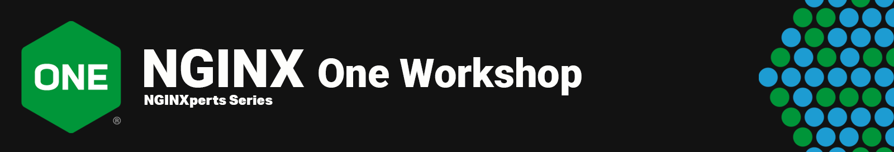
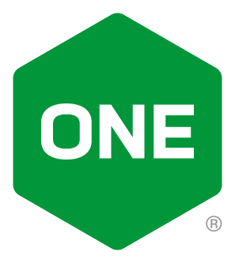

 

# NGINX One Console Workshop

 

This Repo is for learning the **`NGINX One Console`**, with Instructor Lead and Self-paced and Hands-on Lab Exercises and Lab Guides that will teach a student using real NGINX instances with NGINX One Console.

 

## Audience

This Workshop is meant for Modern Application Developers, DevOps, Platform Ops, and SRE engineers working with NGINX, NGINX Plus, Docker - how they are managed, monitored, and configured using the One Console.  Using various NGINX instances, you will connect them to NGINX One Console and explore them within the One Console.

`The Student taking this Workshop must have the basic skills and knowledge with the following:`

- NGINX Opensource or Plus
- NGINX configurations: files, directives, and variables
- Chrome Browser
- Linux OS / desktop skills
- Optional: Docker container concepts
- Optional: TLS certificates
- Optional: CVE Security concepts

You should be proficient with the following technologies and concepts.

- NGINX Webserver and Reverse Proxy
- HTTP 1.1 Protocol, TLS
- Various Desktop tools; Visual Studio, Linux, Terminal, Chrome

 

## Knowledge and Skills Requirements

 

NGINX One Console  |  Hands-On Labs
:-------------------------:|:-------------------------:
  |  

 

To meet the Prerequisite skills requirement, there are other Workshops from NGINX to help you prepare.  The student should have completed the NGINX Basics Workshop 101, prior to taking this workshop. (Or have equivalent knowledge).  

- NGINX Basics Workshop - 101 (https://github.com/nginxinc/nginx-basics-workshops)

See [Lab0 prerequisites](/labs/lab0/prerequisites.md) for the Hardware/Software and Skills Prerequisites for taking this Workshop and completing the Lab Exercises.

 

## Getting Started

Review the Github Repo content for the NGINX Basics Workshop 101.  If you have taken this Workshop, and understand the content, you can successfully complete the Lab exercises in this NGINX One Console Workshop.  It is HIGHLY recommended that you complete the 101 Workshop prior.  

It will take approximately 1 hour to complete the NGINX One Console Workshop.

 

## How to Use

The content and lab exercises are presented in a sequence as you build and add additional NGINX instances and functionality as you progress.  It is essential that the Lab Exercises are completed in the order provided.  This content provided is for example only, is not for production workloads.  The user of this information assumes all risks.

- Click [LabGuide](labs/readme.md) to begin the Lab Exercises.

 

## Contributing

Please see the [contributing guide](https://github.com/nginxinc/nginx-one-workshops/blob/main/CONTRIBUTING.md) for guidelines on how to best contribute to this project.

 

### Authors

- Chris Akker - Solutions Architect - Community and Alliances @ F5, Inc.
- Shouvik Dutta - Solutions Architect - Community and Alliances @ F5, Inc.
- Adam Currier - Solutions Architect - Community and Alliances @ F5, Inc.

-------------

 

## License

[Apache License, Version 2.0](https://github.com/nginxinc/nginx-one-workshops/blob/main/LICENSE)

&copy; [F5, Inc.](https://www.f5.com/) 2025
