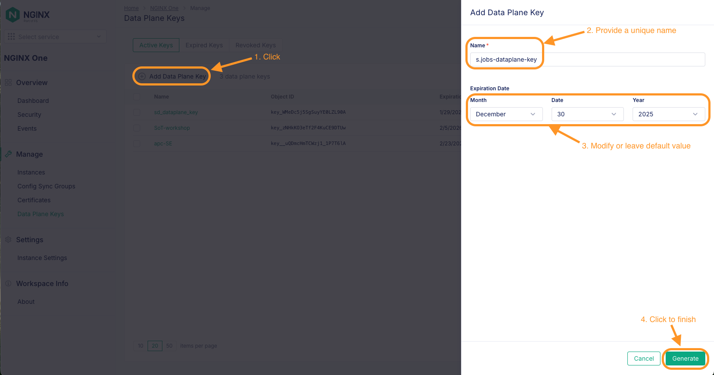

# NGINX One Console Access & Overview

## Introduction

In this lab, you will be logging into NGINX One Console and exploring various components within NGINX One console. This lab requires that you have access to F5 Distributed Cloud to work with NGINX one console. As part of this lab, you will explore the Nginx One console product, as a quick Overview of what it is and how to access it.

 

## Learning Objectives

By the end of the lab you will be able to:

- [Understand NGINX One Console product](#nginx-one-console-introduction)
- [Access and navigate the NGINX One Console](#access-and-navigate-the-nginx-one-console)
- [Create and manage data plane keys that would be used to manage NGINX instances](#create-and-manage-data-plane-keys-that-would-be-used-to-manage-nginx-instances)

## Prerequisites

- You must have an F5 Distributed Cloud(XC) Account
- You must have enabled NGINX One service on F5 Distributed Cloud(XC)
- See `Lab0` for instructions on setting up your system for this Workshop
- Familiarity with basic Linux concepts and commands
- Familiarity with basic Nginx concepts and commands

 

### NGINX One Console Introduction

The F5 NGINX One Console is a service which is part of the F5 Distributed Cloud, gives all NGINX users access to a SaaS experience for managing NGINX instances. The console lets you monitor and control your NGINX fleet from one place. You can check configurations, track performance metrics, identify security vulnerabilities, manage SSL certificates, and more.

The NGINX One Console is valuable because it simplifies the complexities of modern application delivery by integrating multiple functionalities into a single platform. This reduces the need for disparate tools, lowers operational overhead and costs, and ensures robust security for your applications. You will be able to accelerate application delivery and time-to-value like never before with SaaS capabilities.

NGINX One Console offers the following key benefits:

- **Centralized control:** Manage all your NGINX instances from a single console.
- **Enhanced monitoring and risk detection:** Automatically detect critical vulnerabilities (CVEs), verify SSL certificate statuses, and identify security issues in NGINX configurations.
- **Performance optimization:** Track your NGINX versions and receive recommendations for tuning your configurations for better performance.
- **Graphical Metrics Display:** Access a dashboard that shows key metrics for your NGINX instances, including instance availability, version distribution, system health, and utilization trends.
- **Real-time alerts:** Receive alerts about critical issues.

### How it works

The Nginx One Console requires `nginx-agent`, an open source software module written by Nginx that connects and communicates with Nginx One.  This nginx-agent must be installed and running on every Nginx instance that you wish to manage with Nginx One.  You will use the publicly available Nginx with Agent images from Docker Hub for your Nginx OSS containers.  In addition, as part of your Docker Compose file, your NGINX Plus containers already have the required `NGINX Agent` installed for you.  Nginx-agent can also be installed using regular Linux package managers like `apt` and `yum`.  Refer to the References Section for links to the Nginx Agent installation guides.

### Access and navigate the NGINX One console

1. Login into the F5 Distributed Cloud console using your account credentials. The login page can be found at: https://console.ves.volterra.io/login/start

    

1. Once logged in, the "home" screen shows you various tiles which represent F5 Distributed Cloud console features. In this lab, we'll focus on the `NGINX One` console tile as highlighted in the below screenshot.

    

1. Click on the `NGINX One` tile from the home screen. The NGINX One "welcome" screen will appear. Make sure the Nginx One Console status shows `green - Enabled` as highlighted in below screenshot.  Click on `Visit Service`.  If it is not enabled, you must request access from your F5 Distributed Cloud admin.

    

1. By default, this will bring you to the Nginx Console `Overview Dashboard` page. As no NGINX Instances are being managed by NGINX One you are seeing the blank dashboard as shown in below screenshot.

    

    Once you add different NGINX Instance in the next section, this Dashboard would get populated by useful insights as depicted in below sample dashboard screenshot.

    

 

### Create and manage data plane keys that would be used to manage NGINX instances

1. Within the Nginx One Console, click on `Manage > Data Plane Keys`. This would show all the Data Plane keys that you currently have.

    

1. Click on `Add Data Plane Key` to create a new Dataplane key. This should open an `Add Data Plane Key` window. Provide a name of your choice for the new key. By default, the expiration date is set for a year. You can modify the expiration data as per your preference or keep the defaults for this workshop. Click on `Generate` to create your new key.

    

    Once the key is generated, copy the value of this key to the clipboard using the `Copy` icon on the right side.  **NOTE:**  This Dataplane Key is only shown here and NGINX One doesn't save this value. Save this value locally as you would be using it to register new NGINX Instances.  You can Register as many Nginx Instances as you like with the same Dataplane Key.  If you lose the value of the key then you need to generate a new one again.

    

1. Once you have saved the key locally for future use, click the `Close` button to finish the Data plane key creation process.

 

### (Optional Exercise): Revoke a data plane key

1. To revoke the data plane key, search the key that you would like to revoke within the Data Plane Keys Page and then click on the key. This should open a new overlay window on the right side as shown in below screenshot. Click on `Revoke` button. In the next confirmation window, again click on `Revoke` button to disable the data plane key.

    
    

### (Optional Exercise): Delete a data plane key

1. Active keys cannot be directly deleted. Any active key first needs to be revoked and then only it can be deleted.

1. You can delete a revoked data plane key by opening the Data Plane Keys Page and then navigating to the `Revoked Keys` tab. This view should list all the revoked keys.

    

    To delete a particular revoked key, select the key and then click on `Delete Selected` button. In the next confirmation window, again click on `Delete` button to delete the data plane key.

    
    

 

This ends lab1.

 

## References:

- [Nginx One Console](https://docs.nginx.com/nginx-one/)
- [Nginx Agent](https://docs.nginx.com/nginx-agent/overview/)

 

### Authors

- Chris Akker - Solutions Architect - Community and Alliances @ F5, Inc.
- Shouvik Dutta - Solutions Architect - Community and Alliances @ F5, Inc.
- Adam Currier - Solutions Architect - Community and Alliances @ F5, Inc.

-------------

Navigate to ([Lab2](../lab2/readme.md) | [LabGuide](../readme.md))
