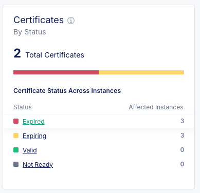
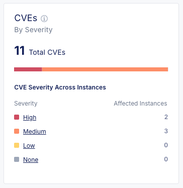
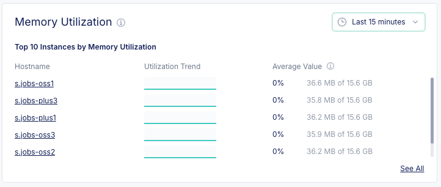
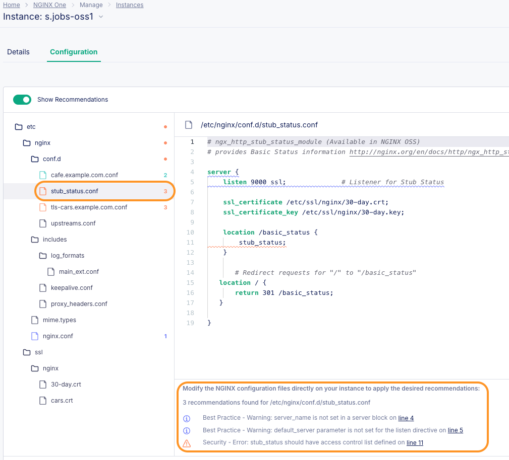
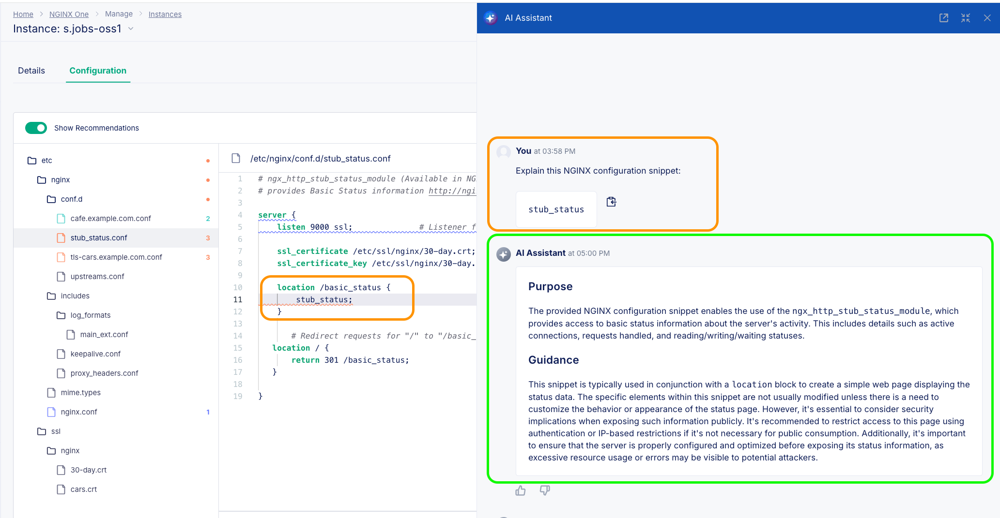
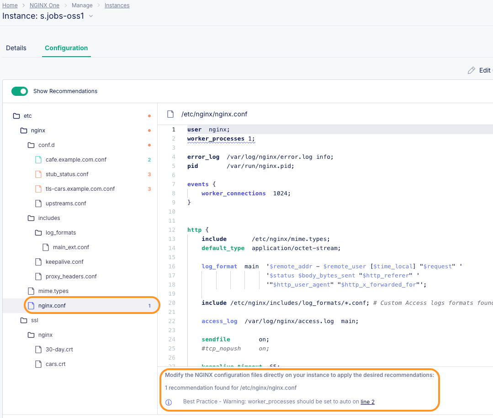
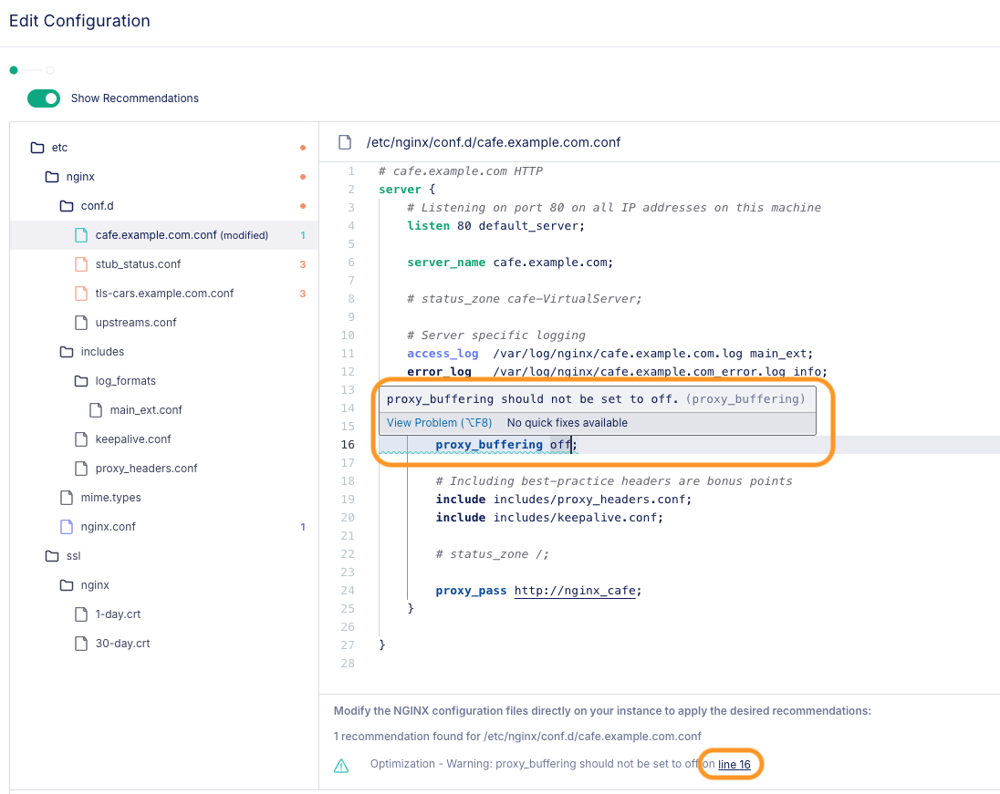
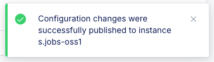

# NGINX One Console Overview and Deep Dive

## Introduction

In this lab, you will use NGINX One Console and explore various features within NGINX One Console. You will then dive deep into those features and explore further.  You will also use the NGINX One AI Assistant to help you with Nginx directives, variables, and best practices.

<br/>

## Learning Objectives

By the end of the lab you will be able to:

- Explore NGINX One Console Overview Dashboard
- Understand NGINX One Certificates feature
- Understand NGINX One Configuration Recommendations feature
- Understand NGINX One CVE feature
- Explore NGINX One AI Assistant

## Prerequisites

- You must have an F5 Distributed Cloud(XC) Account
- You must have enabled NGINX One service on F5 Distributed Cloud(XC)
- See `Lab0` for instructions on setting up your system for this Workshop.
- You have built all workshop components from previous section.
- Familiarity with basic Linux concepts and commands
- Familiarity with basic NGINX concepts and commands

<br/>

## Explore the NGINX One Console Overview Dashboard


Within NGINX One Console service, click on the Overview Dashboard, to see the Summary Panels of your NGINX fleet:

- Availability of your Instances to the Console
- Different Versions of NGINX OSS / Plus being used
- Different Versions of Linux Distros being used 
- The Expiration dates/status of your TLS Certificates
- Expert analysis of your NGINX configurations - and YES!! NGINX AI is here :-)
- Any CVEs detected, either with NGINX or the Linux OS
- CPU, RAM, and Disk utilization
- Network Throughput metrics
- Summary of HTTP 400/500 Response Codes

<br/>

### Availability

This Panel is pretty self explanatory, which of your NGINX Instances is online and communicating with the Console. Click on the `Online, Offline, or Unavailable` links for more details. You can add a `Filter` to assist with sorting/displaying your Instances. Notice there is a `Last Reported Time` column, so you know when the instance last did a handshake with the Console. Under `Actions`, you can go directly to the Configuration tool, or Delete the Instance.


<br/>

### NGINX Versions

This Panel shows a Summary of which NGINX Versions are in use and by how many instances. Sure, you could write a `bash script to SSH into every Instance`, and query `nginx -v` and collect this data yourself ... but why not use the Console instead? Do you even *have* `root privileges` to SSH in the first place? This makes it easy to know what versions of NGINX are running on your Instances - do they need a patch or an upgrade??


<br/>

### Operating Systems

This Panel shows a Summary of which Linux Distros are in use and by how many instances. Sure, you could write YABS - yet another bash script - to SSH into every Instance, and query `uname` and collect the versions yourself ... but why not use the Console's Easy Button instead? As the number of people, teams, and projects grow using NGINX, the OS Version sprawl can become an issue. The Console lets you see this level of detail quite easily. And it makes it easy to find Linux versions that may not be approved by Security for Production, or need a patch applied.


<br/>

### Certificates Overview

This Panel shows a Summary of the TLS Certificate expiration Status, using each certificate's expiry date as reported with openssl on each Instance. NGINX Agent scans the NGINX config files, then uses openssl to query each Certificate file, and reports this information up to the NGINX One Console. If you click on the `Expired, Expiring, Valid, or Not Ready` links, you get additional details on the name of the certificate and on which Instance it can be found. Once again, this saves you writing another bash script, you can see this TLS metadata at your fingertips. You will update an expired certificate in the next Exercise.



<br/>

### Configuration Recommendations Overview

This Panel shows some possible improvements that could be made to your current running NGINX configs. Some are Security related, or an Optimization, or a Best Practice from the experts that built NGINX. Clicking on each of these will give you additional details and provide an easy way to edit / update your NGINX configs. You will do this in the next Exercise.


<br/>

### CVEs Overview

This Panel is a great tool to show you the CVEs that you might have in your NGINX fleet, with `High-Medium-Low Severity` classes, and which Instances are affected. Even better, click on the CVE hyperlink takes you directly to the CVE website for detailed information, and possible remediations.



Click on your `$NAME-plus1` or `$NAME-plus2` Instance, you should see a list of all the CVEs identified by NGINX One Console CVE scanner. NOTE: *This list may not include ALL CVEs*, rather just the list that NGINX One Console knows about at the time of the last scan.

Plus1 | Plus2
:-------------------------:|:-------------------------:
 | 

<br/>

### CPU, RAM, Disk Utilization

These Panels show Host level information from the Linux OS about the consumption of hardware resources that the NGINX Agent reports to the One Console. There is a `Time Selector` to show these metrics over different periods of time, with a history graph plotted for you. Click the `See All` button for a columnar list, which you can Filter and Sort. 
*NOTE: Docker containers do not report Disk usage.*

CPU | RAM | Disk
:-------------------------:|:-------------------------:|:---------------:
 |  | 

<br/>

### Unsuccessful Response Codes

The NGINX Agent scans the Access logs and summarizes the number of 4xx and 5xx HTTP Return codes found, and reports this information to the NGINX One Console. There is `Time Selector` and a `See All` button for this Panel as well.


<br/>

### Top Network Usage

This Panel shows basic Network level information from the Linux OS about the network traffic that the  NGINX Agent reports to the NGINX One Console. There is a `Time Selector` to show these metrics over different periods of time, with a history graph plotted for you. Click the `See All` button for a columnar list, which you can Filter and Sort.


<br/>

## NGINX One Console CVEs Deep Dive

 | 

One of the nice security feature of the NGINX One Console is the ability to provide a CVE summary with `High-Medium-Low Severity` classes. Clicking those classes reveals which Instances fall under them.

1. Using the Overview Dashboard CVEs Panel, Click on the `High` Severity link. This will provide a List View of the Instances that have CVEs that are classified under `High` Severity.

    

1. Click on the `$NAME-plus1` Instance. This will provide the Instance level Details, you will see a `CVEs` Section, this time with the Name, Severity and Description for each CVEs applicable to the instance.

    

1. If you click on one of the CVEs name hyperlink, for example `CVE-2024-39792`, it will directly open the CVE website on a new tab with detailed information and possible remediations.

    

1. In similar fashion explore, click on the `Medium` Severity link within the Overview Dashboard and explore all the other CVEs that are classified under `Medium` Severity.

1. Another alternate way to look into CVEs is to navigate to the `Security` tab. This opens a new window in the left pane that shows all the F5 announced CVEs that are related to NGINX. This view also has a counter besides the CVE Name that shows how many instances are impacted by that particular CVE.
    

1. Clicking on the CVE name opens a new pane that shows you the instances impacted by that particular CVE. `View More` link would directly open the CVE website on a new tab similar to earlier steps.
    

<br/>

## NGINX One Console Certificates Deep Dive

 | 

Another nice feature of the NGINX One Console is the ability to quickly see the `Expiration Dates of the TLS Certificates` being used by your NGINX Instances. When the nginx-agent reads the NGINX configuration, it looks for the TLS certificate path/name, and uses openssl to collect the Certificate Expiration date and Subject Name, and sends this information to the One Console. It provides both a Summary of all the certificates, and the details on each one. Sure, you can write an bash script to login with root privileges to every NGINX Server, and collect this information yourself. But using the NGINX One Console makes this easy to see and help plan appropriate actions.

>There is one small caveat to this feature, it only scans the TLS certificates that are part of the running NGINX configuration of the Instance, *it does not check additional TLS certificates*, even if they are in the same location on disk.

- **Expired** means the current date is past the certificate's Expiration Date.
- **Expiring** means the current data is within 31 days of the certificate's Expiration Date.

1. Using the Overview Dashboard Certificates Panel, Click on the `Expiring` link. This will provide a List View of the Instances affected, with metadata about the Instances using the Certificate.

1. Click on the `$NAME-oss1` Instance. This will provide the Instance level Details, you will see a `Certificates` Section, this time with the Name, Status, Expiration Date, and Subject Name for each certificate file.

    

1. If you Click on the actual certificate file, for example `30-day.crt`, it will give you a List of all the Instances that are using that same certificate.

    

<br>

**Optional Lab Exercise:**

Fix the Expired Certificate! If you want to create a new certificate, say with a 91-day expiration, follow these instructions to use `openssl` to create a Self-Signed certificate/key pair, and update your NGINX config files to use the new Certficate.

1. Change your Terminal to the appropriate directory, in this exercise, that would be `labs/lab2/nginx-oss/etc/ssl/nginx`.

1. Create a new `$NAME-91-day` SSL certificate/key pair:

    ```bash
    openssl req -x509 -nodes -days 91 -newkey rsa:2048 -keyout $NAME-91-day.key -out $NAME-91-day.crt -subj "/CN=NginxOneWorkshop"

    ```

1. Verify the .crt and .key files were created, in the correct volume mounted folder:

    ```bash
    ls -l

    ```
    ```bash
    ## Sample output ##
    ubuntu@NGINX-Basics:~/Documents/nginx-one-workshops/labs/lab2/nginx-oss/etc/ssl/nginx$ ls -l
    total 32
    -rw-rw-r-- 1 ubuntu ubuntu 1131 Mar 19 22:07 1-day.crt
    -rw------- 1 ubuntu ubuntu 1704 Mar 19 22:07 1-day.key
    -rw-rw-r-- 1 ubuntu ubuntu 1131 Mar 19 22:07 30-day.crt
    -rw------- 1 ubuntu ubuntu 1704 Mar 19 22:07 30-day.key
    -rw-rw-r-- 1 ubuntu ubuntu 1131 Mar 19 21:58 cars.crt
    -rw-rw-r-- 1 ubuntu ubuntu 1704 Mar 19 21:58 cars.key
    -rw-rw-r-- 1 ubuntu ubuntu 1131 Mar 20 00:03 s.jobs-91-day.crt
    -rw------- 1 ubuntu ubuntu 1704 Mar 20 00:03 s.jobs-91-day.key

    ```

1. Edit the `tls-cars.example.com.conf` file that can be found in `lab2/nginx-oss/etc/nginx/conf.d/` file path. Change the names of the crt/key from `cars.crt and cars.key` to `$NAME-91-day.crt and $NAME-91-day.key`; Lines #13-14.

    ```nginx
    ...
    # Update the following 2 lines for NGINX cert and key directives and file locations

        ssl_certificate /etc/ssl/nginx/s.jobs-91-day.crt;
        ssl_certificate_key /etc/ssl/nginx/s.jobs-91-day.key;

    ...

    ```

1. Once you have made this file edit, you would need to reload nginx within all the NGINX OSS containers to incorporate these configuration changes. To do so run below command in your Terminal:

    ```bash
    docker exec -it $NAME-oss1 nginx -s reload
    docker exec -it $NAME-oss2 nginx -s reload
    docker exec -it $NAME-oss3 nginx -s reload

    ```

    The above set of commands would reload nginx in all three NGINX OSS containers: $NAME-oss1, $NAME-oss2 and $NAME-oss3.

<br/>

## NGINX One Console Configuration Recommendations Deep Dive

One of the Best Features of the NGINX ONE Console is the Configuration analysis and recommendations that it provides. The NGINX Product Management and Development teams are experts at NGINX, and they have collaborated to create these valuable insights. There is also an **`NGINX AI Assistant`** , to provide additional help for NGINX directives, variables, and configurations.  There are three types of Recommendations:

- Security: NGINX configurations to provide the best levels of security.
- Optimization: NGINX configurations known to provide optimal performance.
- Best Practices: Ideal configurations that follow standards and suggest settings for optimal operation of NGINX.

1. From the Overview Dashboard, click on the `Security` and then click on the `$NAME-oss1` Instance.

     | 

1. Switch view to `Configuration` tab to see the recommendation details. The Recommendations are at the bottom of the screen, and if you look at the config file list, you see small numbers next to each config file that is affected. These are `color-coded`: the Orange numbers are for Security, Blue numbers are for Best Practices, and the Green numbers for for Optimizations.

    

1. If you click on the `cafe.example.com.conf` file, the Recommendations will be shown on the bottom, with details and Line Numbers, so you know which ones are being highlighted.

    

1. Now Click on `stub_status.conf`. One of the security details at the bottom highlighting section is:

    *Security - Error: stub_status should have access control list defined on Line 11*.

    This security recommendation suggests you to consider adding an ACL to the stub_status module, which provides metrics about your NGINX instance. With no access list defined, anyone can see it.

    
    
    But...what IS `stub_status`?  Use the NGINX AI Assistant to tell you all about it. Highlight the word `stub_status` in your config file, and then click the `Explain with AI` button.  Your highlighted text automatically becomes the question to the AI Assistant, and it sends you back a quick response with details.  Very nice indeed!

    


1. Now Click on the `nginx.conf` file, it will show you a best practice recommendations about the `worker_processes` Directive.

    

    Ok, so now what?? You can fix all these. Just Click the `Edit Configuration` Pencil icon at the top, and now you can edit the NGINX config files directly.

1. Try this on the `cafe.example.com.conf` file. At the bottom, Click the link for `line 4`. It will take you directly to the file's config line, and also display an explanation with details about the parameter.

    Add the `default_server` directive to Line4, so it reads `listen 80 default_server;`.

    >And another Great Feature of the NGINX One Console, **NGINX Mice!!** If you `mouse-over` any of the `colored words` in your config, you will see a pop-up with details about the Directive, Variable, or Parameter. No more Googling to try and find details about NGINX configurations, it's at your finger/mouse tips!

    

1. Now do the same for Line #16, the `proxy_buffering off` Directive, change it to `on`.

    

    However, you want more details on `Proxy Buffering`.  Use your mouse, and highlight `proxy_buffering off`, then click the `Explain with AI` button in the upper right.  Your highlighted text becomes the question to the AI Assistant, and it will respond in a few seconds with a detailed explanation.

    

    >How cool is that?

    >>But wait a sec, you have an `Open Support Ticket for a Slow Server`, you wonder... can the NGINX AI Assitant help me with NGINX Logging?  YES IT CAN!!

    Check out the Extended logging format, found in the `/etc/nginx/includes/log_formats/main_ext.conf` file.  What do you find - several `$upstream` logging variables? Now highlight `$upstream_response_time` and Click AI Assistant.  A detailed explanation of this logging variable is at your fingertips.

    
    
1. When finished with your Edits, Click the Green `Next` button. This will show you a side-by-side `DIFF` of the before/after configuration changes that you made.

    

1. Now you can click the Green `Publish` button to commit your changes to the NGINX Instance. The NGINX Agent on the Instance will re-test and then apply your configuration changes. You will see two pop-ups for Publishing Status and `Success`.

    
    

1. You can follow this same procedure for your other NGINX config files, making the edits and Publish your changes.

    >You can even add `new` files to your NGINX configurations, and Publish those as well! Just click on `Add file` while you are in Edit mode.

1. Take some time to use the NGINX AI Assistant.  Explore your various Nginx config files, highlight different directives and variables and paramaters, and see what the AI can tell you.

<br/>

## (Optional Exercise): Check how to Pull and Run individual containers

If you would like to just run a few containers without Docker Compose, here are some examples to try. Notice that the `$TOKEN with Dataplane Key` must be set and used for Registration with the NGINX One Console:

1. Run an OSS container, with Debian Linux, called `workshop1` using the $TOKEN variable, as follows.

    ```bash
    sudo docker run --name=workshop1 --hostname=workshop1 --env=NGINX_AGENT_SERVER_GRPCPORT=443 --env=NGINX_AGENT_SERVER_HOST=agent.connect.nginx.com --env=NGINX_AGENT_SERVER_TOKEN=$TOKEN --env=NGINX_AGENT_TLS_ENABLE=true --restart=always --runtime=runc -d docker-registry.nginx.com/nginx/agent:mainline

    ```

1. Run a second OSS container running Alpine Linux called `workshop2`, as follows:

    ```bash
    sudo docker run --name=workshop2 --hostname=workshop2 --env=NGINX_AGENT_SERVER_GRPCPORT=443 --env=NGINX_AGENT_SERVER_HOST=agent.connect.nginx.com --env=NGINX_AGENT_SERVER_TOKEN=$TOKEN --env=NGINX_AGENT_TLS_ENABLE=true --restart=always --runtime=runc -d docker-registry.nginx.com/nginx/agent:alpine

    ```

1. Run a third OSS container running NGINX 1.26 / Alpine Linux called `workshop3`, as follows:

    ```bash
    sudo docker run --name=workshop3 --hostname=workshop3 --env=NGINX_AGENT_SERVER_GRPCPORT=443 --env=NGINX_AGENT_SERVER_HOST=agent.connect.nginx.com --env=NGINX_AGENT_SERVER_TOKEN=$TOKEN --env=NGINX_AGENT_TLS_ENABLE=true --restart=always --runtime=runc -d docker-registry.nginx.com/nginx/agent:1.26-alpine

    ```

## (Optional Exercise): Check Container registry for all NGINX Container Images with NGINX Agent installed

1. Find all the currently available `NGINX OSS` containers with Agent installed. Curl the `Docker Registry`:

    ```bash
    curl https://docker-registry.nginx.com/v2/nginx/agent/tags/list | jq
    ```

1. Find all the currently available `NGINX Plus` containers with Agent installed. Curl the `NGINX Private Registry` ( **NOTE:** you will need your `nginx-repo Certificate and Key` files to run this command):

    ```bash
    curl https://private-registry.nginx.com/v2/nginx-plus/agent/tags/list --key nginx-repo.key --cert nginx-repo.crt | jq
    ```

<br/>

This ends Lab3.

<br/>

## References:

- [NGINX One Console](https://docs.nginx.com/nginx-one/)

<br/>

### Authors

- Chris Akker - Solutions Architect - Community and Alliances @ F5, Inc.
- Shouvik Dutta - Solutions Architect - Community and Alliances @ F5, Inc.
- Adam Currier - Solutions Architect - Community and Alliances @ F5, Inc.

-------------

Navigate to ([Lab4](../lab4/readme.md) | [LabGuide](../readme.md))
