# Nginx One Config Sync Groups

## Introduction

In this lab, we will show how to create and manage `Config Sync Groups` in the NGINX One Console. Config sync groups synchronize NGINX configurations across multiple NGINX instances, ensuring consistency and ease of management. If you’ve used instance groups in NGINX Instance Manager, you’ll find config sync groups in NGINX One similar. Let's go ahead and create one then add some instances to it.

<br/>

## Learning Objectives

By the end of the lab you will be able to:

- Create a Config Sync Group
- Add instances to the group (OSS + NGinx Plus)
- Make changes and apply a default config
- Troubleshoot CSG issues

## Prerequisites

- You must have an F5 Distributed Cloud(XC) Account
- You must have enabled NGINX One service on F5 Distributed Cloud(XC)
- See `Lab0` for instructions on setting up your system for this Workshop
- Familiarity with basic Linux concepts and commands
- Familiarity with basic Nginx concepts and commands

### Create a Config Sync Group

- Under the `Manage` heading in the left hand column, click on `Config Sync Groups`.<br/>
  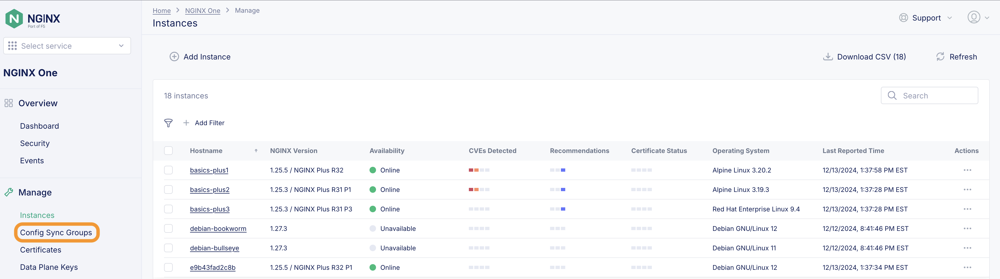<br/><br/>

- In the resulting panel at the top, click on the `Add Config Sync Group` button.<br/>
  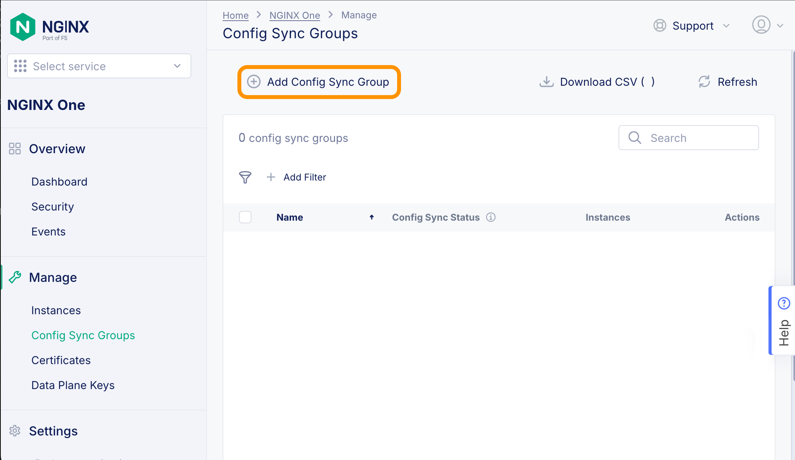<br/><br/>

- A modal window will pop up and ask you to give a name for the Config Sync Group. Here we will use the name:
  `basics-workshop-plus`<br/>
  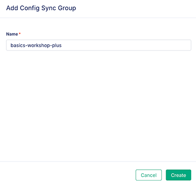<br/><br/>

### Create and add an instance to the group

On this page is a button that says `Add Instance to Config Sync Group`

<br/>

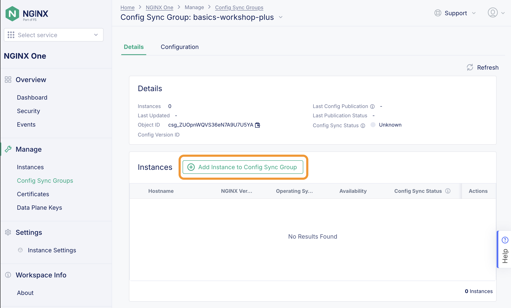

<br/>

This will pop up another modal window on the right. We will choose the second option that says: `Register a new instance with NGINX One and then add it to the config sync group`. Then proceed to click on the `Next` button.

<br/>


<br/>

The next option is to generate a dataplane key or use an existing one. We will choose `Use existing Key` and enter `$TOKEN` so that we can use the variable that we created earlier (you can also paste the value of the key itself should you choose).

<br/>


<br/>

If you are testing on bare metal, there is a curl command listed to register things. We are going to choose the `Docker Container` option which will list the steps we need to perform. There are three of them as shown in the image below. We are going to modify them a bit (you may need sudo in your environment):

<br/>

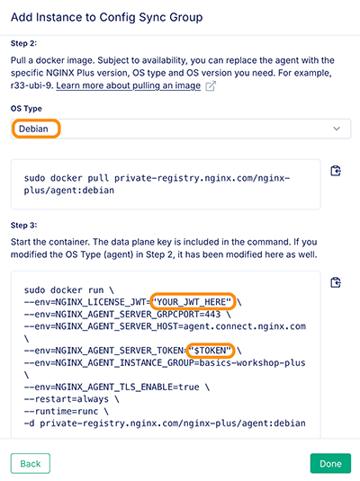

<br/>

Now that we saw the process as outlined in the NGINX One console, let's go over this again and run the provided commands in the terminal (with some modifications):

### Step 1

Confirm you are still logged in to the NGINX Private Registry. Replace `YOUR_JWT_HERE` with the content of the JSON Web Token (JWT) from MyF5 or you can use the environment variable you previously set: `$JWT`.

```bash
docker login private-registry.nginx.com --username=$JWT --password=none
```

### Step 2

Pull a docker image. Subject to availability, you can replace the agent with the specific NGINX Plus version, OS type and OS version you need. For example, r33-ubi-9. Here we are going to pull the r31 version of NGINX+ on alpine to demonstrate that.

```bash
docker pull private-registry.nginx.com/nginx-plus/agent:nginx-plus-r31-alpine-3.19-20240522
```

### Step 3

Start the container. We are going to modify the command shown in the console to use our environment variables. We are also going to add a `hostname` for the container as well as a `name` for it (to make it easier to work with).

```bash
docker run \
--hostname=basics-manual \
--name=basics-manual \
--env=NGINX_LICENSE_JWT="$JWT" \
--env=NGINX_AGENT_SERVER_GRPCPORT=443 \
--env=NGINX_AGENT_SERVER_HOST=agent.connect.nginx.com \
--env=NGINX_AGENT_SERVER_TOKEN="$TOKEN" \
--env=NGINX_AGENT_INSTANCE_GROUP=basics-workshop-plus \
--env=NGINX_AGENT_TLS_ENABLE=true \
--restart=always \
--runtime=runc \
-d private-registry.nginx.com/nginx-plus/agent:nginx-plus-r31-alpine-3.19-20240522
```

You can see that the container starts up. With a refresh on the Config Sync Groups page, you will see that the basics-workshop-plus Config Sync Group now has 1 instance in it.

<br/>

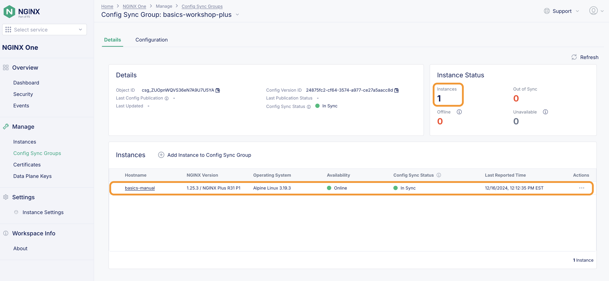

<br/>

Hey, didn't we use docker compose to start our containers before? We can add instances to this `Config Sync Group` even easier than what we did above - automatically!

Let's stop our running containers by running:

```bash
docker compose down
```

Now open up the docker-compose.yml. You can uncomment the lines numbered 14, 36, & 58. This NGINX variable is all you need to add these to the instance group:

```bash
NGINX_AGENT_INSTANCE_GROUP: basics-workshop-plus
```

Let's launch the containers again and then watch the Nginx One console to see the instances added to the Config Sync Group.

```bash
docker compose up
```

Use the refresh button and you should see the three original instances added to our config group. These will only be the Plus instances as they were the instances to which we added the variable line.

<br/>

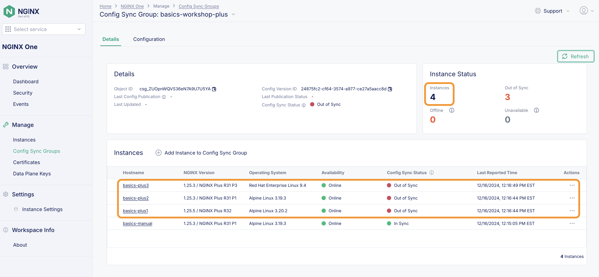

<br/>

Upon being added to the Config Instance group, NGINX One will attempt to apply the configuration of the group to the instances in it. Here we can see the config was immediately applied to **basics-plus-2**:

<br/>

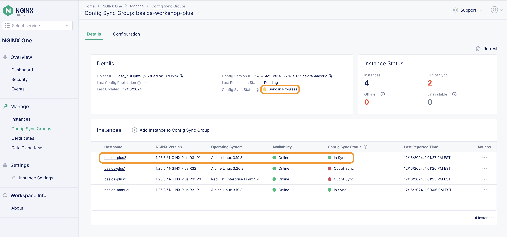

<br/>

Before this finishes, let's show we can push a change to the whole group! Click on the `Configuration` button next to the `Details`. Then click the `Edit Config` button:
<br/>

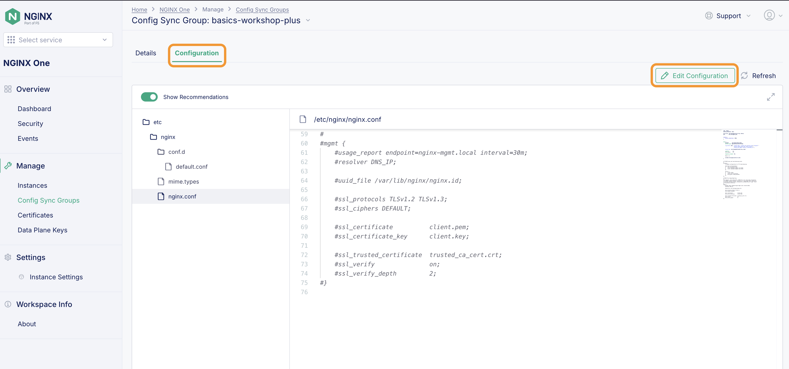

<br/>

On line 76, Let's simply add a comment, a trivial change. Then click the `Next` button.

<br/>

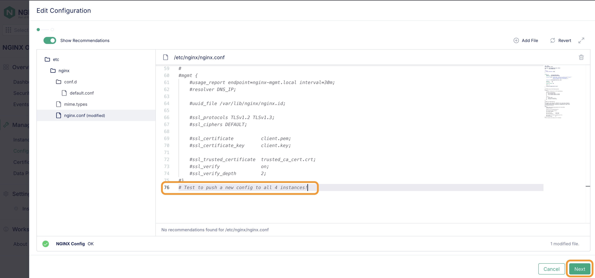

<br/>

The next screen allows you to see a diff between the two configs. After reviewing you can click `Save and Publish`.

<br>

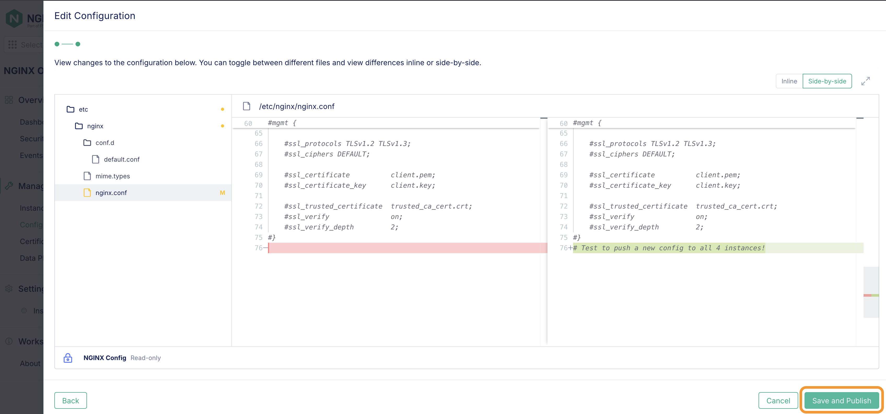

<br>

NGINX One will indicate the change was a success and push it to all of our instances. Click on the `Details` button of the group to see the status of the instances.

<br>

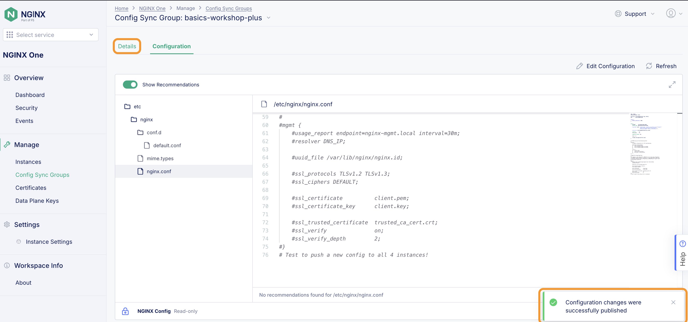

<br>

We can now see all the instances are in sync!

<br>

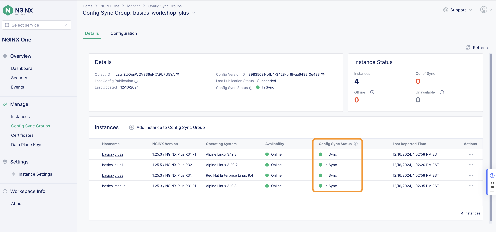

<br>

---

**NOTE**

A final note... you can `mix OSS and Plus instances` in the same group! The important caveat is that the config features must be available to all instances. If you are going to be working with NGINX Plus specific configurations, you are better off putting those into their own Config Sync Group.

---

## Wrap UP

> If you are finished with this lab, you can use Docker Compose to shut down your test environment. Make sure you are in the `lab7` folder:

```bash
docker compose down

```

```bash
##Sample output##
[+] Running 10/10
 ✔ Container basics-oss3   Removed                                                               6.4s
 ✔ Container basics-plus2  Removed                                                              10.7s
 ✔ Container web1          Removed                                                               0.5s
 ✔ Container basics-oss1   Removed                                                               5.5s
 ✔ Container web2          Removed                                                               0.4s
 ✔ Container basics-plus1  Removed                                                              10.7s
 ✔ Container web3          Removed                                                               0.5s
 ✔ Container basics-oss2   Removed                                                               6.2s
 ✔ Container basics-plus3  Removed                                                              10.6s
 ✔ Network lab7_default    Removed                                                               0.1s

```

To clean up the manual container we added:

```bash
docker ps | grep manual
f8a5fb797615   private-registry.nginx.com/nginx-plus/agent:nginx-plus-r31-alpine-3.19-20240522   "/usr/bin/supervisor…"   About an hour ago   Up About an hour   80/tcp                                                                                                                                                                         basics-manual
```

Your container id will be different. You can stop it by using `docker stop <container id>`. Another tip, if you only have a few containers, docker will identify the container id with the first few characters (assuming they are unique). Here we use the first 3 characters and that's enough for docker to know which container we are talking about:

```bash
docker stop f8a
f8a
```

As we are finished with this exercise we can fully remove the container image as well:

```bash
docker rm f8a
f8a
```

Don't forget to stop all of the Nginx containers if you are finished with them, and Delete them from the Nginx One Instance inventory.

<br/>

<br/>

This ends lab4.

<br/>

## References

- [Nginx One Console](https://docs.nginx.com/nginx-one/)

<br/>

### Authors

- Chris Akker - Solutions Architect - Community and Alliances @ F5, Inc.
- Shouvik Dutta - Solutions Architect - Community and Alliances @ F5, Inc.
- Adam Currier - Solutions Architect - Community and Alliances @ F5, Inc.

---

Navigate to ([Lab5](../lab5/readme.md) | [LabGuide](../readme.md))

