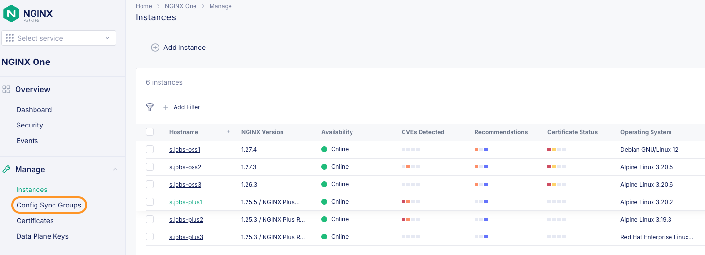
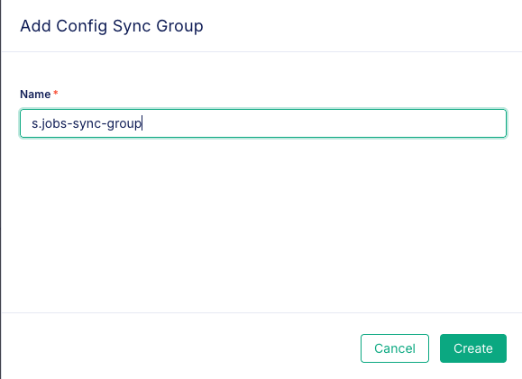
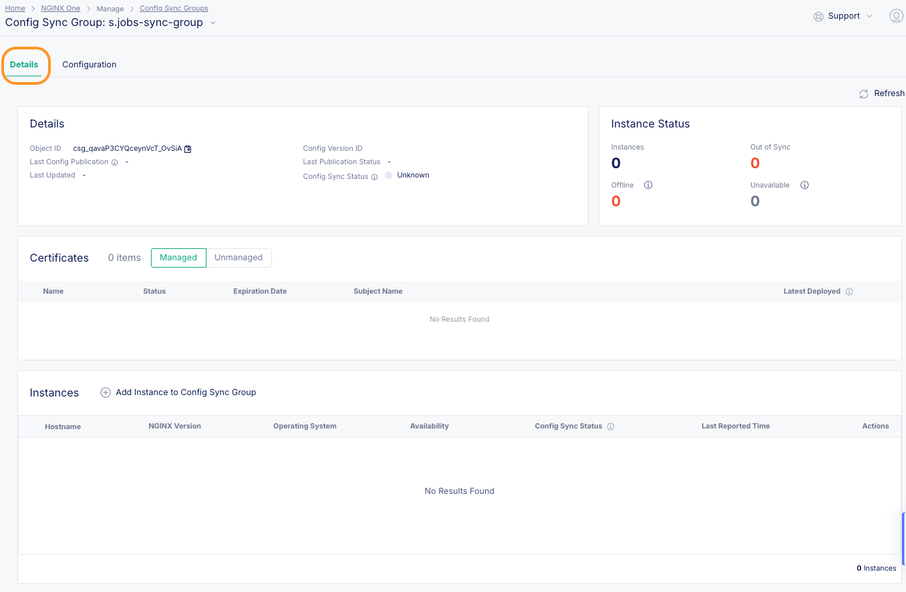
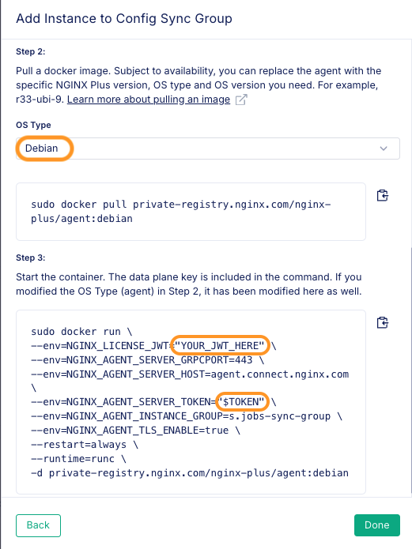
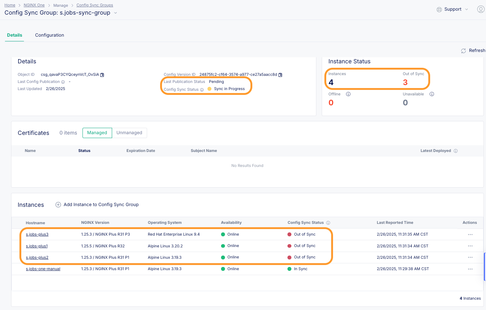
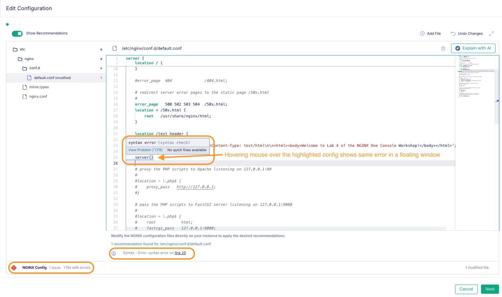
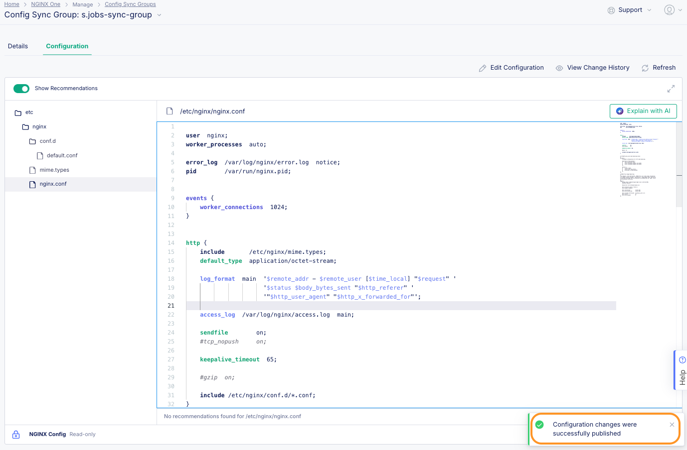
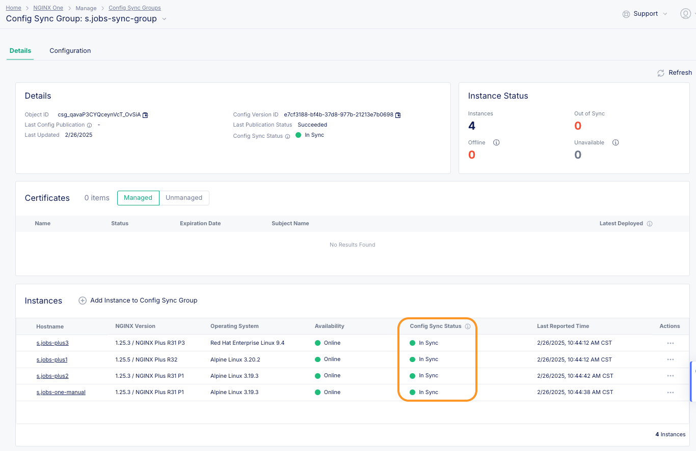

# NGINX One Console Config Sync Groups

## Introduction

In this lab, we will show how to create and manage `Config Sync Groups` in the NGINX One Console. Config sync groups synchronize NGINX configurations across multiple NGINX instances, ensuring consistency and ease of management. If you’ve used instance groups in NGINX Instance Manager, you’ll find config sync groups in NGINX One Console similar. Let's go ahead and create one then add some instances to it.

<br/>

## Learning Objectives

By the end of the lab you will be able to:

- Create a Config Sync Group
- Add instances to the group (OSS + NGINX Plus)
- Make changes and apply a default config
- Troubleshoot CSG issues

## Prerequisites

- You must have an F5 Distributed Cloud(XC) Account
- You must have enabled NGINX One service on F5 Distributed Cloud(XC)
- See `Lab0` for instructions on setting up your system for this Workshop
- You must have a dataplane key - you can use the one created from the earlier labs
- Familiarity with basic Linux concepts and commands
- Familiarity with basic NGINX concepts and commands

### Create a Config Sync Group

Config Sync Groups allow you to group multiple NGINX instances and leverage an identical configuration across all instances. This feature is extremely helpful in ephemeral environments, such as Docker and Kubernetes, as the NGINX instance can pull its configuration versus needing to rebuild the NGINX container every time the configuration changes. This section will go through using this feature.

- Under the `Manage` heading in the left hand column, click on the `Config Sync Groups` link.

  <br/><br/>

- In the resulting panel at the top, click on the `Add Config Sync Group` button.

  <br/><br/>

- A modal window will pop up and ask you to give a name for the Config Sync Group. Here you will use the name: `$NAME-sync-group` (Replace $NAME with the your `initials.lastname` like you did in lab2)

  <br/><br/>

Click the create button. Your newly created Config Sync Group `$NAME-sync-group` should be in the list.

You can now explore your Config Sync Group by selecting `$NAME-sync-group`. When you select it, there are two tabs named _Details_ and _Configuration_.

On the _Details_ tab, there are two views: _Details_ represents additional details of this group and _Instances_ represents the NGINX instances that are in this group.



On the _Configuration_ tab, there is a view that defines the NGINX configurations to use for all NGINX instances in this Config Sync Group.


Notice that the configuration is empty when you first create a Config Sync Group. There are two ways to handle the initial configuration.

- Option 1: Auto-generate the Config Sync Group's configuration by adding the first NGINX instance. The existing config from the NGINX instance will be used as the config for your Config Sync Group.

- Option 2: Manually define the NGINX configurations before adding any NGINX instances using the UI text editor.

### Option 1 - Create and add an instance to the group

On this page is a button that says `Add Instance to Config Sync Group`. Click on this.

<br/>


<br/>

This will pop up another modal window on the right. We will choose the second option that says: `Register a new instance with NGINX One Console and then add it to the config sync group`. Then proceed to click on the `Next` button.

<br/>


<br/>

The next option is to generate a dataplane key or use an existing one. We will choose `Use existing Key` and enter `$TOKEN` so that we can use the variable that we created earlier (you can also paste the value of the key itself should you choose).

<br/>


<br/>

If you are testing on bare metal, there is a curl command listed to register things. We are going to choose the `Docker Container` option which will list the steps we need to perform. There are three of them as shown in the image below. We are going to modify them a bit (you may need sudo in your environment):

<br/>



<br/>

Now that we saw the process as outlined in the NGINX One console, let's go over this again and run the provided commands in the terminal (with some modifications):

### Step 1

Confirm you are still logged in to the NGINX Private Registry. Replace `YOUR_JWT_HERE` with the content of the JSON Web Token (JWT) from MyF5 or you can use the environment variable you previously set: `$JWT`.

```bash
docker login private-registry.nginx.com --username=$JWT --password=none
```

### Step 2

Pull a docker image. Subject to availability, you can replace the agent with the specific NGINX Plus version, OS type and OS version you need. For example, r33-ubi-9. Here we are going to pull the r31 version of NGINX+ on alpine to demonstrate that.

```bash
docker pull private-registry.nginx.com/nginx-plus/agent:nginx-plus-r31-alpine-3.19-20240522
```

### Step 3

Start the container. We are going to modify the command shown in the console to use our environment variables. We are also going to add a `hostname` for the container as well as a `name` for it (to make it easier to work with).

```bash
docker run \
--hostname="$NAME"-one-manual \
--name="$NAME"-one-manual \
--env=NGINX_LICENSE_JWT="$JWT" \
--env=NGINX_AGENT_SERVER_GRPCPORT=443 \
--env=NGINX_AGENT_SERVER_HOST=agent.connect.nginx.com \
--env=NGINX_AGENT_SERVER_TOKEN="$TOKEN" \
--env=NGINX_AGENT_INSTANCE_GROUP="$NAME"-sync-group \
--env=NGINX_AGENT_TLS_ENABLE=true \
--restart=always \
--runtime=runc \
-d private-registry.nginx.com/nginx-plus/agent:nginx-plus-r31-alpine-3.19-20240522
```

You can see that the container starts up. With a refresh on the Config Sync Groups page, you will see that the `$NAME-sync-group` Config Sync Group now has 1 instance in it.

<br/>


<br/>

You can also notice that it says you are in sync! You did not populate the configuration manually, so the first container added will download the configuration and become the new default config. You will change this a bit later. Hey, didn't you use docker compose to start your containers in the previous labs? You can add those instances to this `Config Sync Group` even easier than what you did above - automatically!

Let's stop your running containers by running: (**NOTE:** Make sure you are within `labs/lab2` folder before running the command)

```bash
docker compose down
```

Now open up the _**lab2/docker-compose.yml**_ file in an editor. You can uncomment the lines numbered **14, 36, & 58**. This NGINX variable is all you need to add these to the Config Sync Group:

```bash
NGINX_AGENT_INSTANCE_GROUP: $NAME-sync-group
```

Let's launch the containers again and then watch the NGINX One Console to see the instances added to the Config Sync Group.

```bash
docker compose up --force-recreate -d
```

Use the refresh button and you should see the three new instances added to our config group. These will only be the Plus instances as they were the instances to which we added the variable line.

<br/>



<br/>

Upon being added to the Config Instance group, NGINX One Console will attempt to apply the configuration of the group to the instances in it. Here you can see the sync is still in progress and so the config sync status for **$NAME-plus1**, **$NAME-plus2** and **$NAME-plus3** instances says it is `Out of Sync`. This shows it takes a moment as the Config Sync Group applies the configuration to each new instance. You will need to refresh the UI to make sure the configs all get applied, but give it a minute. Once the `Last Publication Status` status changes from `Pending` to `Succeeded` all the instances should in `In Sync` state as shown below:

<br/>


<br/>

### Option 2 - Let's manually change the config file and apply it to the group

Let's show you can push a change to the whole group! Click on the `Configuration` button next to the `Details`.

1. When you select the _Configuration_ tab, notice the configuration here is identical to the first NGINX instance you just added. You could have pre-populated this area before any instances were added and the first instance would have pulled the config instead of pushing it's config as in the previous example. Now click the `Edit Configuration` button on the right hand side of the page:
   <br/>


<br/>

You are going to add to the contents (which were pulled from the first added instance) of the default config that will be used going forward. Click on and modify the /etc/nginx/conf.d/default.conf file. You are going to add this snippet at lines 21-25

```nginx
     location /test_header {
        add_header X-Test-App true;
        return 200 'HTTP/1.1 200 OK\nContent-Type: text/html\n\n<html><body>Welcome to Lab 4 of the NGINX One Console Workshop!</body></html>';
    }
```

<br/>
You will notice it now says (modified) in braces next to the file we changed. At the bottom left you can see that the configuration checker thinks our changes look good.

<br/>


<br/>

What would it look like if there was a problem when NGINX One Console checked the config? Lets try to place a new `server` block within the same server block (NOTE: This is an error. As nesting Server blocks is not allowed within NGINX):



<br/>

Ok so lets remove the `server{}` block so that you don't have any errors. Click on the green **Next** button. The following screen allows you to see a diff between the two configs. After reviewing you can click `Save and Publish`.

<br>


<br>

NGINX One Console will indicate the change was a success and push it to all of our instances. Click on the `Details` button of the group to see the status of the instances.

<br>



<br>

You can now see all the instances are in sync!

<br>



<br>

All new instances that you add to the Config Sync Group will inherit this configuration. If you spin up another new nginx-plus container, you can verify that it has the same configuration.

---

**NOTE**

A final note... you can _**mix OSS and Plus instances**_ in the same group! The important caveat is that the config features must be available to all instances. If you are going to be working with NGINX Plus specific configurations, you are better off putting those into their own **Config Sync Group**.

---

## Wrap Up

> If you are finished with this lab, you can use Docker Compose to shut down your test environment. Make sure you are in the `lab2` folder:

```bash
cd ../lab2
docker compose down
```

```bash
##Sample output##
[+] Running 10/10
 ✔ Container s.jobs-oss1         Removed                                                         6.1s
 ✔ Container s.jobs-web3         Removed                                                         0.3s
 ✔ Container s.jobs-web2         Removed                                                         0.2s
 ✔ Container s.jobs-plus2        Removed                                                         6.0s
 ✔ Container s.jobs-web1         Removed                                                         0.2s
 ✔ Container s.jobs-oss2         Removed                                                         6.9s
 ✔ Container s.jobs-plus1        Removed                                                         6.0s
 ✔ Container s.jobs-plus3        Removed                                                         5.2s
 ✔ Container s.jobs-oss3         Removed                                                         7.0s
 ✔ Network lab2_default          Removed                                                         0.1s
```

To clean up the manual container we added run below command:

```bash
docker stop $NAME-one-manual
```

As we are finished with this exercise we can fully remove the container image as well:

```bash
docker rm $NAME-one-manual
```

Don't forget to stop all of the NGINX containers if you are finished with them, and **Delete them from the NGINX One Console Instance inventory**.

<br/>

<br/>

This ends lab4.

<br/>

## References

- [NGINX One Console](https://docs.nginx.com/nginx-one/)
- [NGINX One Console - Manage Config Sync Groups](https://docs.nginx.com/nginx-one/how-to/config-sync-groups/manage-config-sync-groups/)

<br/>

### Authors

- Chris Akker - Solutions Architect - Community and Alliances @ F5, Inc.
- Shouvik Dutta - Solutions Architect - Community and Alliances @ F5, Inc.
- Adam Currier - Solutions Architect - Community and Alliances @ F5, Inc.

---

Navigate to ([Lab5](../lab5/readme.md) | [LabGuide](../readme.md))
