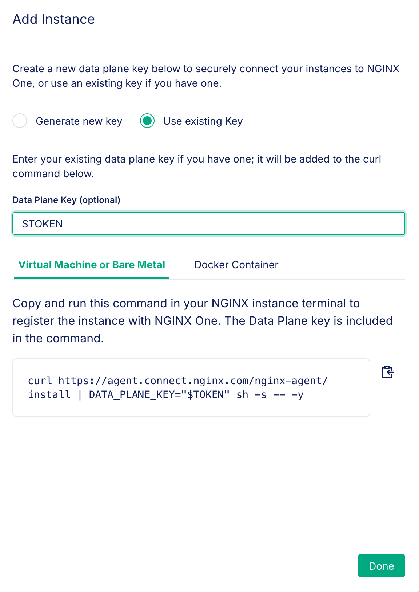
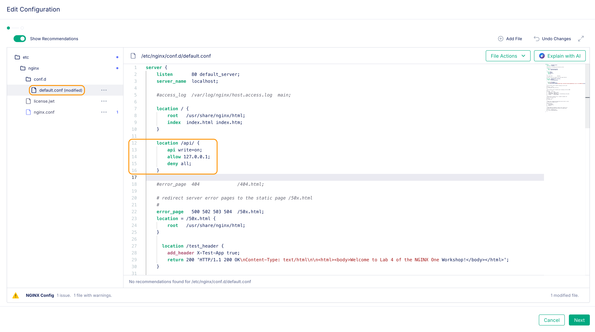
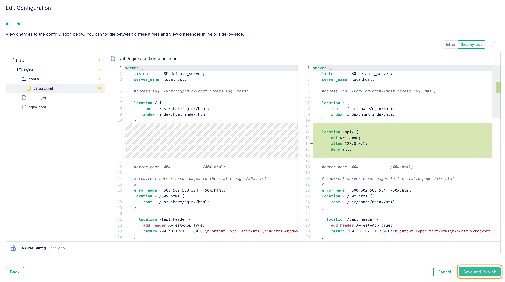

# NGINX One Console and Upgrading NGINX Plus Instances to R33

## Introduction

This lab will explore the R33 upgrade process with One Console. With release 33, your instances being managed is now a requirement. Let's explore how we can add our instances to One Console and how it will assist us in prepping our systems for the R33 upgrade. We will explore the One Console interface, create an Instance Group and look at how we can manage configs. Finally, we will show deploying a R33 container instance to One Console and upgrading our a standalone instance to R33 via One Console.

## Learning Objectives

- You will learn how to deploy a R33 version of a docker container
- You will learn how to pin a release version while installing NGINX Plus
- You will learn how to add an NGINX web server to One Console
- You will learn how to install NGINX Agent
- You will learn how to use Instance Groups to manage files
- You will learn how to upgrade your release to R33 (latest)

## Prerequisites

- You must have a license for NGINX One (jwt, key & cert)
- You must have Docker and Docker Compose installed and running
- See `Lab0` for instructions on setting up your system for this Workshop
- Familiarity with basic Linux concepts and commands
- Familiarity with basic NGINX concepts and commands

<br/>

### Deploy a container running R33 with Docker


|          NGINX One Console         |              Docker              |             NGINX Plus             |
| :--------------------------------------: | :------------------------------: | :--------------------------------: |
|  |  |  |


# Deploy an R33 instance.

Release 33 of NGINX now requires NGINX Agent to be installed along with a license for NGINX One (Not to be confused with the NGINX One Console we are working with today). It is not as painful as some have been led to believe. Let's add a new R33 instance to our lab setup.

First we need the NGINX One `license.jwt` file which you can get from [my.f5.com](https://my.f5.com). Create a new file in the lab5 folder called `license.jwt` and paste the contents into it. If you are in the F5 UDF environment, this has been done for you. The $JWT environment variable should still be set from the earlier labs, but you can check it. If it is not there, add the license to a CLI variable as you did previously:

```bash
echo $JWT
# If the result is empty, set it the JWT variable again. 
export JWT=$(cat license.jwt)

#Confirm the other two previously used variables are still set:
echo $NAME
echo $TOKEN

# If they are not set, go ahead and set them again:
export NAME=s.jobs
export TOKEN=<insert the token key for One Console that you used previously>
```

If you updated/changed the JWT token, you will need to login to docker again. Skip if everything was still set from before:

```bash
docker login private-registry.nginx.com --username=$JWT --password=none
```

In this portion of the lab we re-use a docker-compose.yml file from lab2 to deploy our containers and register with the One Console. This time we will now add an R33 (latest) version of the NGINX Plus container. Open the docker-compose file in VS Code.

```bash
vi lab5/docker-compose.yml
```

After the `plus3` instance code block we will put a new block of code for the R33 release. We will call this `plus4`, keeping in line with our naming convention for the labs.

Starting on line 74 let's uncomment this block of code (ends on line 94):

```bash
plus4: # Debian R33 NGINX Plus Web / Load Balancer
    environment:
      NGINX_AGENT_SERVER_HOST: 'agent.connect.nginx.com'
      NGINX_AGENT_SERVER_GRPCPORT: '443'
      NGINX_AGENT_TLS_ENABLE: 'true'
      NGINX_AGENT_SERVER_TOKEN: $TOKEN # Datakey Fron Nginx One Console
      NGINX_LICENSE_JWT: $JWT
      NGINX_AGENT_INSTANCE_GROUP: $NAME-sync-group
    hostname: $NAME-plus4
    container_name: $NAME-plus4
    image: private-registry.nginx.com/nginx-plus/agent:debian # From Nginx Private Registry R33
    volumes: # Sync these folders to container
      - ./nginx-plus/etc/nginx/nginx.conf:/etc/nginx/nginx.conf
      - ./nginx-plus/etc/nginx/conf.d:/etc/nginx/conf.d
      - ./nginx-plus/etc/nginx/includes:/etc/nginx/includes
      - ./nginx-plus/usr/share/nginx/html:/usr/share/nginx/html
    ports:
      - '80' # Open for HTTP
      - '443' # Open for HTTPS
      - '9000' # Open for API / Dashboard page
      - '9113' # Open for Prometheus Scraper page
    restart: always
  #
```

Save your edits. You'll notice a couple of changes from the other blocks (besides the name). The first is the environment variable called `NGINX_LICENSE_JWT: $JWT` This is what authorizes the pulling of this specific image. The second change is the image name `private-registry.nginx.com/nginx-plus/agent:debian` which pulls the debian version of the NGINX Plus with Agent installed. We will be able to see this in the One Console once deployed.

Now that this file is edited, save it and let's restart the containers. Issue the following commands:

```bash
docker compose down
docker compose up --force-recreate -d
```

<br />

# Examine in One Console

You will notice a few things in One console now. First - why are there duplicate container names?!?!? 


Containers as we know are ephemeral. Once we destroy / recreate them they re-register with the Console. You can manually clean these up (delete the grayed out versions of your images) or you can have these cleaned up automatically. Previously we used the search to narrow down the instances with your name. This time we will use the Filter feature. Choose the action of `Availability is Unavailable` then you can select your containers and use the `Delete selected` button. 


Once done, remember to clear the filter so you will be able to see the active instances.


 To automate this removal of instances, you can expand the `Settings` menu on the left hand side it will reveal an entry for `Instance Settings`. 


Clicking that will take you to a screen where you can change the cleanup to a time of your choosing. We usually leave it at 24 hours not seen, but we can set it down to a single hour. 


<details>
  <summary><b>Note</b></summary>
Make sure you aren't too aggressive with the auto cleanup as sometimes it is good to see what has been out in production over a recent period.
</details>


Now that we cleaned things up we can see the plus4 instance in our `Instances` interface.  


If we click on the instance name, now we can see the NGINX version as well as the Agent version that are deployed:


That's how easy it is to deploy an R33 instance and have it registered with One Console. Using A/B testing practices, you can move the traffic from any R32 container to the R33 instance. We can now clean up the One Console environment by issuing:

```bash
docker compose down
```


# Stand up a NGINX Plus instance on NGINX Plus R32

Let's create an NGINX instance that is pinned to version R32 ona virtual machine. This will allow us to show an upgrade from R32 to the new R33. From the jumphost you can use the terminal to get to the command line to do an install. You can also use Webshell to the nplus server or RDP directly to it. From the VS Studio Terminal window, run the following commands.

**Note: If you are using the F5 UDF environment, these files have been placed there ahead of time for your convenience. You can continue with the next step (install).

```bash
ssh nplus
cd ~/Documents

sudo mkdir -p /etc/nginx/
sudo cp license/license.jwt /etc/nginx/license.jwt

sudo mkdir -p /etc/ssl/nginx
sudo cp license/nginx-repo.* /etc/ssl/nginx/
```

With the cert and key in place we can go ahead with the install. Let's do the pre-work:

```bash
sudo apt update
sudo apt install apt-transport-https lsb-release ca-certificates wget gnupg2 ubuntu-keyring
wget -qO - https://cs.nginx.com/static/keys/nginx_signing.key     | gpg --dearmor     | sudo tee /usr/share/keyrings/nginx-archive-keyring.gpg >/dev/null
 printf "deb [signed-by=/usr/share/keyrings/nginx-archive-keyring.gpg] \
https://pkgs.nginx.com/plus/ubuntu `lsb_release -cs` nginx-plus\n" | sudo tee /etc/apt/sources.list.d/nginx-plus.list
```

For this lab, we need to pin this release version to R32 so that we can show the upgrade process. The keys we are using are good for R33, so if we simply ask for an install of nginx we will get the latest release (currently R33). To pin the release, we manually need to put the R32 branch in URL like:  `/plus/R32/`

```bash
sudo vi /etc/apt/sources.list.d/nginx-plus.list 
```
Change this line:

```bash
"https://pkgs.nginx.com/plus/ubuntu jammy nginx-plus"
```

 to:

```bash
"https://pkgs.nginx.com/plus/R32/ubuntu jammy nginx-plus"
```

Run the commands to install NGINX Plus:

```bash
sudo wget -P /etc/apt/apt.conf.d https://cs.nginx.com/static/files/90pkgs-nginx
sudo apt update
sudo apt install -y nginx-plus
```

Confirm the version that you installed:

```bash
nginx -v
```

```bash
### SAMPLE OUTPUT ###
nginx version: nginx/1.25.5 (nginx-plus-r32-p2)
```

```bash
sudo systemctl start nginx
```


## Install NGINX agent and add NGINX Plus to One Console

First, we will create a new Config Sync Group to add machines that we want to upgrade. As a best practice, you want your Config Sync Groups to only contain machines that have the exact same configuration. For example, a group for docker containers with nginx.  One for OSS instances you have. Here we are creating a group to add Virtual Machines that we want to upgrade. Follow the same process as the previous lab by clicking on `Config Sync Groups` in the left hand menu and then clicking on the `Add Config Sync Group` button.


In the Nginx One Console, click on the Instances menu in the left hand side. Click on `Add Instance` button. 


It will ask you if you want to `Generate a new key` or `Use existing key`.  We have already created a TOKEN variable in previous labs so we will use that same value.  Click on the radio button for `Use existing key`.  



In the field labeled `Data Plane Key (optional)`, type in the environment variable `$TOKEN`.  This will customize the curl command. For this example, we will use `Virtual Machine or Bare Metal` tab. You will see the command to install agent and register the instance with One Console.

Confirm or set your environment variables:

```bash
export NAME=s.jobs
export TOKEN=<insert token here>
export JWT=$(cat /home/ubuntu/Documents/license/license.jwt)
```
Install the NGINX Agent and register with the One Console:

```bash
curl https://agent.connect.nginx.com/nginx-agent/install | DATA_PLANE_KEY="$TOKEN" sh -s -- -y 
```
Now that agent is installed, there are a couple of modifications we can make to get the most out of this installation.

## Enable NGINX Plus API

To collect comprehensive metrics for NGINX Plus–including bytes streamed, information about upstream systems and caches, and counts of all HTTP status codes we can add the following to the NGINX Plus configuration file:

```bash
location /api/ {
  api write=on;
  allow 127.0.0.1;
  deny all;
}
```

This configuration:
 - Enables the NGINX Plus API.
 - Allows requests only from 127.0.0.1 (localhost).
 - Blocks all other requests for security.

We can do this in the One Console - in the Config Sync Group, click on the Configuration tab. Here we will edit the `/etc/nginx/conf.d/default.con`f file. Insert the above code on lines 12-16 as shown below.



Click `Next` to load the editor comparison screen and then click on the `Save and Publish` button.




## Add to a Config Sync Group
We can get this instance to go into a One Console Config Sync Group with a small config change. Go back to your jumphost and Visual Studio, and in the terminal make sure you are on the nplus server. If not ssh to it with `ssh nplus`. 

We can add one line to the config `/etc/nginx-agent/agent-dynamic.conf` file:

```bash
cd  /var/lib/nginx-agent 
sudo vi agent-dynamic.conf 
```
add the following line to the bottom of the file (use your name in place of s.jobs - meaning the one you used for the group above):

```bash
instance_group: s.jobs-nginx-plus-vm
```

### Restart the agent to add to the group.

```bash
sudo systemctl start nginx-agent
sudo nginx -s reload
```
When the first instance is added to an Config Sync Group, that config becomes the default (if none existed ahead of time). Now that we have configured Agent on this system, you will see it in the Config Sync Group section we assigned it to.

We have a system added to the Config Sync Group, let's show how we can push out config changes and even new files. To do an upgrade on an R32 system, there needs to be a `license.jwt` file placed in the `/etc/nginx` folder. This prevents accidental upgrades to R33 or later from happening. Putting the file in place we can then go and upgrade each system. 


# Upgrade NGINX Plus from R32 to R33

Let's take the previous R32 install we created and upgrade it. This time we will do it with assistance from One Console. On the `nplus` system there is a directory for the NGINX One license files. The path is `~/Documents/license`

In the UDF environment, the files are already there. From the jumphost system, check via the Visual Studio terminal:

```bash
ssh nplus
cd Documents/
tree license/
```

```bash
#Sample Output
license/
├── license.jwt
├── nginx-repo.crt
└── nginx-repo.key

0 directories, 3 files
```

In the One Console we will create a new file. Pull up the Config Sync Group  - we can see there is one Instance (nplus) that is in the group.  

Click on the group name and it will bring up the Details pane. 


Click on the Configuration tab. This will show the initial config pulled from the first instance that was added. We can add our own files to this and we will do so now. Click on the `+ Add File` button.

The upgrade license file needs to be put in a certain location which is `/etc/nginx/license.jwt`. Type in that file name (including the path) and hit the green `Add` button.


Copy the value from the `~/Downloads/license/license.jwt` and enter it into this file in the NIM file. Click the `Next` button.


This will bring up a confirmation screen and we will select the green `Save and Publish` button.


On pressing this button, that new file was pushed out to the remote system. Let's confirm that by going to the terminal on the nplus system and checking. In Visual Studio terminal, you should still be on the `nplus` system. If not, do a `ssh nplus` and then we can check to see if the license file is there:


We can see the Console pushed out the new license file to the remote system. This can be a huge help in the upgrade process, as we can put 100's of instances into the instance group, then push the license.jwt file out to all of them automatically making them ready for an upgrade. Let's go ahead and upgrade the instance as we are on the server already. For our example, we pinned the release to R32. When upgrading a system, you will not be sure if the system was pinned, so let's check:

```bash
cd /etc/apt/sources.list.d/
sudo vi nginx-plus.list
```

This URL does contains R32, so it is pinned. Change this line:

```bash
"https://pkgs.nginx.com/plus/R32/ubuntu jammy nginx-plus"
```

to:

```bash
"https://pkgs.nginx.com/plus/ubuntu jammy nginx-plus"
```

Now we can do an upgrade:

```bash
sudo apt update
sudo apt upgrade nginx-plus -y
```

Confirm in One Console that the system was upgraded. Click on the `Instances` menu on the left-hand side and you will see the instance was upgraded:


You can update a single instance following this procedure for adding a license.jwt to the server. Using a Config Sync group, you can hadd 100's or 1000's of instances and have them all prepared for the upgrade.  


**This completes Lab5.**

## References

- [NGINX One Console](https://docs.nginx.com/nginx-one/)
- [NGINX Instance MAnager](https://docs.nginx.com/nginx-instance-manager)
- [NGINX Plus](https://docs.nginx.com/nginx)

### Authors

- Chris Akker - Solutions Architect - Community and Alliances @ F5, Inc.
- Shouvik Dutta - Solutions Architect - Community and Alliances @ F5, Inc.
- Adam Currier - Solutions Architect - Community and Alliances @ F5, Inc.

-------------

Navigate to [Main Menu](../readme.md))
