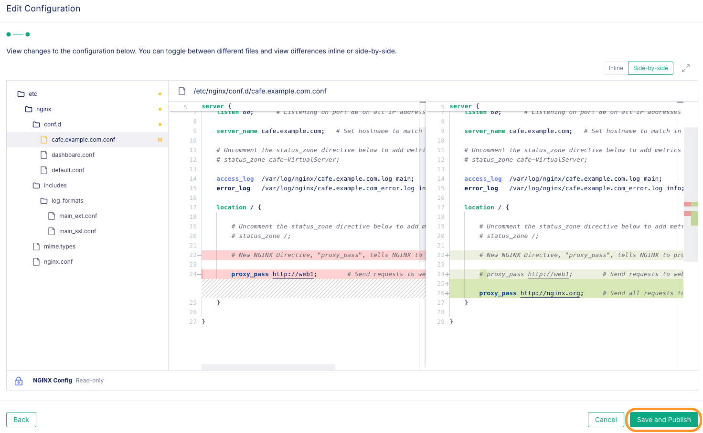
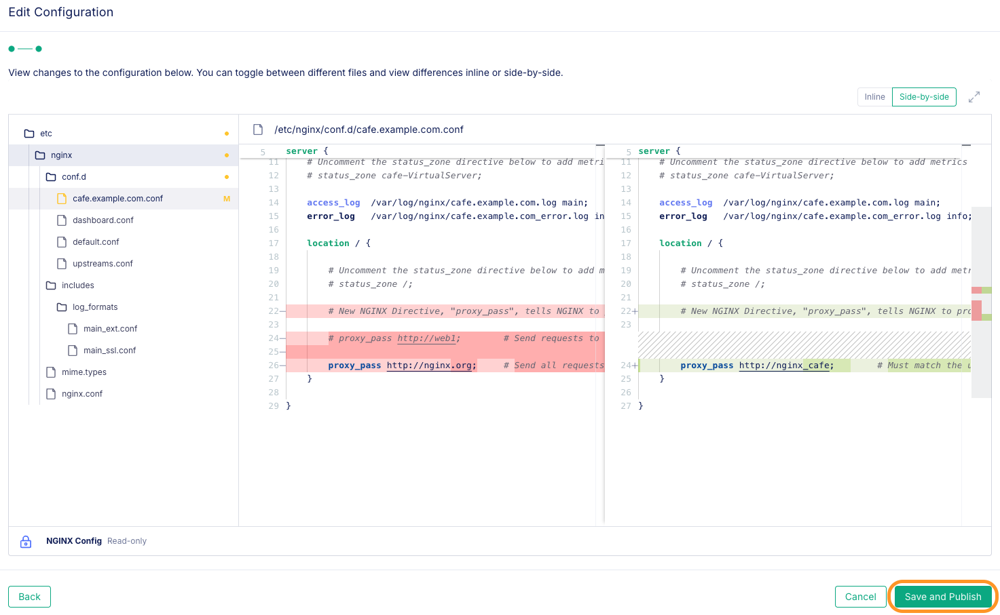
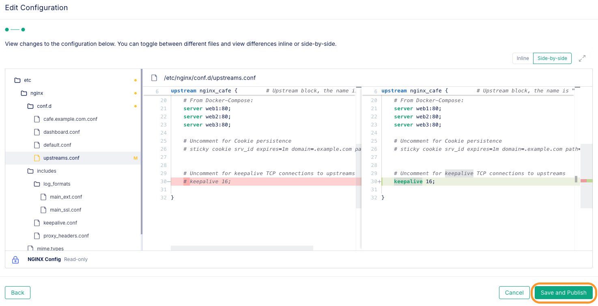

# NGINX Reverse Proxy and HTTP Load Balancing

## Introduction

In this lab, you will build a test lab environment using NGINX Plus and Docker.  This will require that you run NGINX Plus as a `Reverse Proxy and Load Balancer` in a Docker container.  Then you will run three NGINX demo web servers, to be used as your `backend` web servers.  After all the containers are running, you will test and verify each container, the NGINX Proxy and the web servers.  All of these NGINX containers will be used as a learning platform to complete the remaining Lab Exercises.  It is important to run these NGINX containers correctly to complete the exercises and receive the most benefit from the Workshop.

NGINX Plus | Docker
:-------------------------:|:-------------------------:
  |

<br/>

## Learning Objectives

By the end of the lab you will be able to:

- Compose and run an `NGINX Plus Docker` image
- Build your Workshop enviroment with Docker Compose
- Verify Container build with NGINX tests
- Configure NGINX for Proxy and Load Balancing
- Explore NGINX load balancing algorithms
- Run an HTTP Load Test tool
- Configure and test Persistence
- Add NGINX features following Best Practices

## Prerequisites

- You must have an F5 Distributed Cloud(XC) Account
- You must have enabled NGINX One service on F5 Distributed Cloud(XC)
- See `Lab0` for instructions on setting up your system for this Workshop.
- You have built all workshop components from previous section.
- Familiarity with basic Linux concepts and commands
- Familiarity with basic NGINX concepts and commands
- Proficient with the HTTP protocol


## Build the Workshop Environment with Docker Compose

For this lab you will run 4 Docker containers.  The first one will be used as an NGINX-Plus reverse proxy and load balancer, and other 3 will be used for backend web servers.


<br/>

### Configure the NGINX-Plus Docker build parameters

<br/>


1. Inspect the `docker-compose.yml` file, located in the `labs/lab5` folder.  Notice you are running the NGINX-Plus web and Proxy container, from Lab1.  

    ```bash
    ...

    services:
    nginx-plus:                     # NGINX Plus Web / Load Balancer
        environment:
            NGINX_AGENT_SERVER_HOST: 'agent.connect.nginx.com'
            NGINX_AGENT_SERVER_GRPCPORT: '443'
            NGINX_AGENT_TLS_ENABLE: 'true'
            NGINX_AGENT_SERVER_TOKEN: $TOKEN # Datakey From One Console
        hostname: $NAME-nginx-plus
        container_name: $NAME-nginx-plus
        image: private-registry.nginx.com/nginx-plus/agent:nginx-plus-r32-alpine-3.20-20240613 # CVE - From Nginx Private Registry
        volumes:                    # Sync these folders to container
            - ./nginx-plus/etc/nginx/nginx.conf:/etc/nginx/nginx.conf
            - ./nginx-plus/etc/nginx/conf.d:/etc/nginx/conf.d
            - ./nginx-plus/etc/nginx/includes:/etc/nginx/includes
            - ./nginx-plus/usr/share/nginx/html:/usr/share/nginx/html
        ports:
            - 80:80       # Open for HTTP
            - 443:443     # Open for HTTPS
            - 9000:9000   # Open for API / dashboard page
        restart: always

    ```

    Also notice in the `docker-compose.yml` you are running three Docker NGINX webserver containers, using a demo image from Docker Hub.  These will be your upstreams, backend webservers for the exercises.

    ```bash
    ...
    web1:
        hostname: $NAME-web1
        container_name: $NAME-web1
        image: nginxinc/ingress-demo       # Image from Docker Hub
        ports:
            - "80"                           # Open for HTTP
            - "443"                          # Open for HTTPS
    web2:
        hostname: $NAME-web2
        container_name: $NAME-web2
        image: nginxinc/ingress-demo
        ports:
            - "80"
            - "433"
    web3:
        hostname: $NAME-web3
        container_name: $NAME-web3
        image: nginxinc/ingress-demo
        ports:
            - "80"
            - "443"   

    ```

1. Make sure your three environment variables are still set in your Visual Studio terminal. If they are not set, then refer to lab2 to set them up before proceeding to next step.

    ```bash
    # Check if below environment variables are present in your terminal

    echo "----------------------------------------------"
    echo $TOKEN
    echo "----------------------------------------------"
    echo $JWT
    echo "----------------------------------------------"
    echo $NAME
    echo "----------------------------------------------"
    ```

1. Confirm you are still logged in to the NGINX Private Registry, using the `$JWT` environment variable for the username, as follows. (Your system may require sudo)

    ```bash
    docker login private-registry.nginx.com --username=$JWT --password=none
    ```

1. Using a Terminal, run Docker Compose to build and run your containers: 

    (**NOTE:** Make sure you are within `labs/lab5` folder before running the command)

    ```bash
    docker compose up --force-recreate -d
    ```

1. Verify all four containers are running:

    ```bash
    docker ps | grep $NAME
    ```

    ```bash
    ## Sample output ##
    CONTAINER ID   IMAGE                                                                             COMMAND                  CREATED          STATUS                 PORTS                                                                                                                 NAMES
    aa9a9e192f7e   nginxinc/ingress-demo                                                             "/docker-entrypoint.…"   40 seconds ago   Up 39 seconds          0.0.0.0:32796->80/tcp, :::32796->80/tcp, 0.0.0.0:32794->443/tcp, :::32794->443/tcp                                    s.jobs-web3
    76e3295909f6   nginxinc/ingress-demo                                                             "/docker-entrypoint.…"   40 seconds ago   Up 39 seconds          443/tcp, 0.0.0.0:32797->80/tcp, :::32797->80/tcp, 0.0.0.0:32795->433/tcp, :::32795->433/tcp                           s.jobs-web2
    c538afe67823   nginxinc/ingress-demo                                                             "/docker-entrypoint.…"   40 seconds ago   Up 39 seconds          0.0.0.0:32799->80/tcp, :::32799->80/tcp, 0.0.0.0:32798->443/tcp, :::32798->443/tcp                                    s.jobs-web1
    afb0b2736ab1   private-registry.nginx.com/nginx-plus/agent:nginx-plus-r32-alpine-3.20-20240613   "/usr/bin/supervisor…"   40 seconds ago   Up 39 seconds          0.0.0.0:80->80/tcp, :::80->80/tcp, 0.0.0.0:443->443/tcp, :::443->443/tcp, 0.0.0.0:9000->9000/tcp, :::9000->9000/tcp   s.jobs-nginx-plus
    ```

1. Verify `all` of your three web backend servers are working.  Using a Terminal, run below Docker exec curl commands hitting each backend container. Verify you get a response to the curl request.  

    ```bash
    docker exec -it $NAME-web1 curl -s http://localhost |grep $NAME-web1 
    docker exec -it $NAME-web2 curl -s http://localhost |grep $NAME-web2
    docker exec -it $NAME-web3 curl -s http://localhost |grep $NAME-web3
    ```

    ```bash
    curl -s http://localhost |grep Hostname

    ```

    ```bash
    ## Sample outputs ##

      <p class="smaller"><span>Server Name:</span> <span>s.jobs-web1</span></p>  # web1
      <p class="smaller"><span>Server Name:</span> <span>s.jobs-web2</span></p>  # web2
      <p class="smaller"><span>Server Name:</span> <span>s.jobs-web3</span></p>  # web3
    ```

1. Test the NGINX Plus container, verify it also sends back a response to a curl request:

    ```bash
    docker exec -it $NAME-nginx-plus curl http://localhost  

    ```

    ```bash
    ## Sample output ##

    <!DOCTYPE html>
    <html>
    <head>
    <title>Welcome to nginx!</title>
    
    ...snip

    <p><em>Thank you for using nginx.</em></p>
    </body>
    </html>

    ```

    Congrats - you should see the `Welcome to nginx!` page.

<br/>

### NGINX Plus Dashboard Page

<br/>

1. Test your Nginx Plus Dashboard with Chrome, is it working on http://localhost:9000/dashboard.html?

    Remember, the Nginx Plus Dashboard configuration is in the /etc/nginx/conf.d folder, `dashboard.conf` file.  The actual /dashboard.html is in the `user/share/nginx/html` folder.

    

<br/>

### NGINX Reverse Proxy

<br/>

Now that you know all 4 containers are working with the NGINX Welcome page, and the Plus Dashboard page, you can build and test the **NGINX Plus Proxy and Load Balancing** functions.  You will use a new NGINX `proxy_pass` Directive. You will first start with a Reverse Proxy configuration, test it out then add the Upstream backends and test out Load Balancing.

You will now configure a new NGINX configuration for the `cafe.example.com` website.  

This will require a new NGINX config file, for the Server and Location Blocks. Follow below steps to create the new config files:

1. Using NGINX One Console, navigate to  `Instances` and then click on your `$NAME-nginx-plus` instance.

    

1. Within the`$NAME-nginx-plus` instance, navigate to `Configuration` tab and then click on the `Edit Configuration` button to add a new file.

    

1. You will add a new file to the `etc/nginx/conf.d` folder. To do so click on `Add File` button. And then provide the new file name with full path: `etc/nginx/conf.d/cafe.example.com.conf` as shown below. Click on `Add` button to add the file. 

    

    

    This config file will store the Server and Location blocks for the new website. However, instead of a Location block that points to a folder with html content on disk, you will tell NGINX to `proxy_pass` the request to one of your three web containers instead.  

    This will show you how to unlock the amazing power of NGINX...
    - it can serve it's own WEB content
    - it can also serve content from **another web server!**

1. Copy/paste the example provided here, in your `cafe.example.com.conf` file. (Ignore the configuration recommendations for now. You will address them later in this lab.)

    ```nginx
    # cafe.example.com HTTP
    # NGINX Basics Workshop
    # Nov 2024, Chris Akker, Shouvik Dutta, Adam Currier
    #
    server {
        
        listen 80;      # Listening on port 80 on all IP addresses on this machine

        server_name cafe.example.com;   # Set hostname to match in request

        # Uncomment the status_zone directive below to add metrics to the Dashboard
        # status_zone cafe-VirtualServer;
        
        access_log  /var/log/nginx/cafe.example.com.log main; 
        error_log   /var/log/nginx/cafe.example.com_error.log info;

        location / {
            
            # Uncomment the status_zone directive below to add metrics to the Dashboard
            # status_zone /;

            # New NGINX Directive, "proxy_pass", tells NGINX to proxy traffic to another server.
            
            proxy_pass http://web1;        # Send requests to web1
        }

    } 
    
    ```

1. Click on `Next` to proceed and then click on `Save and Publish` in the side-by-side differences page.

    

1. Once the content of the file has been saved, you should see a pop up window as shown below.

    

1. Time to Test!!! Go back to Visual Studio Terminal and run below commands to test if your new `proxy_pass` configuration is working as expected. Run this command several times.

   ```bash
    curl -s http://cafe.example.com |grep Server
    ```

    ```bash
     ## Sample outputs ##
      
     #Test 1
      <p class="smaller"><span>Server Name:</span> <span>s.jobs-web1</span></p>
      <p class="smaller"><span>Server Address:</span> <span><font color="green">172.20.0.5:80</font></span></p>
      
     #Test 2
      <p class="smaller"><span>Server Name:</span> <span>s.jobs-web1</span></p>
      <p class="smaller"><span>Server Address:</span> <span><font color="green">172.20.0.5:80</font></span></p>

     #Test 3
      <p class="smaller"><span>Server Name:</span> <span>s.jobs-web1</span></p>
      <p class="smaller"><span>Server Address:</span> <span><font color="green">172.20.0.5:80</font></span></p>

    ```

1. Test it out in browser. Similar to curl, your browser refreshes should show you the "Out of stock" graphic and webpage for $NAME-web1.  

    

    Optional Exercise: If you like, change the `proxy_pass` to `web2` or `web3`, and see what happens.

    <br/>

    >This is called a `Direct proxy_pass`, where you are telling NGINX to Proxy the request to another web server.  You can also use an FQDN name, or an IP:port with proxy_pass.  In this lab environment, Docker DNS is providing the IP for web1.

    <br/>

1. You can even use proxy_pass in front of a public website. Try that, with `nginx.org`. What do you think, can you use a Docker container on your desktop to deliver someone else's website? No, that `can't` be that easy, can it?

1. Update the file `cafe.example.com.conf` using NGINX One Console and change the `proxy_pass` directive as shown in below config snippet:

    ```nginx
    # cafe.example.com HTTP
    # NGINX Basics Workshop
    # Nov 2024, Chris Akker, Shouvik Dutta, Adam Currier
    #
    server {
        
        listen 80;      # Listening on port 80 on all IP addresses on this machine

        server_name cafe.example.com;   # Set hostname to match in request

        # Uncomment the status_zone directive below to add metrics to the Dashboard
        # status_zone cafe-VirtualServer;

        access_log  /var/log/nginx/cafe.example.com.log main; 
        error_log   /var/log/nginx/cafe.example.com_error.log info;

        location / {

            # Uncomment the status_zone directive below to add metrics to the Dashboard
            # status_zone /;
            
            # New NGINX Directive, "proxy_pass", tells NGINX to proxy traffic to another website.
            
            # proxy_pass http://web1;        # Send requests to web1

            proxy_pass http://nginx.org;     # Send all requests to nginx.org website 
        }

    } 
    
    ```

1. Validate your changes in the side-by-side differences page. If everything looks good, click on `Save and Publish`

    

1. Once the content of the file has been updated and saved, you should see a pop up window as shown below.

    

1. Test the updates within browser, <http://cafe.example.com>.  Yes, that works alright, NGINX sends your cafe.example.com request to `nginx.org`.  No WAY, that's cool.

    

<br/>

### NGINX Load Balancing

<br/>

You see the `proxy_pass` working for one backend webserver, but what about the other 2 backends?  Do you need high availability, and increased capacity for your website? Of course, you want to use multiple backends for this, and load balance them.  This is very easy, as it requires only 2 configuration changes:

- Create a new .conf file for the Upstream Block
- Modify the proxy_pass to use the name of this upstream block

You will now configure the `NGINX Upstream Block`, which is a `list of backend servers` that can be used by NGINX Proxy for load balancing requests.

1. Within `etc/nginx/conf.d` folder, add a new file called `upstreams.conf`. Click on `Add` button to add the file.

    

1. This new file will be the config file for the Upstream Block with three backends - web1, web2, and web3. Copy/paste the below commands within `upstreams.conf` file.

    ```nginx
    # NGINX Basics, Plus Proxy to three upstream NGINX containers
    # Nov 2024 - Chris Akker, Shouvik Dutta, Adam Currier
    #
    # nginx_cafe servers

    upstream nginx_cafe {         # Upstream block, the name is "nginx_cafe"

        # Uncomment the zone directive below to add metrics to the Dashboard
        # zone nginx_cafe 256k;

        # Load Balancing Algorithms supported by NGINX
        # - Round Robin (Default if nothing specified)
        # - Least Connections
        # - IP Hash
        # - Hash (Any generic Hash)     

        # Uncomment for Least Time Last Byte algorithm
        # least_time last_byte;

        # From Docker-Compose:
        server web1:80;
        server web2:80;
        server web3:80;

        # Uncomment for Cookie persistence
        # sticky cookie srv_id expires=1m domain=.example.com path=/;


        # Uncomment for keepalive TCP connections to upstreams
        # keepalive 16;

    }

    ```

1. Save and Publish the `upstreams.conf` file with above content.

    

1. Modify the `proxy_pass` directive in `cafe.example.com.conf`, to proxy the requests to the `upstream` block called `nginx_cafe`.  And it goes without saying, you can have literally hundreds of upstream blocks for various backend apps, but each upstream block name must be unique.  (And you can have hundreds of backends, if you need that much capacity for your website).

    ```nginx
    # cafe.example.com HTTP
    # NGINX Basics Workshop
    # Nov 2024, Chris Akker, Shouvik Dutta, Adam Currier
    #
    server {
        
        listen 80;      # Listening on port 80 on all IP addresses on this machine

        server_name cafe.example.com;   # Set hostname to match in request

        # Uncomment the status_zone directive below to add metrics to the Dashboard
        # status_zone cafe-VirtualServer;

        access_log  /var/log/nginx/cafe.example.com.log main; 
        error_log   /var/log/nginx/cafe.example.com_error.log info;

        location / {
            
            # Uncomment the status_zone directive below to add metrics to the Dashboard
            # status_zone /;

            # New NGINX Directive, "proxy_pass", tells NGINX to proxy traffic to another server.
            
            proxy_pass http://nginx_cafe;        # Must match the upstream block name
        }

    } 
    ```

1. Validate your changes in the side-by-side differences page. If everything looks good, click on `Save and Publish`

    

1. Once the content of the file has been updated and saved, you should see a pop up window as shown below.

    

1. Test and verify that, with updated configs, `cafe.example.com` is load balancing to `all three containers`, run the curl command at least 3 times:

    ```bash
    # Run curl from outside of container (Run at least 3 times)
    curl -s http://cafe.example.com |grep Server      
    ```

    ```bash
     ## Sample outputs ##

     # Test 1
      <p class="smaller"><span>Server Name:</span> <span>s.jobs-web1</span></p>      # web1
      <p class="smaller"><span>Server Address:</span> <span><font color="green">172.20.0.5:80</font></span></p>
      
     # Test 2
      <p class="smaller"><span>Server Name:</span> <span>s.jobs-web2</span></p>      # web2
      <p class="smaller"><span>Server Address:</span> <span><font color="green">172.20.0.4:80</font></span></p>
      
     # Test 3
      <p class="smaller"><span>Server Name:</span> <span>s.jobs-web3</span></p>      # web3
      <p class="smaller"><span>Server Address:</span> <span><font color="green">172.20.0.3:80</font></span></p>

    ```

    You should see `Server Names` like `$NAME-web1`, `$NAME-web2`, and `$NAME-web3` as NGINX load balances all three backends - your NGINX-Plus is now a Reverse Proxy, and load balancing traffic to 3 web containers! Notice the `Server Address`, with the IP address of each upstream container.  Note: Your IP addresses will likely be different.

1. Test again, this time using a browser, click `Refresh` at least 3 times:

    Using your browser, go to http://cafe.example.com

    You should see the `Out of Stock` web page, note the `Server Name` and `Server Addresses`.

    NGINX Web1 | NGINX Web2 | NGINX Web3 
    :-------------------------:|:-------------------------:|:-------------------------:
      | |

    <br/>

    >This is called an `Upstream proxy_pass`, where you are telling NGINX to Proxy the request to a list of servers in the upstream block, and load balance them.

    <br/>

1. These backend application do have the following multiple paths which can also be used for testing. Feel free to try them out:
   - [http://cafe.example.com/coffee](http://cafe.example.com/coffee)
   - [http://cafe.example.com/tea](http://cafe.example.com/tea)
   - [http://cafe.example.com/icetea](http://cafe.example.com/icetea)
   - [http://cafe.example.com/beer](http://cafe.example.com/beer)
   - [http://cafe.example.com/wine](http://cafe.example.com/wine)
   - [http://cafe.example.com/cosmo](http://cafe.example.com/cosmo)
   - [http://cafe.example.com/mojito](http://cafe.example.com/mojito)
   - [http://cafe.example.com/daiquiri](http://cafe.example.com/daiquiri)

<br/>

### Update the Nginx Plus Dashboard

Now that you have a server, location, and upstream block defined, you can add these to the Nginx Plus Dashboard so you can see the traffic and metrics.  Nginx uses the  `status_zone` and `zone` Directives to allocate memory for storing the metrics, and making them available for display in the Dashboard.  The `status_zone` is used in the Server and Location blocks, the `zone` is used for the Upstream block.

1. Uncomment the `status_zone` directive in the `cafe.example.com.conf` server and location blocks, follow this example:

    ```nginx
        # cafe.example.com HTTP
        # NGINX Basics Workshop
        # Nov 2024, Chris Akker, Shouvik Dutta, Adam Currier
        #
        server {
            
            listen 80;      # Listening on port 80 on all IP addresses on this machine

            server_name cafe.example.com;   # Set hostname to match in request
            
            # Uncomment the status_zone directive below to add metrics to the Dashboard
            status_zone cafe-VirtualServer;

            access_log  /var/log/nginx/cafe.example.com.log main; 
            error_log   /var/log/nginx/cafe.example.com_error.log info;

            location / {
                
                # Uncomment the status_zone directive below to add metrics to the Dashboard
                status_zone /;

                # New NGINX Directive, "proxy_pass", tells NGINX to proxy traffic to another server.
                
                proxy_pass http://nginx_cafe;        # Send requests to upstreams
            }

        } 

    ```

1. Uncomment the `zone` directive to your Upstream block, in `upstreams.conf`, as follows:

    ```nginx
        # NGINX Basics, Plus Proxy to three upstream NGINX containers
        # Nov 2024 - Chris Akker, Shouvik Dutta, Adam Currier
        #
        # nginx_cafe servers

        upstream nginx_cafe {         # Upstream block, the name is "nginx_cafe"

        # Uncomment the zone directive below to add metrics to the Dashboard
        zone nginx_cafe 256k;

            # Load Balancing Algorithms supported by NGINX
            # - Round Robin (Default if nothing specified)
            # - Least Connections
            # - IP Hash
            # - Hash (Any generic Hash)

            # Load Balancing Algorithms supported by NGINX Plus
            # - Least Time Last Byte / Header
            # - Random Two     

            # Uncomment for Least Time Last Byte algorithm      
            # least_time last_byte;

            # From Docker-Compose:
            server web1:80;
            server web2:80;
            server web3:80;

            # Uncomment for Cookie persistence
            # sticky cookie srv_id expires=1m domain=.example.com path=/;

            # Uncomment for keepalive TCP connections to upstreams
            # keepalive 16;

        }

    ```

1. Validate your changes in the side-by-side differences page. If everything looks good, click on `Save and Publish`.

    

1. Now check out your Plus Dashboard, at http://localhost:9000/dashboard.html.  What do you see?

    There should be new Tabs at the Top.  `HTTP Zones` are for your Virtual Servers and Location blocks.  `HTTP Upstreams` are for your backends.  Hit refresh serveral times on your cafe.example.com browser, while watching the Dashboard.  You will see the metrics values changing in realtime, as the Dashboard will update every second.

    

    

<br/>

### NGINX HTTP Protocol and Keep-alives

<br/>

Now that you have Reverse Proxy and load balancing working, you need to ensure proper information is passed to and from the backend servers.  After all, if you insert a Proxy in between the client and the server, you might lose some important information in the request or the response.  `NGINX proxy_headers` are used to restore this information, and add additional information as well using NGINX $variables.  Proxy headers are also used to control the HTTP protocol itself, which you will do first.

In this next exercise, you will define these HTTP Protocol Headers, and then tell NGINX to use them in your `cafe.example.com` Server block, so that every request and response will now include these new headers.  

**NOTE:** When NGINX proxies a request to an Upstream, it uses the HTTP/1.0 protocol by default, for legacy compatibility.  

However, this means a `new TCP connection for every request`, and is quite inefficient.  Modern apps mostly run HTTP/1.1, so you will tell NGINX to use HTTP/1.1 for Proxied requests, which allows NGINX to re-use TCP connections for multiple requests.  (This is commonly called HTTP keepalives, or HTTP pipelining).  And don't forget - HTTP/1.1 is `mandatory` for Host Headers as well, which is usually required.

<br/>

Chrome | Curl
:-------------------------:|:-------------------------:
  |

<br/>

1. Within `etc/nginx/includes` folder, add a new file called `keepalive.conf`. Click on `Add` button to add the file. Notice you are putting `keepalive.conf` in `etc/nginx/includes` folder and not the regualar `etc/nginx/conf.d` folder. It is recommended to create seperate config files for reusable configurations and use `include` directive to inject them where they are needed. This makes your configuration more human redable.

    

1. Copy/paste the below commands within `keepalive.conf` file.

    ```nginx
    # Nginx Basics keepalive.conf
    # Nov 2024 - Chris Akker, Shouvik Dutta, Adam Currier
    #
    # Default is HTTP/1.0 to upstreams, HTTP keepalives needed for HTTP/1.1
    proxy_http_version 1.1;

    # Set the Connection header to empty 
    proxy_set_header Connection "";

    # Host request header field, or the server name matching a request
    proxy_set_header Host $host;

    ```

    Notice that there are three Directives and Headers required for HTTP/1.1 to work correctly:

    - HTTP Protocol = Use the `$proxy_protocol_version` variable to set it to `1.1`.
    - HTTP Connection Header = should be blank, `""`, the default is `Close`.
    - HTTP Host = the HTTP/1.1 protocol requires the Host Header be set, `$host`

1. Save and Publish the `keepalive.conf` file with above content.

    

1. Now update your `cafe.example.com.conf` file to use the HTTP/1.1 protocol to communicate with the Upstreams. You will make use of an `include` directive here:

    ```nginx
    # cafe.example.com HTTP
    # NGINX Basics Workshop
    # Nov 2024, Chris Akker, Shouvik Dutta, Adam Currier
    #
    server {
        
        listen 80;      # Listening on port 80 on all IP addresses on this machine

        server_name cafe.example.com;   # Set hostname to match in request
        
        # Uncomment the status_zone directive below to add metrics to the Dashboard
        status_zone cafe-VirtualServer;

        access_log  /var/log/nginx/cafe.example.com.log main; 
        error_log   /var/log/nginx/cafe.example.com_error.log info;

        location / {

            # Uncomment the status_zone directive below to add metrics to the Dashboard
            status_zone /;
            
            # Enable HTTP keepalives
            include includes/keepalive.conf;     # Use HTTP/1.1 keepalives
            
            # New NGINX Directive, "proxy_pass", tells NGINX to proxy traffic to another server.
            
            proxy_pass http://nginx_cafe;        # Must match the upstream block name
        }

    } 
    ```

1. Validate your changes in the side-by-side differences page. If everything looks good, click on `Save and Publish`

    

1. Once the content of the file has been updated and saved, you should see a pop up window as shown below.

    

1. Test and verify using curl, send a request to your website, and look at the Headers sent back:

    ```bash
    # Run curl from outside of container
    curl -I http://cafe.example.com

    ```

    ```bash
    ##Sample output##

    HTTP/1.1 200 OK                          # protocol version is 1.1
    Server: nginx/1.25.5
    Date: Thu, 27 Feb 2025 23:14:36 GMT
    Content-Type: text/html; charset=utf-8
    Connection: keep-alive                   # Connection header = keep-alive
    Expires: Thu, 27 Feb 2025 23:14:35 GMT
    Cache-Control: no-cache

    ```

1. Using your browser, open its "Dev Tools", or Right-Click "Inspect" option, so you can see the browser's debugging metadata.  Visit your website, <http://cafe.example.com>.  If you click on the Network Tab, and then the first object, you will see the Request and Response Headers, and should find `Connection:` = `keep-alive` in both the Request and the Response Headers.

    

<br/>

### NGINX Custom Request Headers

<br/>

Now you need to enable some HTTP Headers, to be added to the Request.  These are often needed to relay information between the HTTP client and the backend server. These Headers are in addition to the HTTP Protocol control headers.

1. Within `etc/nginx/includes` folder, add a new file called `proxy_headers.conf`. Click on Add button to add the file.  

    

1. Copy/paste the below commands within `proxy_headers.conf` file.

    ```nginx
    # Nginx Basics proxy_headers.conf
    # Nov 2024 - Chris Akker, Shouvik Dutta, Adam Currier
    #
    ## Set Headers to the proxied servers ##

    # client address in binary format
    proxy_set_header X-Real-IP $remote_addr;

    # X-Forwarded-For client request header 
    proxy_set_header X-Forwarded-For $proxy_add_x_forwarded_for;

    # request scheme, “http” or “https”
    proxy_set_header X-Forwarded-Proto $scheme;

    ```

1. Save and Publish the `proxy_headers.conf` file with above content.

    

1. Now update your `cafe.example.com.conf` file to use the `proxy_headers.conf` added to the config using an `include` directive:

    ```nginx
    # cafe.example.com HTTP
    # NGINX Basics Workshop
    # Nov 2024, Chris Akker, Shouvik Dutta, Adam Currier
    #
    server {
        
        listen 80;      # Listening on port 80 on all IP addresses on this machine

        server_name cafe.example.com;   # Set hostname to match in request
        
        # Uncomment the status_zone directive below to add metrics to the Dashboard
        status_zone cafe-VirtualServer;

        access_log  /var/log/nginx/cafe.example.com.log main; 
        error_log   /var/log/nginx/cafe.example.com_error.log info;

        location / {

            # Uncomment the status_zone directive below to add metrics to the Dashboard
            status_zone /;
            
            # Enable HTTP keepalives
            include includes/keepalive.conf;     # Use HTTP/1.1 keepalives
            
            include includes/proxy_headers.conf; # Add Request Headers

            # New NGINX Directive, "proxy_pass", tells NGINX to proxy traffic to another server.
            
            proxy_pass http://nginx_cafe;        # Must match the upstream block name
        }

    } 

    ```

1. Validate your changes in the side-by-side differences page. If everything looks good, click on `Save and Publish`

    

1. Once the content of the file has been updated and saved, you should see a pop up window as shown below.

    

1. Using your browser, and Dev Tools, did you find the Proxy Request Headers?

<br/>

## NGINX Load Balancing Algorithms and Load Testing

<br/>

NGINX Plus | WRK
:-------------------------:|:-------------------------:
  |

<br/>   

Different backend applications may benefit from using different load balancing techniques.  NGINX support both legacy and more modern algorithms for different use cases.  You will configure and test several of these algorithms, put them under a Loadtest, and observe the results.  Then you will add/change some NGINX Settings/Directives to improve performance, and Loadtest again and see if it made any difference.

1. NGINX's default Load Balancing algorithm is round-robin, if not specified in the upstream block.  In this next lab exercise, you will use the Plus `least_time last_byte` algorithm to send more traffic to different backends based on the response time.  

1. Using NGINX One Console, update your `upstreams.conf` file to enable Least Time Last Byte, as follows:

    ```nginx
    # NGINX Basics, Plus Proxy to three upstream NGINX containers
    # Nov 2024 - Chris Akker, Shouvik Dutta, Adam Currier
    #
    # nginx_cafe servers

    upstream nginx_cafe {         # Upstream block, the name is "nginx_cafe"

        # Uncomment the zone directive below to add metrics to the Dashboard
        zone nginx_cafe 256k;

        # Load Balancing Algorithms supported by NGINX
        # - Round Robin (Default if nothing specified)
        # - Least Connections
        # - IP Hash
        # - Hash (Any generic Hash)     

        # Uncomment for Least Time Last Byte algorithm
        least_time last_byte;

        # From Docker-Compose:
        server web1:80;
        server web2:80;
        server web3:80;

        # Uncomment for Cookie persistence
        # sticky cookie srv_id expires=1m domain=.example.com path=/;

        # Uncomment for keepalive TCP connections to upstreams
        # keepalive 16;

    }

    ```

1. Validate your changes in the side-by-side differences page. If everything looks good, click on `Save and Publish`

    

1. Once the content of the file has been updated and saved, you should see a pop up window as shown below.

    

1. While watching your NGINX Plus Dashboard at <http://localhost:9000/dashboard.html>, run the `wrk` load generation tool at your nginx-plus LoadBalancer:  

    `wrk` load generation tool is a docker container that will download and run, with 4 threads, at 200 connections, for 1 minute:

    ```bash
    docker run --name wrk --network=lab5_default --rm elswork/wrk -t4 -c200 -d1m -H 'Host: cafe.example.com' --timeout 2s http://$NAME-nginx-plus/coffee

    ```

    In the `HTTP Upstreams` page, you should notice about 200 Active Connections, and the number of `server requests` should be increasing rapidly.

    After the 1 minute run of `wrk` load generation tool has finished, you should see a Summary of the statistics.  It should look similar to this:

    ```bash
    ##Sample output##
    Running 1m test @ http://s.jobs-nginx-plus/coffee
    4 threads and 200 connections
    Thread Stats   Avg      Stdev     Max   +/- Stdev
        Latency   170.33ms  130.60ms   1.38s    60.66%
        Req/Sec   297.60    324.02     1.72k    82.64%
    71007 requests in 1.00m, 111.87MB read
    Requests/sec:   1182.59                     # Good performance ?
    Transfer/sec:      1.86MB

    ```

    Well, that performance looks pretty good, about ~1200 HTTP Reqs/second (how much do you get?).  But NGINX can do better.  You will enable TCP keepalives to the Upstreams.  This Directive will tell NGINX to create a `pool of TCP connections to each Upstream`, and use that established connection pool to rapid-fire HTTP requests to the backends.  `No delays waiting for the TCP 3-way handshakes!`  It is considered a Best Practice to enable keepalives to the Upstream servers.

1. Using NGINX One Console, update your `upstreams.conf` file to uncomment the `keepalives 16` line.

    ```nginx
    ...snip

        # Uncomment for Least Time Last Byte algorithm
        least_time last_byte;

        # Docker-compose:
        server web1:80;
        server web2:80;
        server web3:80;
                            
        # Uncomment for Cookie persistence
        # sticky cookie srv_id expires=1m domain=.example.com path=/;

        # Uncomment for keepalive TCP connections to upstreams
        keepalive 16;

    }

    ```

1. Validate your changes in the side-by-side differences page. If everything looks good, click on `Save and Publish`

    

1. Once the content of the file has been updated and saved, you should see a pop up window as shown below.

    

1. Run the `wrk` load generator again. You should now have `least_time last_byte` and `keepalive` both **enabled**.

    After the 1 minute run of `wrk` load generation tool has finished, you should see a Summary of the statistics.  It should look similar to this:

    ```bash
    ##Sample output##
    Running 1m test @ http://s.jobs-nginx-plus/coffee
    4 threads and 200 connections
    Thread Stats   Avg      Stdev     Max   +/- Stdev
        Latency    41.68ms   29.71ms 434.89ms   91.38%
        Req/Sec     1.33k   435.08     2.45k    77.17%
    318197 requests in 1.00m, 501.50MB read
    Requests/sec:   5298.94         # NICE, much better!
    Transfer/sec:      8.35MB
    ```

    <br/>

    >Wow, **around FOUR times the performance**, with Upstream `keepalive` enabled - over 5300 HTTP Reqs/second.  Did you see a performance increase??  Your mileage here will vary of course, depending on what kind of machine you are using for these Docker containers.

    

    >But this points out a very important concept to be aware of: NGINX uses HTTP/1.0 to all upstreams by default.  HTTP/1.0 is limited to a single TCP connection for a single HTTP object on the web page.  If you have hundreds of web objects, you will need hundreds of TCP connections.  This is a large waste of time and resources, so adding TCP Keepalives and HTTP/1.1 will make a significant improvement in performance in most cases.

    <br/>

**(Optional Exercise)**: In this next lab exercise, you will use the `weighted` algorithm to send more traffic to different backends.

1. Using NGINX One Console, update your `upstreams.conf` file to modify the `server` entries to set an administrative ratio, as follows:

    ```nginx
    ...snip

        # Docker-compose:
        server web1:80 weight=1;   
        server web2:80 weight=3;
        server web3:80 weight=6;
        
        # Uncomment for Cookie persistence
        # sticky cookie srv_id expires=1m domain=.example.com path=/;

        # Uncomment for keepalive TCP connections to upstreams
        keepalive 16;

    }

    ```

1. Validate your changes in the side-by-side differences page. If everything looks good, click on `Save and Publish`

    

1. Once the content of the file has been updated and saved, you should see a pop up window as shown below.

    

1. Test again with curl and your browser, you should see a response distribution similar to the server weights. 10% to web1, 30% to web2, and 60% to web3.

1. For a fun test, hit it again with `wrk`...what do you observe?  Do admin weights help or hurt performance?  

    ```bash
    docker run --name wrk --network=lab5_default --rm elswork/wrk -t4 -c200 -d1m -H 'Host: cafe.example.com' --timeout 2s http://$NAME-nginx-plus/coffee

    ```

    

    So that is not too bad for a single CPU docker container.  But didn't you hear that NGINX performance improves with the number of CPUs in the machine?

    Can NGINX go faster? Yes, if you give it more resources.  Let's try `adding some CPU horsepower` and see what happens!!

1. Within NGINX One Console, check your `nginx.conf` file... does it say `worker_processes 1;` near the top?  Hmmm, NGINX is configured to use only one Worker and therefore only one CPU core.  You will change it to `FOUR`, and re-test.  Assuming you have at least 4 cores that Docker and NGINX can use:

    ```nginx
    user  nginx;
    worker_processes  4;      # Change to 4 and re-test

    error_log  /var/log/nginx/error.log info;
    pid        /var/run/nginx.pid;


    events {
        worker_connections  1024;
    }

    ...snip

    ```

    **NOTE:**  The NGINX default setting for `worker_processes` is `auto`, which means one Worker for every CPU core in the machine.  However, some Virtualization platforms, and Docker will often set this value to 1, something to be aware of and check.

1. Also update your `upstreams.conf` file to remove the `server weight=x` parameter from all three servers, and verify the load balancing algorithm is set to `least_time last_byte` .

    ```nginx
    ...snip

        # Uncomment for Least Time Last Byte algorithm
        least_time last_byte;

        # Docker-compose:
        server web1:80;   
        server web2:80;
        server web3:80;
        
        # Uncomment for Cookie persistence
        # sticky cookie srv_id expires=1m domain=.example.com path=/;

        # Uncomment for keepalive TCP connections to upstreams
        keepalive 16;

    }

    ```

1. Once the both the files has been updated validate your changes in the side-by-side differences page. If everything looks good, click on `Save and Publish`

    

1. Once the content of the file has been updated and saved, you should see a pop up window as shown below.

    

1. You should now have `4 workers`, `least_time last_byte` and `keepalive` **enabled**.  Run the `wrk` load generation tool again. **CRANK IT UP!**

    ```bash
     docker run --name wrk --network=lab5_default --rm elswork/wrk -t4 -c200 -d1m -H 'Host: cafe.example.com' --timeout 2s http://$NAME-nginx-plus/coffee
    ```

    Within the `$NAME-nginx-plus` container, run `top` to see the NGINX Workers at work.  Should look something like this:

    ```bash
    docker exec -it $NAME-nginx-plus top
    ```

    ```bash
    ##Sample output##
    Mem: 4894752K used, 11506784K free, 101004K shrd, 128764K buff, 2330160K cached
    CPU:  33% usr  38% sys   0% nic   1% idle   0% io   0% irq  25% sirq
    Load average: 6.25 2.86 1.20 13/1251 31249
    PID  PPID USER     STAT   VSZ %VSZ CPU %CPU COMMAND
        9     1 root     R    1216m   7%   1   9% /usr/bin/nginx-agent
    31044     8 nginx    R    11472   0%   0   6% nginx: worker process
    31047     8 nginx    R    11688   0%   3   6% nginx: worker process
    31045     8 nginx    R    11264   0%   0   6% nginx: worker process
    31046     8 nginx    R    11568   0%   3   6% nginx: worker process
        8     1 root     S    10472   0%   0   0% nginx: master process /usr/sbin/nginx -g daemon off;
        1     0 root     S    31224   0%   2   0% {supervisord} /usr/bin/python3 /usr/bin/supervisord -c /etc/supervisord.conf -u root --n
        7     1 root     S     1628   0%   2   0% sh -c while true; do \ echo "READY"; \ read line; \ echo $line | grep -q EXIT  && test -
    31224     0 root     R     1624   0%   3   0% top

    ```

1. Run the `wrk` load generator again for 1 minute.

    ```bash
     docker run --name wrk --network=lab5_default --rm elswork/wrk -t4 -c200 -d1m -H 'Host: cafe.example.com' --timeout 2s http://$NAME-nginx-plus/coffee
    ```

   After the 1 minute run of `wrk` load generation tool has finished, you should see a Summary of the statistics.  It should look similar to this:

    ```bash
    ##Sample output##
    Running 1m test @ http://s.jobs-nginx-plus/coffee
    4 threads and 200 connections
    Thread Stats   Avg      Stdev     Max   +/- Stdev
        Latency    32.27ms   25.45ms 482.19ms   83.75%
        Req/Sec     1.71k   471.19     3.72k    64.48%
    409418 requests in 1.00m, 645.32MB read
    Requests/sec:   6916.35         # Even better w/ 4 cores
    Transfer/sec:     10.74MB

    ```

    Around 7,000 Requests/Second from a little Docker container...not too shabby!  

    <br/>

    >**Summary:**  NGINX can and will use whatever hardware resources you provide.  And as you can see, you were shown just a few settings, but there are **MANY** NGINX configuration parameters that affect performance.  Only time, experience, and rigorous testing will determine which NGINX Directives and values will work best for Load Balancing your applications.

<br/>

### NGINX Persistence / Affinity

<br/>

With many legacy applications, the HTTP client and server must create a temporal unique relationship for the duration of the transaction or communication session.  However, when proxies or load balancers are inserted in the middle of the communication, it is important to retain this association between the client and the server. The ADC / Load Balancer industry commonly refers to this concept as `Persistence`, or `Sticky`, or `Affinity`, depending on which term the vendor has chosen to use.

With NGINX, there are several configuration options for this, but in this next lab exercise, you will use the Plus feature called `sticky`.  This will allow NGINX to send requests to the same backend based on a Set-Cookie that Nginx sends to the Client, and the client sends back to Nginx.

1. Using NGINX One console, update your `upstreams.conf` to include `sticky cookie` persistance, as follows:

    ```nginx
    # NGINX Basics, Plus Proxy to three upstream NGINX containers
    # Nov 2024 - Chris Akker, Shouvik Dutta, Adam Currier
    #
    # nginx_cafe servers

    upstream nginx_cafe {         # Upstream block, the name is "nginx_cafe"
    
       # Uncomment the zone directive below to add metrics to the Dashboard
       zone nginx_cafe 256k;

        # Load Balancing Algorithms supported by NGINX
        # - Round Robin (Default if nothing specified)
        # - Least Connections
        # - IP Hash
        # - Hash (Any generic Hash)

        # Uncomment for Least Time Last Byte algorithm      
        least_time last_byte;

        # From Docker-Compose:
        server web1:80;
        server web2:80;
        server web3:80;

        # Uncomment for Cookie persistence
        sticky cookie srv_id expires=1m domain=.example.com path=/;


        # Uncomment for keepalive TCP connections to upstreams
        keepalive 16;

    }

    ```

    The sticky cookie Directive sets the following:

    - name of the cookie, `srv_id`
    - the expiration, `1m`, set to 1 minute for testing only
    - the domain, `.example.com`
    - the path, `/`

1. Validate your changes in the side-by-side differences page. If everything looks good, click on `Save and Publish`

    

1. Once the content of the file has been updated and saved, you should see a pop up window as shown below.

    

1. Test out `sticky cookie` persistence with your browser.  Watching the Plus Dashboard Upstreams, you should now find that NGINX will always send your request to the same backend, it will no longer load balance your requests to all three backends.  If you wait over 1 minute and try again, does it pick a new Upstream?  Why?

    While using Chrome, Open Dev Tools, and Refresh - did you find the `Set-Cookie` Header and Values ?

    If you try curl, what happens ?

    ```bash
    # Run curl from outside of container
    curl -s http://cafe.example.com |grep Server    # try 5 or 6 times

    ```

    Hint:  Are you passing the cookie with curl?  Maybe a Google search will help?

    First find the Cookie and Value:

    ```bash
    curl -I http://cafe.example.com

    ```

    ```bash
    ## Sample Output ##
    HTTP/1.1 200 OK
    Server: nginx/1.25.5
    Date: Fri, 28 Feb 2025 18:34:51 GMT
    Content-Type: text/html; charset=utf-8
    Connection: keep-alive
    Set-Cookie: srv_id=e5e058108bf51b40a80786ae6d8cd0b8; expires=Fri, 28-Feb-25 18:35:51 GMT; max-age=60; domain=.example.com; path=/
    Expires: Fri, 28 Feb 2025 18:34:50 GMT
    Cache-Control: no-cache
    ```

    Then try curl with the cookie, like this example:

    ```bash
    curl -s --cookie "srv_id=e5e058108bf51b40a80786ae6d8cd0b8" http://cafe.example.com |grep Server   ## Try several times

    ```

1. Now try the `wrk` load generation tool again, with the Sticky Cookie enabled, what happens ?

    Class Discussion - what did you observe while testing Sticky Cookie ?

<br/>

## Wrap Up

1. If you need to find the `answers` to the lab exercises, you will find the final NGINX configuration files for all the exercises in the `labs/lab5/final` folder.  Use them for reference to compare how you completed the labs.

1. If you are finished with this lab move to the next lab. Please donot shut down your test environment as you would be using the same environment in lab6.

**This completes Lab5.**

<br/>

## References:

- [NGINX Plus](https://docs.nginx.com/nginx/)
- [NGINX Admin Guide](https://docs.nginx.com/nginx/admin-guide/)
- [NGINX Technical Specs](https://docs.nginx.com/nginx/technical-specs/)
- [NGINX Load Balancing Methods](https://docs.nginx.com/nginx/admin-guide/load-balancer/http-load-balancer/#choosing-a-load-balancing-method)
- [NGINX Sticky Cookie](https://docs.nginx.com/nginx/admin-guide/load-balancer/http-load-balancer/#enabling-session-persistence)
- [Docker](https://www.docker.com/)
- [Docker Compose](https://docs.docker.com/compose/)
- [WRK Docker image](https://registry.hub.docker.com/r/elswork/wrk)

<br/>

### Authors

- Chris Akker - Solutions Architect - Community and Alliances @ F5, Inc.
- Shouvik Dutta - Solutions Architect - Community and Alliances @ F5, Inc.
- Adam Currier - Solutions Architect - Community and Alliances @ F5, Inc.

-------------

Navigate to ([Lab6](../lab6/readme.md) | [Main Menu](../readme.md))
