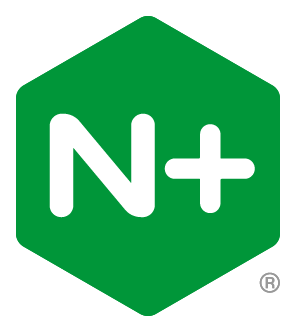

# Upgrading NGINX Plus Instances to R34

## Introduction

This lab will explore the R33-R34 upgrade process with NGINX One Console. Starting with NGINX Plus Release 33, your instances being managed is now a requirement. Let's explore how you can add your instances to NGINX One Console and how it will assist us in prepping your systems for the upgrade. You will explore the NGINX One Console interface, create an Instance Group and look at how you can manage configs. Finally, you will see deploying a R34 container instance to NGINX One Console and upgrading your standalone instance to R34 via NGINX One Console.

## Learning Objectives

- You will learn how to deploy a R34 version of a docker container
- You will learn how to add an NGINX web server to NGINX One Console
- You will learn how to install NGINX Agent
- You will learn how to use Instance Groups to manage files
- You will learn how to upgrade your release to R34 (latest)

## Prerequisites

- You must have completed Labs1-4
- You must have a license for NGINX One (jwt, key & cert)
- You must have Docker and Docker Compose installed and running
- See `Lab0` for instructions on setting up your system for this Workshop
- Familiarity with basic Linux concepts and commands
- Familiarity with basic NGINX concepts and commands

<br/>

## Deploy a container running R34 with Docker

|          NGINX One Console         |              Docker              |             NGINX Plus             |
| :--------------------------------------: | :------------------------------: | :--------------------------------: |
|  |  |  |

<br/>

### Deploy an R34 instance

Starting with Release 33, NGINX Plus requires NGINX Agent to be installed along with a license for NGINX One (Not to be confused with the NGINX One Console you are working with today). It is not as painful as some have been led to believe. You will now add the latest version of an instance to your lab setup.

1. First you need the NGINX One `license.jwt` file which you can get from [my.f5.com](https://my.f5.com). Create a new file in the lab5 folder called `license.jwt` and paste the contents into it. *If you are in the F5 UDF environment, this has been done for you.* The $JWT environment variable should still be set from the earlier labs, but you can check it. If it is not there, add the license to an environment variable as you did previously:

1. Change to the `lab5` folder for these exercises.
    
    ```bash
    cd lab5
    ```
    
    ```bash
    echo $JWT
    ```

    If the result is empty, set it the JWT variable again, you must be in the `/lab5 folder`.

    ```bash
    export JWT=$(cat ../lab2/license.jwt)
    ```

    Confirm the other two previously used variables are still set:
    
    ```bash
    echo $NAME
    echo $TOKEN
    ```

    If they are not set, go ahead and set them again:
    
    ```bash
    export NAME=<YOUR_INITIALS.LASTNAME>
    export TOKEN=<insert the dataplane key for NGINX One Console that you used previously>
    ```

1. If you updated/changed the JWT token, you will need to login to Docker again. Skip if everything was still set from before:

    ```bash
    docker login private-registry.nginx.com --username=$JWT --password=none

    ```

1. In this portion of the lab you will re-use a `docker-compose.yml` file from lab2 to deploy your containers and register with the NGINX One Console. This time you will now add an R34 (latest) version of the NGINX Plus container. Open the docker-compose file in VS Code.

    After the `plus3` instance code block you will put a new block of code for the R34 release.  You will call this `plus4`, keeping in line with your naming convention for the labs.

    Starting on line 75, let's uncomment this block of code (ends on line 96). A little tip, in VS Studio you can highlight the block of code and press `Ctrl` + `/` to uncomment the whole block at once.

    ```bash
    ### Uncomment the section below for Lab5
    plus4: # Debian R34 NGINX Plus Web / Load Balancer
        environment:
          NGINX_AGENT_SERVER_HOST: 'agent.connect.nginx.com'
          NGINX_AGENT_SERVER_GRPCPORT: '443'
          NGINX_AGENT_TLS_ENABLE: 'true'
          NGINX_AGENT_SERVER_TOKEN: $TOKEN    # Datakey Fron NGINX One Console
          NGINX_LICENSE_JWT: $JWT
          NGINX_AGENT_INSTANCE_GROUP: $NAME-sync-group
        hostname: $NAME-plus4
        container_name: $NAME-plus4
        image: private-registry.nginx.com/nginx-plus/agent:r34-debian    # From NGINX Private Registry R34
        volumes: # Sync these folders to container
          - ./nginx-plus/etc/nginx/nginx.conf:/etc/nginx/nginx.conf
          - ./nginx-plus/etc/nginx/conf.d:/etc/nginx/conf.d
          - ./nginx-plus/etc/nginx/includes:/etc/nginx/includes
          - ./nginx-plus/usr/share/nginx/html:/usr/share/nginx/html
        ports:
          - '80' # Open for HTTP
          - '443' # Open for HTTPS
          - '9000' # Open for API / Dashboard page
          - '9113' # Open for Prometheus Scraper page
        restart: always

    ```

1. Save your edits. You'll notice a couple of changes from the other blocks (besides the name). 
    - The first is the environment variable called `NGINX_LICENSE_JWT: $JWT` This is what authorizes the pulling of this specific image. 
    - The second change is the image name `private-registry.nginx.com/nginx-plus/agent:r34-debian` which pulls the R34 Debian version of NGINX Plus with Agent installed. You will be able to see this in the NGINX One Console once deployed.

1. Now that this file is edited, restart the containers. Issue the following commands:

    ```bash
    docker compose down
    docker compose up --force-recreate -d

    ```

<br />

## Examine in NGINX One Console

1. You will notice a few things in NGINX One Console now. First - why are there duplicate container names?!?!?

    

1. Containers as you know are ephemeral. Once you destroy / recreate them they re-register with the Console. You can manually clean these up (delete the grayed out versions of your images) or you can have these cleaned up automatically. Previously you used the search to narrow down the instances with your name. This time you will use the Filter feature. Choose the action of `Availability is Unavailable` then you can select your containers and use the `Delete selected` button.

    > **NOTE:** If you are in shared environment make sure you are deleting only your instances.

    

1. Once done, remember to clear the filter so you will be able to see the active instances.

    

1. **(Optional Step):** To automate this removal of instances, you can expand the `Settings` menu on the left hand side it will reveal an entry for `Instance Settings`. (Requires Admin access. See [References](#references) for details)

    

    Clicking that will take you to a screen where you can change the cleanup to a time of your choosing. The default is at 24 hours, but you can set it down to a single hour.

    

    > **NOTE:** Make sure you aren't too aggressive with the auto cleanup as sometimes it is good to see what has been out in production over a recent period.

1. Now that you have cleaned things up, you can see the `plus4` instance in your `Instances` interface.  

    

1. If you click on the `plus4` instance name, now you can see the NGINX version as well as the Agent version that are deployed:

    

That's how easy it is to deploy an R34 instance and have it registered with NGINX One Console. Using A/B testing practices, you can move the traffic from any R31/32 container to the R33 instance.

>Notice that the `plus4, R34` container was ADDED to your <$NAME-sync-group>, (from your docker-compose file, line #82).  This means it has the *SAME configuration* as the `plus1,2,3` containers.  Because the configurations are synchronized, you can easily move traffic from older R31/R32 containers to newer R33/R34 containers.

>>This is a great way to upgrade and migrate your NGINX fleet to the latest versions of NGINX!  After all the traffic has been routed to newer containers, you can safely delete older containers.


When you are finished, you can now clean up your Docker environment by issuing:

```bash
docker compose down

```

Don't forget to remove your unused instances from the NGINX One Console.

<br/>

## Confirm you have an R32 Instance

You will now start the process of upgrading a standalone web server. Confirm that you have this instance by issuing the following commands:

1. SSH to the web server:
    ```bash
    ssh nplus

    ```

1. Confirm the version that you installed:

    ```bash
    nginx -v

    ```

    ```bash
    ### SAMPLE OUTPUT ###
    nginx version: nginx/1.25.5 (nginx-plus-r32-p1)

    ```

<br/>

## Install NGINX Agent and add NGINX Plus VM to NGINX One Console

First, you will create a new Config Sync Group to add machines that you want to upgrade. As a best practice, you want your Config Sync Groups to only contain machines that will have the exact same configuration. For example, a group for docker containers with NGINX. One for OSS instances you might have. Here you are creating a group to add Virtual Machines that you want to upgrade.

1. Follow the same process as the previous lab by clicking on `Config Sync Groups` in the left hand menu and then clicking on the `Add Config Sync Group` button.

    

1. In the NGINX One Console, open your new Config Sync Group, click on the `Add Instance` button.

    

1. It will ask you if you want to `Generate a new key` or `Use existing key`. You have already created a TOKEN variable in previous labs so you will use that same value.  Click on the radio button for `Use existing key`.  

    

1. In the field labeled `Data Plane Key (optional)`, type in the environment variable `$TOKEN`. This will customize the curl command. For this example, you will use `Virtual Machine or Bare Metal` tab. You will see the command to install agent and register the instance with NGINX One Console, and add it to your Sync Group.

1. You should already be connected, but if not, use the VScode Terminal and SSH to the NGINX Plus VM.

    ```bash
    ssh nplus

    ```

1. Set your three environment variables, check them with `echo`:

    ```bash
    export NAME=<YOUR_INITIALS.LASTNAME>
    export TOKEN=<insert dataplane key here>
    export JWT=$(cat /home/ubuntu/Documents/license/license.jwt)

    ```

    ```bash
    echo $NAME
    echo $TOKEN
    echo $JWT

    ```


1. Set the hostname of your Ubuntu VM, so it displays in the NGINX One Console Instances. Use `Nginx123` for the password:

    ```bash
    hostnamectl hostname $NAME-nplus-vm

    ```

    ```bash
    ##Sample Output ##
    ==== AUTHENTICATING FOR org.freedesktop.hostname1.set-static-hostname ===
    Authentication is required to set the statically configured local hostname, as well as the pretty hostname.
    Authenticating as: Ubuntu (ubuntu)
    Password:  # Use Nginx123
    ==== AUTHENTICATION COMPLETE ===

    ```

    Verify it was set:

    ```bash
    hostname

    ```

    ```bash
    ## Sample output ##
    s.jobs-nplus-vm

    ```

1. Install the NGINX Agent and register with the NGINX One Console. You can copy/paste from the NGINX One Console, or use this example:

    ```bash
    curl https://agent.connect.nginx.com/nginx-agent/install | DATA_PLANE_KEY="$TOKEN" sh -s -- -y -c $NAME-sync-group-vm

    ```

    ```bash
    ## Sample output ##
    % Total    % Received % Xferd  Average Speed   Time    Time     Time  Current
                                    Dload  Upload   Total   Spent    Left  Speed
    100 33610    0 33610    0     0   182k      0 --:--:-- --:--:-- --:--:--  183k

    --- This script will install the NGINX Agent package ---

      1. Checking admin user ... you'll need sudo rights.
      2. Checking data plane key ... ok.
      3. Checking OS compatibility ... ubuntu detected.
      4. Adding public key ... done.
      5. Adding repository ... added.

    ...snip

    After NGINX agent is launched, it takes a couple of minutes for this system to appear in the NGINX One user interface.

    Launching nginx-agent ...
    All done.

    ```

1. Verify the nginx-agent is running:

    ``` bash
    sudo systemctl status nginx-agent

    ```

    ```bash
    ## Sample output ##
    ● nginx-agent.service - NGINX Agent
        Loaded: loaded (/etc/systemd/system/nginx-agent.service; enabled; vendor preset: enabled)
        Active: active (running) since Fri 2025-03-21 18:36:51 UTC; 8min ago
          Docs: https://github.com/nginx/agent#readme
        Process: 2963 ExecStartPre=/bin/mkdir -p /var/run/nginx-agent (code=exited, status=0/SUCCESS)
        Process: 2964 ExecStartPre=/bin/mkdir -p /var/log/nginx-agent (code=exited, status=0/SUCCESS)
      Main PID: 2965 (nginx-agent)
          Tasks: 11 (limit: 9553)
        Memory: 12.1M
            CPU: 34.276s
        CGroup: /system.slice/nginx-agent.service
                └─2965 /usr/bin/nginx-agent

    Mar 21 18:45:45 s.jobs-nplus nginx-agent[3164]: time="2025-03-21T18:45:45Z" level=info msg="Events initializing"
    Mar 21 18:45:45 s.jobs-nplus nginx-agent[3164]: time="2025-03-21T18:45:45Z" level=info msg="NGINX Counter initializing { false unix:/var/run/nginx>
    Mar 21 18:45:45 s.jobs-nplus nginx-agent[3164]: time="2025-03-21T18:45:45Z" level=info msg="Commander received meta:<timestamp:<seconds:1742582745>
    Mar 21 18:45:45 s.jobs-nplus nginx-agent[3164]: time="2025-03-21T18:45:45Z" level=info msg="setting displayName to s.jobs-nplus"
    Mar 21 18:45:45 s.jobs-nplus nginx-agent[3164]: time="2025-03-21T18:45:45Z" level=info msg="OneTimeRegistration completed"
    Mar 21 18:45:45 s.jobs-nplus nginx-agent[3164]: time="2025-03-21T18:45:45Z" level=info msg="Upload: Sending data chunk data 0 (messageId=63bc0d33->
    Mar 21 18:45:45 s.jobs-nplus nginx-agent[3164]: time="2025-03-21T18:45:45Z" level=info msg="Upload: Sending data chunk data 1 (messageId=63bc0d33->
    Mar 21 18:45:45 s.jobs-nplus nginx-agent[3164]: time="2025-03-21T18:45:45Z" level=info msg="Upload sending done 63bc0d33-d2ca-4932-a8ab-fbc3c9d0e4>
    Mar 21 18:45:45 s.jobs-nplus nginx-agent[3164]: time="2025-03-21T18:45:45Z" level=info msg="setting displayName to s.jobs-nplus"
    Mar 21 18:45:45 s.jobs-nplus nginx-agent[3164]: time="2025-03-21T18:45:45Z" level=info msg="setting displayName to s.jobs-nplus"

    ```

Now that NGINX Agent is installed, configured for your Config Sync Group, the VM should appear in the Instances and the Config Sync Group `$NAME-sync-group-vm`. There are a couple of modifications you should make to get the most out of NGINX Plus.

<br>

## Enable NGINX Plus Dashboard and API

The NGINX Plus Dashboard and API is where NGINX exposes all of the over 240 metrics available. These include:

- HTTP requests/responses
- TLS session metrics
- TCP connection metrics
- Healthcheck success, failures, servers up/down
- Response Time for both HTTP and TCP upstreams
- NGINX Caching Ram/Disk usage, Cache Hit Ratio
- NGINX DNS resolver
- NGINX Worker metrics
- And others

You can do this in the NGINX One Console - in the Config Sync Group, click on the Configuration tab, then Edit. Click the Add file button, and create `/etc/nginx/conf.d/dashboard.conf`. Use the example provide here, just copy/paste:

    ```nginx
    # NGINX Plus Basics, Nov 2024
    # Chris Akker, Shouvik Dutta, Adam Currier
    # dashboard.conf
    #
    server {
        # Conventional port for the NGINX Plus API is 8080
        listen 9000;
        access_log off;    # reduce noise in access logs

        location /api/ {
        # Enable in read-write mode
        api write=on;
        }
        # Conventional location of the NGINX Plus dashboard
        location = /dashboard.html {
            root /usr/share/nginx/html;
        }

        # Redirect requests for "/" to "/dashboard.html"
        location / {
            return 301 /dashboard.html;
        }
    }

    ```


Click `Next` to load the editor comparison screen and then click on the `Save and Publish` button.

This configuration:

- Enables the Dashboard on port 9000, at the /dashboard.html URI.
- Enables the NGINX Plus API.

<br/>

## Upgrade NGINX Plus VM from R32 to R34

You have a system added to the Config Sync Group, let's show how you can push out config changes and **even new files**. To do an upgrade on an R32 system, there needs to be a `license.jwt` file placed in the `/etc/nginx` folder. This prevents accidental upgrades to R33 or later from happening. You will use the NGINX One Console to place the required R34 license file on each VM, so then you can go and upgrade each system.

Let's take the R32 install and upgrade it. This time you will do it with assistance from NGINX One Console. On the `nplus` VM there is a directory for the NGINX One license files. The path is `~/Documents/license`.

1. In the UDF environment, the files are already there. From the jumphost, ssh to the `nplus` VM as you did earlier:

    ```bash
    ssh nplus
    cd Documents/
    tree license/

    ```

    ```bash
    #Sample Output
    license/
    ├── license.jwt
    ├── nginx-repo.crt
    └── nginx-repo.key

    0 directories, 3 files

    ```

1. In the NGINX One Console you will create a new file. Pull up the VM Config Sync Group  - you can see there is one Instance (nplus) that is in the group.  

    Click on the group name and it will bring up the _Details_ pane.

    

1. Click on the Configuration tab. This will show the initial config pulled from the first instance that was added. You can add your own files to this and you will do so now. Click on the `+ Add File` button.

    The upgrade license file must be put in a specific location which is `/etc/nginx/license.jwt`. Type in that file name (including the path) and hit the green `Add` button.

    

    Copy the value from the `lab5/license.jwt` and enter it into this file. Click the `Next` button.

    >**NOTE:** Make sure you do not add any extra spaces or characters to the license file or it would be considered invalid.

    

    This will bring up a confirmation screen and you will select the green `Save and Publish` button.

    

1. After publication, the new `license.jwt` file was pushed out to the remote system. Let's confirm that by going to the terminal on the nplus system and checking. In Visual Studio terminal, you should still be on the `nplus` system. If not, do a `ssh nplus` and then you can check to see if the license file is there:

    

    You can see the Console pushed out the new license file to the remote system. This can be a huge help in the upgrade process, as you can put 100's of instances into the Config Sync Group, then push the license.jwt file out to all of them automatically making them ready for an upgrade.

1. R32 is installed on the nplus server, and the NGINX repository is installed on the system. To upgrade, issue the following commands:

    ```bash
    sudo apt update
    sudo apt upgrade nginx-plus -y

    ```

    Confirm nginx-plus was upgraded on the VM:

    ```bash
    nginx -v

    ```

    ```bash
    ## Sample output ##
    nginx version: nginx/1.27.4 (nginx-plus-r34)

    ```

1. NGINX Agent detected the NGINX upgrade and automatically send this information to NGINX One Console. You can also confirm this with NGINX One Console that the NGINX Plus version was upgraded for the VM. Click on the `Instances` menu on the left-hand side and you will see the instance was upgraded:

    

You can update a single instance following this procedure for adding a license.jwt to the server. However, using a Config Sync Group, you can prepare 100's or 1000's of instances in your NGINX fleet and have them ready for the upgrade.  

<br/>

**This completes Lab5.**

<br/>

## References

- [NGINX One Console](https://docs.nginx.com/nginx-one/)
- [NGINX One Console Roles](https://docs.nginx.com/nginx-one/rbac/roles/)
- [NGINX Plus R33 Release Notes](https://docs.nginx.com/nginx/releases/)
- [NGINX Plus](https://docs.nginx.com/nginx)

### Authors

- Chris Akker - Solutions Architect - Community and Alliances @ F5, Inc.
- Shouvik Dutta - Solutions Architect - Community and Alliances @ F5, Inc.
- Adam Currier - Solutions Architect - Community and Alliances @ F5, Inc.

-------------

Navigate to ([LabGuide](../readme.md))
