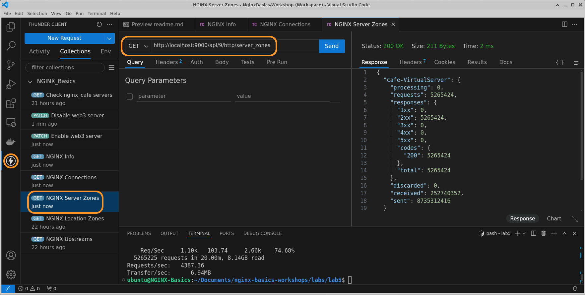

# NGINX Plus Logs, Logging and Troubleshooting

## Introduction

In this lab, you will look into enhanced logs. You will also enable Active healthchecks. You will also test out dynamic configuration reloads and Dynamic upstreams with Plus API. You will continue working on the containers that you built in the previous Lab Exercises. It is important to run these containers correctly to complete the exercises and receive the most benefit from the Workshop.

NGINX Plus | Docker
:-------------------------:|:-------------------------:
  |

## Learning Objectives

By the end of the lab you will be able to:

- Configure NGINX Extended Access Logging
- Enable and test Nginx Plus Active Healthchecks
- Test Dynamic Configuration Reloads
- Test Dynamic Upstreams with the Plus API

## Prerequisites

- You must have an F5 Distributed Cloud(XC) Account
- You must have enabled NGINX One service on F5 Distributed Cloud(XC)
- You have built all workshop components from previous section
- Familiarity with basic Linux concepts and commands
- Familiarity with basic NGINX concepts and commandsNginx-Plus container from Lab1
- (Optional) You should have Visual Studio Code installed to work through the NGINX configuration files
- (Optional) You should have `Visual Studio Thunder Client` extension tool to make calls to NGINX Plus API
- See `Lab0` for instructions on setting up your system for this Workshop

<br/>

## NGINX Extended Access Logging

At the end of lab5 exercise, you have a working NGINX Proxy, and several backends. You will now continue adding and using additional NGINX Directives, Variables, and testing them out.  In order to better see the results of these new Directives on your proxied traffic, you need better and more information in your Access logs.  The default NGINX `main` access log_format only contains a fraction of the information you need, so you will  `extend` it to include more information, especially about the Upstream backend servers.

1. In this next exercise, you will use a new `log_format` which has additional $variables added to the access.log, so you can see this metadata.  You will use the Best Practice of defining the log format ONCE, but potentially use it in many Server blocks.

1. Inspect the `main` access log_format that is the default when you install NGINX.  You will find it in the `/etc/nginx/nginx.conf` file.  As you can see, there is `nothing` in this log format about the Upstreams, Headers, or other details you need.

    ```nginx
    ...snip from /etc/nginx/nginx.conf

    log_format  main  '$remote_addr - $remote_user [$time_local] "$request" '
                    '$status $body_bytes_sent "$http_referer" '
                    '"$http_user_agent" "$http_x_forwarded_for"';

    # nothing above on Upstreams, how do you even know which server handled the request ???

    ...

    ```

1. Inspect the `main_ext.conf` configuration file, located in the `/etc/nginx/includes/log_formats` folder.  You will see there are many added $variables, some are for the request, some for proxy functions, some for the response, and several are about the Upstream (so you know which backend was chosen and used for a request).  NGINX has `hundreds` of $variables you can use, depending on what you need to see.

    ```nginx
    # Extended Log Format
    # Nginx Basics
    log_format  main_ext    'remote_addr="$remote_addr", '
                            '[time_local=$time_local], '
                            'request="$request", '
                            'status="$status", '
                            'http_referer="$http_referer", '
                            'body_bytes_sent="$body_bytes_sent", '
                            'Host="$host", '
                            'sn="$server_name", '
                            'request_time=$request_time, '
                            'http_user_agent="$http_user_agent", '
                            'http_x_forwarded_for="$http_x_forwarded_for", '
                            'request_length="$request_length", '
                            'upstream_address="$upstream_addr", '
                            'upstream_status="$upstream_status", '
                            'upstream_connect_time="$upstream_connect_time", '
                            'upstream_header_time="$upstream_header_time", '
                            'upstream_response_time="$upstream_response_time", '
                            'upstream_response_length="$upstream_response_length", ';
                            
    ```

1. You will use the Extended log_format for the next few exercises.  Using NGINX One Console, update your `cafe.example.com.conf` file to use the `main_ext` log format:

    ```nginx
    # cafe.example.com HTTP
    # NGINX Basics Workshop
    # Nov 2024, Chris Akker, Shouvik Dutta, Adam Currier
    #
    server {
        
        listen 80;      # Listening on port 80 on all IP addresses on this machine

        server_name cafe.example.com;   # Set hostname to match in request
        
        # Uncomment the status_zone directive below to add metrics to the Dashboard
        status_zone cafe-VirtualServer;

        access_log  /var/log/nginx/cafe.example.com.log main_ext;         # Change this to "main_ext"
        error_log   /var/log/nginx/cafe.example.com_error.log info;

    ...snip

    ```

1. Validate your changes in the side-by-side differences page. If everything looks good, click on `Save and Publish`

    

1. Once the content of the file has been updated and saved, you should see a pop up window as shown below.

    

1. Test your new log format.  Docker Exec into your `$NAME-nginx-plus` container.  Tail the `/var/log/nginx/cafe.example.com.log` access log file, and you will see the new Extended Log Format.

    ```bash
    docker exec -it $NAME-nginx-plus tail -f /var/log/nginx/cafe.example.com.log

    ```

1. While watching your new log format, use curl or your browser, and hit the `cafe.example.com` website a few times.

    It should look something like this (comments and line breaks added for clarity):

    ```bash
     ##Sample output##

     # Raw Output
     remote_addr="172.18.0.1", [time_local=03/Mar/2025:16:51:29 +0000], request="GET / HTTP/1.1", status="200", http_referer="-", body_bytes_sent="649", Host="cafe.example.com", sn="cafe.example.com", request_time=0.001, http_user_agent="Mozilla/5.0 (X11; Linux x86_64) AppleWebKit/537.36 (KHTML, like Gecko) Chrome/131.0.0.0 Safari/537.36", http_x_forwarded_for="-", request_length="421", upstream_address="172.18.0.3:80", upstream_status="200", upstream_connect_time="0.000", upstream_header_time="0.001", upstream_response_time="0.001", upstream_response_length="649", 

     # Formatted output with Line Breaks to make it more readable
     remote_addr="172.18.0.1", 
     [time_local=03/Mar/2025:16:51:29 +0000], 
     request="GET / HTTP/1.1", status="200", 
     http_referer="-", 
     body_bytes_sent="649", 
     Host="cafe.example.com", 
     sn="cafe.example.com", 
     request_time=0.001, 
     http_user_agent="Mozilla/5.0 (X11; Linux x86_64) AppleWebKit/537.36 (KHTML, like Gecko) Chrome/131.0.0.0 Safari/537.36", 
     http_x_forwarded_for="-", 
     request_length="421", 
     upstream_address="172.18.0.3:80", # Nice, now you know what backend was selected
     upstream_status="200", 
     upstream_connect_time="0.000", 
     upstream_header_time="0.001", 
     upstream_response_time="0.001", upstream_response_length="649",

    ```

    As you can see here, NGINX has `many $variables` that you can use, to customize the Access log_format to meet your needs.  You will find a link to NGINX Access Logging, and ALL the NGINX Variables that are availabe in the [References](#references) section below.

    It should also be pointed out, that you can use different log formats for different Hosts, Server Blocks, or even different Location Blocks, you are not limited to just one log_format.

<br/>

## Nginx Plus Active HealthChecks

In this section, you will enable active Plus Healthchecks. Active healthchecks probe your backend applications with requests in a timely fashion to check if they are up and healthy. If the upstream fails the healthchecks, it is marked Down, and will not be used for NEW connections.  Existing connections/requests are left intact.  These checks can be completely customized to match the backend application.

1. Using NGINX One Console, within `etc/nginx/conf.d` folder, add a new file called `status_ok.conf`. Click on `Add` button to add the file.

    

1. This new file will be used by healthcheck to perform a custom response check. Copy/paste the below commands within `status_ok.conf` file.

    ```nginx
    # NGINX Basics, status_ok.conf
    # Nov 2024 - Chris Akker, Shouvik Dutta, Adam Currier
    #
    # Simple health check expecting http 200 and correct Content-Type
    match status_ok {
        status 200;
        header Content-Type = "text/html; charset=utf-8";  # For the nginx-cafe html
    }
    ```

1. Save and Publish the `status_ok.conf` file with above content.

    

1. Now inspect and edit the `cafe.example.com.conf` file. At the bottom of the file, add below `location` block to enable the active healthchecks.

    ```nginx
    # cafe.example.com HTTP
    # NGINX Basics Workshop
    # Nov 2024, Chris Akker, Shouvik Dutta, Adam Currier
    #
    server {
    ...snip

        # Active Healthchecks
        location @health_check {
                internal;            # Requests by NGINX only
                proxy_set_header Host cafe.example.com;
                proxy_pass http://nginx_cafe;
                health_check interval=5s fails=3 passes=2 uri=/ match=status_ok;    

                # Health check access logs are boring but errors are interesting
                # access_log  /var/log/nginx/health_check.log  main;
                access_log off;
                error_log  /var/log/nginx/error.log error;
        }
    }

    ```

    In the above config, the health_check parameters mean the following:

    - location @health_check : internal named location, not exposed externally
    - internal : only accessible by Nginx itself
    - proxy_set_header : set the Host Header in the health check
    - proxy_pass : which upstreams to check
    - interval=5s : check every 5 secs
    - fails=3 :  mark server down after 3 failures
    - passes=2 : mark server up after 2 success
    - uri=/ : uri to check is the root (/)
    - match=status_ok : match condition is using a custom response check that is defined in the `status_ok.conf` file.  *The Upstream Response must contain an HTTP 200 status code, and must also return the Content-Type header with `text/html`.*

        ```nginx
        # Simple health check expecting http 200 and correct Content-Type
        match status_ok {
            status 200;
            header Content-Type = "text/html; charset=utf-8";  # For the nginx-cafe html
        }

        ```

1. Validate your changes in the side-by-side differences page. If everything looks good, click on `Save and Publish`

    

1. Once the content of the file has been updated and saved, you should see a pop up window as shown below.

    

1. Inspect your dashboard: [http://localhost:9000/dashboard.html](http://localhost:9000/dashboard.html). You will find the healthcheck status and metrics under the HTTP Upstreams tab.

      

1. Using terminal on your local machine, issue the following docker command to stop one of the backend nginx cafe containers to trigger a health check failure.

    ```bash
    docker stop $NAME-web3 
    ```

1. Once you have stopped the container, switch back to the browser and check the status of the backend servers.

   

    In the above screenshot, `DT` column specifies the down time for a particular backend server. `x` in `Last` column within the `Health monitors` section indicate that the last health check failed and Nginx is not sending any active traffic to this backend server.

    Refresh your browser at http://cafe.example.com several times, you will not see web3 responding, because Nginx is not load balancing any request to it.

1. NGINX also records health check failures in the `/var/log/nginx/error.log` file which is symlinked to `/dev/stderr` within our docker setup. If you run below command you can see the error.log content.

    ```bash
    docker log $NAME-nginx-plus

    ```

    ```bash
    ## Sample Output ##
    2025/03/03 17:40:47 [error] 1227#1227: upstream timed out (110: Operation timed out) while connecting to upstream, health check "status_ok" of peer 172.18.0.4:80 in upstream "nginx_cafe"
    2025/03/03 17:40:55 [error] 1227#1227: connect() failed (113: Host is unreachable) while connecting to upstream, health check "status_ok" of peer 172.18.0.4:80 in upstream "nginx_cafe"
    2025/03/03 17:41:03 [error] 1227#1227: connect() failed (113: Host is unreachable) while connecting to upstream, health check "status_ok" of peer 172.18.0.4:80 in upstream "nginx_cafe"
    2025/03/03 17:41:11 [error] 1227#1227: connect() failed (113: Host is unreachable) while connecting to upstream, health check "status_ok" of peer 172.18.0.4:80 in upstream "nginx_cafe"
    
    ...
   
    ```

    Notice there are multiple errors. The first error(`#110`) is for TCP connection error and the others(`#113`) following it are for failed HTTP health check request.  These Nginx Errors, #110 and #113, are the `first` thing you should look for when troubleshooting upstreams, if you have healthchecks enabled.

1. Once you have investigated and resolved the issues with `$NAME-web3` backend server you can start it again using below command.

    ```bash
    docker start $NAME-web3

    ```

    After 2 successive health checks, NGINX will detect `web3` backend server is healthy again and begin sending active traffic to it. Observe the NGINX Plus dashboard. You can see that the status of `web3` backend server is now green.

    

<br/>

## NGINX Dynamic Upstream Management

In this section, you will manage your backend servers dynamically using the NGINX Plus API. `$NAME-Web3` server in your workshop environment needs to undergo emergency maintainance - oh crap! But it is currently handling live active traffic. In this section you are tasked to remove it from load balancing without dropping any active traffic. And once maintainance is done, add it back so that it can handle live traffic again.

1. Keep NGINX Plus dashboard open in your browser. You will be looking at the dashboard often in this section.

1. Start the `wrk` load generation tool by downloading and running the following docker container.

   ```bash
    docker run --network=lab5_default --rm elswork/wrk -t4 -c200 -d20m -H 'Host: cafe.example.com' --timeout 2s http://$NAME-nginx-plus/coffee

   ```

    The above command will run the wrk load generation tool for 20 minutes with 200 active connections hitting `/coffee` path.

1. If you look at the `HTTP Upstreams` tab within NGINX Plus dashboard you can clearly see all three backend servers are serving the incoming requests from the load generation tool.

   

1. Open `Thunder Client` extension tool within visual studio and look into the `NGINX_Basics` collection.

    

   (**Note:** You can find the `NGINX_Basics.API_collection.json` file within the `lab5` directory. If you are not familiar with Thunder Client and would prefer running commands on terminal then please use the `curl` equivalent command provided in each step).

1. Open `Check nginx_cafe servers` request and execute the call by clicking on `Send` button. You can confirm from the response that the upstream, nginx_cafe, has three backend servers. Also note that server `web3` has `id=2`. You will use this `id` in subsequent API calls in this section.

    

    ```bash
     #[Optional] curl command if not using Thunder Client
     curl 'http://localhost:9000/api/9/http/upstreams/nginx_cafe' | jq

    ```

1. You will now set `web3` server as `down` which would inform the NGINX Master process to not direct any traffic to that server. Within Thunder Client extension, open `Disable web3 server` request and execute the call by clicking on `Send` button.

    

    ```bash
     #[Optional] curl command if not using Thunder Client
     curl --request PATCH 'http://localhost:9000/api/9/http/upstreams/nginx_cafe/servers/2' \
    --header 'Content-Type: application/json' \
    --data '{
        "down": true
    }' | jq

    ```

1. If you check your NGINX Plus Dashboard, you will notice the `web3` server has turned `grey` and also is marked as `down`. You will also notice that it is not taking any active traffic.

   
  
1. You are notified that the `web3` server has been patched and the maintenance has finished. It can now be added back to the load balancer to serve client traffic. You will now set `web3` server as `down=false` which would inform the NGINX Master process to again resume sending traffic to that server. Within Thunder Client extension, open `Enable web3 server` request and execute the call by clicking on `Send` button.

   

   ```bash
     #[Optional] curl command if not using Thunder Client
     curl --request PATCH 'http://localhost:9000/api/9/http/upstreams/nginx_cafe/servers/2' \
    --header 'Content-Type: application/json' \
    --data '{
        "down": false
    }' | jq

    ```

1. If you check your NGINX Plus Dashboard, you will notice the `web3` server has turned back `green` and is also marked as `up`. You will also notice that it is now again taking equal amount of active traffic.

   

### NGINX Live Activity Monitoring JSON feed

In this section, you will make use of NGINX Plus API to get current statistics returned in a JSON-formatted document. You can request complete statistics at `/api/[api-version]/`, where `[api-version]` is the version number of the NGINX Plus API. This API is extremely useful, as it contains all NGINX Plus metrics(over 240 metrics), which you can pull into a central monitoring tool of your choice. You will do this in future lab exercise.

1. Open `Thunder Client` extension tool within visual studio and look into the `NGINX_Basics` collection.

   (**Note:** You can find the `NGINX_Basics.API_collection.json` file within the `lab5` directory. If you are not familiar with Thunder Client and would prefer running commands on terminal then please use the `curl` equivalent command provided in each step.)

1. Open `NGINX Info` request and execute the call by clicking on `Send` button.`/api/[api-version]/nginx` is used to retrieve basic version, uptime and identification information.

    

    ```bash
     #[Optional] curl command if not using Thunder Client
     curl 'http://localhost:9000/api/9/nginx' | jq

    ```

    ```json
    ## Sample output ##
    {
    "version": "1.25.5",
    "build": "nginx-plus-r32-p1",
    "address": "172.18.0.5",
    "generation": 14,
    "load_timestamp": "2024-11-15T02:04:48.991Z",
    "timestamp": "2024-11-15T02:07:09.277Z",
    "pid": 167,
    "ppid": 1
    }

    ```

1. Open `NGINX Connections` request and execute the call by clicking on `Send` button.`/api/[api-version]/connections` is used to retrieve total active and idle connections

    

    ```bash
     #[Optional] curl command if not using Thunder Client
     curl 'http://localhost:9000/api/9/connections' | jq

    ```

    ```json
    ## Sample output ##
    {
    "accepted": 32190,
    "dropped": 0,
    "active": 1,
    "idle": 6
    }

    ```

1. Open `NGINX Server Zones` request and execute the call by clicking on `Send` button.`/api/[api-version]/http/server_zones` is used to retrieve request and response counts for each HTTP Server group.

    

    ```bash
     #[Optional] curl command if not using Thunder Client
     curl 'http://localhost:9000/api/9/http/server_zones' | jq

    ```

1. Open `NGINX Location Zones` request and execute the call by clicking on `Send` button.`/api/[api-version]/http/location_zones` is used to retrieve request and response counts for each HTTP Location group.

    

    ```bash
     #[Optional] curl command if not using Thunder Client
     curl 'http://localhost:9000/api/9/http/location_zones' | jq

    ```

1. Open `NGINX Upstreams` request and execute the call by clicking on `Send` button.`/api/[api-version]/http/upstreams` is used to retrieve request and response counts, response time, health‑check status, and uptime statistics per server in each HTTP upstream group.

    

    ```bash
     #[Optional] curl command if not using Thunder Client
     curl 'http://localhost:9000/api/9/http/upstreams' | jq

    ```

<br/>

## Wrap Up

1. If you need to find the `answers` to the lab exercises, you will find the final NGINX configuration files for all the exercises in the `labs/lab6/final` folder.  Use them for reference to compare how you completed the labs.

1. If `wrk` load generation tool is still running, then you can stop it by pressing `Ctrl + C`.

1. If you are finished with this lab, you can use Docker Compose to shut down your test environment. 

    (**NOTE:** Make sure you are within `labs/lab5` folder before running the command)

    ```bash
    docker compose down
    ```

    ```bash
    ##Sample output##
    Running 5/5
    Container s.jobs-nginx-plus         Removed
    Container s.jobs-web2               Removed
    Container s.jobs-web3               Removed
    Container s.jobs-web1               Removed                            
    Network lab5_default                Removed

    ```

1. Don't forget to stop all of the NGINX containers if you are finished with them, and **Delete them from the NGINX One Console Instance inventory**.

**This completes Lab6.**

<br/>

## References

- [NGINX Plus](https://docs.nginx.com/nginx/)
- [NGINX Admin Guide](https://docs.nginx.com/nginx/admin-guide/)
- [NGINX Technical Specs](https://docs.nginx.com/nginx/technical-specs/)
- [NGINX Access Logging](https://nginx.org/en/docs/http/ngx_http_log_module.html#access_log)
- [NGINX Variables](https://nginx.org/en/docs/varindex.html)
- [NGINX Plus API Module](https://nginx.org/en/docs/http/ngx_http_api_module.html)
- [NGINX Plus Dynamic Upstreams]( https://docs.nginx.com/nginx/admin-guide/load-balancer/dynamic-configuration-api/)

### Authors

- Chris Akker - Solutions Architect - Community and Alliances @ F5, Inc.
- Shouvik Dutta - Solutions Architect - Community and Alliances @ F5, Inc.
- Adam Currier - Solutions Architect - Community and Alliances @ F5, Inc.

-------------

Navigate to ([Lab7](../lab7/readme.md) | [Main Menu](../readme.md))
