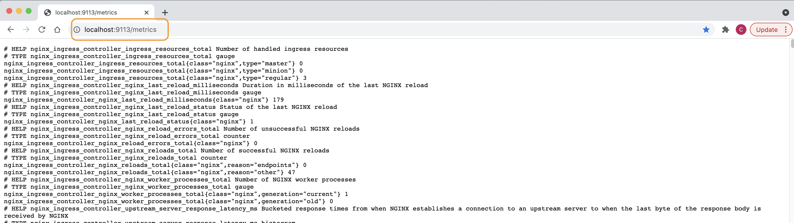

# Monitoring NGINX Plus with Prometheus and Grafana

## Introduction

In this lab, you will be exploring the integration between NGINX Plus, Prometheus and Grafana.

This Solution requires the use of the NGINX provided Javascript and Prometheus modules to collect metrics from the NGINX Plus API, and export those metrics as an HTTP html/text page, commonly called the `scaper page` because it scrapes statistics for publication.  The metrics on this export page are then read and imported into a Prometheus time-series database.  Once these metrics are in the database, you can use Grafana to create many different Dashboards, set Thresholds, Alerts, and other types of graphs for Visualization and Reporting.  As you can imagine, there are literally hundreds of Grafana dashboards written by users of NGINX that you can try out for free.  Grafana also allows you to create and edit your own Dashboards.  You will enable Prometheus on Nginx, and use Docker containers to collect and display Nginx metrics.

NGINX Plus | Prometheus | Grafana
:-------------------------:|:-------------------------:|:-----:
  | |
  
## Learning Objectives

By the end of the lab you will be able to:

- Enable and configure NGINX Javascript (NJS)
- Create Prometheus Exporter configuration
- Test the Prometheus Server
- Test the Grafana Server
- Import and View a simple NGINX Grafana Dashboard

## Prerequisites

- Nginx-Plus container from Lab5
- Nginx ONE Dataplane Key
- NginxPlus License JWT file
- You must have Docker installed and running
- You must have Docker-compose installed
- See `Lab0` for instructions on setting up your system for this Workshop
- Familiarity with basic Linux commands and commandline tools
- Familiarity with basic Docker concepts and commands
- Familiarity with basic HTTP protocol
- Familiarity with Prometheus
- Familiartiy with Grafana

<br/>

As part of your Docker image, your NGINX Plus container already has the required `NGINX Java Script and NGINX Prometheus dynamic modules` needed for Prometheus installed for you.  If you are curious, Docker Exec into your Nginx Plus container, and look in the `/etc/nginx/modules` folder for the modules available.

*NOTE:  Make sure you `docker compose down` any running containers from previous labs before starting this lab.*

1. Make sure your three environment variables are still set in your Visual Studio terminal. If they are not set, then refer to Lab2 to set them up before proceeding to next step.

    ```bash
    # Check if below environment variables are present in your terminal

    echo "----------------------------------------------"
    echo $TOKEN
    echo "----------------------------------------------"
    echo $JWT
    echo "----------------------------------------------"
    echo $NAME
    echo "----------------------------------------------"
    ```

1. Confirm you are still logged in to the NGINX Private Registry, using the `$JWT` environment variable for the username, as follows. (Your system may require sudo)

    ```bash
    docker login private-registry.nginx.com --username=$JWT --password=none

    ```
    It should respond with `Login Succeeded`.

1. Ensure you are in the `lab7` folder.  Using the VSCode Terminal, run Docker Compose to download/run all the containers.

    ```bash
     cd lab7
     docker compose up --force-recreate -d

    ```

1. Verify all SIX of your Lab7 containers have started (ignore the Guacamole container).

    ```bash
    docker ps

    ```

    ```bash
    ## Sample output ##
    CONTAINER ID   IMAGE                                                               COMMAND                  CREATED        STATUS       PORTS                                                                                                                                                            NAMES
    8664bad14c05   private-registry.nginx.com/nginx-plus/agent:nginx-plus-r32-debian   "/docker-entrypoint.…"   4 hours ago    Up 4 hours   0.0.0.0:80->80/tcp, :::80->80/tcp, 0.0.0.0:443->443/tcp, :::443->443/tcp, 0.0.0.0:9000->9000/tcp, :::9000->9000/tcp, 0.0.0.0:9113->9113/tcp, :::9113->9113/tcp   $NAME-nginx-plus
    302cdf1a17dc   nginxinc/ingress-demo                                               "/docker-entrypoint.…"   4 hours ago    Up 4 hours   443/tcp, 0.0.0.0:32779->80/tcp, :::32779->80/tcp, 0.0.0.0:32777->433/tcp, :::32777->433/tcp                                                                      $NAME-web2
    a39caa99adf0   nginxinc/ingress-demo                                               "/docker-entrypoint.…"   4 hours ago    Up 4 hours   0.0.0.0:32775->80/tcp, :::32775->80/tcp, 0.0.0.0:32774->443/tcp, :::32774->443/tcp                                                                               $NAME-web3
    173bab90ecfa   nginxinc/ingress-demo                                               "/docker-entrypoint.…"   4 hours ago    Up 4 hours   0.0.0.0:32778->80/tcp, :::32778->80/tcp, 0.0.0.0:32776->443/tcp, :::32776->443/tcp                                                                               $NAME-web1
    cc9ba360acff   prom/prometheus                                                     "/bin/prometheus --c…"   4 hours ago    Up 4 hours   0.0.0.0:9090->9090/tcp, :::9090->9090/tcp                                                                                                                        prometheus
    7bb2da3684cd   grafana/grafana                                                     "/run.sh"                4 hours ago    Up 4 hours   0.0.0.0:3000->3000/tcp, :::3000->3000/tcp                                                                                                                        grafana

    ```

1. Using the One Console, find your `<$NAME>-nginx-plus` under Manager > Instance.  Click on the name, Configuration, then Edit your `nginx.conf` file, you will make 2 changes.

    - Uncomment Line #8 to enable the `ngx_http_js_module` module.
    - Uncomment Line #37 to set a parameter for an NGINX buffer called `subrequest_output_buffer_size`.

    ```nginx
    ...snip

    user  nginx;
    worker_processes  1;

    error_log  /var/log/nginx/error.log info;
    pid        /var/run/nginx.pid;

    # Uncomment to enable NGINX JavaScript module
    load_module modules/ngx_http_js_module.so;   # Added for Prometheus

    ...snip

        # Uncomment for Prometheus scraper page output buffer
        subrequest_output_buffer_size 32k;       # Added for Prometheus

    ...snip

    ```

    

1. Also Inspect, then Edit the `/etc/nginx/conf.d/prometheus.conf` file.  This is the NGINX config file which opens up port 9113, and provides access to the scraper page.  Uncomment all the lines to enable this.

    ```nginx
    # NGINX Plus Prometheus configuration, for HTTP scraper page
    # Chris Akker, Shouvik Dutta, Adam Currier - Mar 2025
    # https://www.nginx.com/blog/how-to-visualize-nginx-plus-with-prometheus-and-grafana/
    # Nginx One
    #
    # Uncomment all lines below
    js_import /usr/share/nginx-plus-module-prometheus/prometheus.js;

    server {
    
        listen 9113;               # This is the default port for Prometheus scraper page
        
        location = /metrics {
            js_content prometheus.metrics;
        }

        location /api {
            api;
        } 

    }

    ```

    

1. After your edits are completed, click Next and Publish your changes to enable Prometheus NJS and the scraper page on port 9113.

1. Start the WRK load generation tool.  This will provide some traffic to the $NAME-nginx-plus container, so the statistics will be increasing.  You may have to change $NAME to your name, like `s.jobs-nginx-plus'.

    ```bash
    docker run --name wrk --network=lab7_default --rm elswork/wrk -t4 -c200 -d20m -H 'Host: cafe.example.com' --timeout 2s http://s.jobs-nginx-plus/coffee

    ```

1. Test the Prometheus scraper page.  Open your browser to <http://localhost:9113/metrics>.  You should see an html/text page like this one.  You will notice there are MANY statistcs available, this page is like a text version of the NGINX Plus dashboard. This page can be easily imported into many different Performance Management and Monitoring tools.  You will see how to do this in the next section with Prometheus and Grafana.

    Click refresh a couple times, and some of the metrics should increment.

    

1. Check your Nginx Plus Dashboard at <http://localhost:9000/dashboard.html>, you should also see HTTP Zone and Upstream counters incrementing during the loadtest.

<br/>

## Prometheus and Grafana Server Docker containers

<br/>

  |
--- | ---

In this section, you will use and explore the two Docker containers for the Prometheus and Grafana servers.  These servers will collect and display various metrics from the Nginx Plus container.  You will also run a load test to create some traffic and watch the metrics Dashboards in real-time.

1. Inspect your `docker-compose.yml` file, you will see it includes 2 additional Docker containers for this lab, one for a Prometheus server, and one for a Grafana server.  These have been configured to run for you, but the images will be pulled from public repos.

    ```bash
    ...snip
    
    prometheus:
        hostname: prometheus
        container_name: prometheus
        image: prom/prometheus
        volumes:
            - ./nginx-plus/etc/prometheus/prometheus.yml:/etc/prometheus/prometheus.yml
        ports:
            - "9090:9090"          # Prometheus Server Web Console
        restart: always
        depends_on:
            - nginx-plus
    grafana:
        hostname: grafana
        container_name: grafana
        volumes:
            - grafana-storage:/var/lib/grafana
        image: grafana/grafana
        ports:
            - "3000:3000"          
            - "3000:3000"          # Grafana Server Web Console
        restart: always
        depends_on:
            - nginx-plus
    volumes:
    grafana-storage:
        name: "grafana-storage"
        external: false

    ```

1. Verify these 2 containers are running.

    ```bash
    docker ps -a

    ```

    ```bash
    ##Sample output##
    CONTAINER ID   IMAGE                   COMMAND                  CREATED          STATUS          PORTS                                                                                      NAMES
    8a61c66fc511   prom/prometheus         "/bin/prometheus --c…"   36 minutes ago   Up 36 minutes   0.0.0.0:9090->9090/tcp                                                                     prometheus
    4d38710ed4ec   grafana/grafana         "/run.sh"                36 minutes ago   Up 36 minutes   0.0.0.0:3000->3000/tcp                                                                     grafana

    ...snip

    ```

If both are running, you can continue with the next section.

<br/>

### Prometheus

<br/>


<br/>

**Prometheus** is a very popular software package that can collect statistics from many different NGINX instances. The Prometheus server will collect the NGINX Plus statistics from the scraper page that you enabled in the previous section.

<br/>

1. Using Chrome, navigate to <http://localhost:9090>. You should see a Prometheus webpage like this one. In the dark grey banner, click on `Status`, then `Target Health`.  You should see that Prometheus is configured to scape statistics from your `nginx-plus` Endpoint on port 9113 (as you configured Nginx earlier).  The State should be `Green`.  Last Scrape shows how long since the last pull of data.

    

1. On the Grey Banner, click on `Query`.  Type `nginxplus_` in the query box to see a list of all the Nginx Plus statistics that Prometheus is collecting for you.  Select `nginxplus_http_requests_total` from the list, click on Graph, and then click the "Execute" Button.  Change the Time window if needed. This will provide a graph similar to this one:

    

    *Take a few minutes to explore other metrics available from NGINX Plus.  Can you find the `HTTP Upstream Response Times` of your 3 backend web servers???*

    **HINT**
    
    

    >*Pop Quiz: How much memory did Nginx use during your WRK loadtest?*

<br/>

### Grafana

<br/>


<br/>

Grafana is a popular data visualization tool, which can link to a time-series database and graphical web presentation tools. Grafana uses the Prometheus database as a `DataSource`, and allows you to create Dashboards of the Nginx statistics that are important to you.

1. Log into the Web console for Grafana at <http://localhost:3000>.  The default Login should be user/pass of `admin/admin`.  This will present the main Grafana page.

1. Create a Prometheus Data Source.  In the middle of the Grafana Welcome page, click on `Add your first Data Source`, and select Prometheus.

1. Set the Connection URL to `http://prometheus:9090` as shown.  (this is your Prometheus container):

    

1. Scroll to the bottom and click the `Save and Test` button. You should see a green `Successfully queried the Prometheus API` message.  Click the Home page link to return to the Home page.

1. Grafana Dashboard definitions can be saved as JSON files. Import the provided `labs/lab7/NGINX-Basics.json` file to see statistics like the NGINX Plus HTTP Requests Per Second, Connections, Upstream Response Times, and HTTP Response Codes.  

    - Click on `Create New Dashboard` from Home page and then `Import dashboard`.  
    - Copy and Paste the contents of the `labs/lab7/NGINX-Basics.json` file provided.
    - Click on the `Load` button.
    - Set the Datasource to `Prometheus` and then click on the `Import` button.
    - Sometimes you have change the Datasource, Dashboard ID, Name, or other settings for it to Import properly.

    You should see a Grafana Dashboard similar to this one. Set the Time Window to `Last 5 minutes`, and the Refresh to `5s`:

    

    If needed, restart your `WRK loadtest` to create some traffic and metrics to view.
    
    There are many different Grafana Dashboards available, and you have the option to create and build Dashboards to suite your needs.  NGINX Plus provides over 240 metrics for Nginx, TCP, HTTP, TLS, Virtual Servers, Location Blocks, Rate Limits, Caching, Resolvers, and Upstreams.

    Take a few minutes to explore Grafana, and you can also import shared Dashboards that other people have created, by exploring the Grafana website and searching for "nginx".

<br/>

## Wrap Up

1. If the `wrk` load generation tool is still running, then you can stop it by pressing `Ctrl + C`.

1. If you are finished with this lab, you can use Docker Compose to shut down your test environment. Make sure you are in the `lab7` folder:

    ```bash
    cd lab7
    docker compose down

    ```

    ```bash
    ##Sample output##
    Running 5/5
    Container nginx-plus         Removed
    Container web2               Removed
    Container prometheus         Removed
    Container web3               Removed
    Container web1               Removed
    Container grafana            Removed                            
    Network lab7_default         Removed

    ```

<br/>

**This completes Lab7.**

<br/>

## References:

- [NGINX Plus](https://www.nginx.com/products/nginx/)
- [NGINX Admin Guide](https://docs.nginx.com/nginx/admin-guide/)
- [NGINX Technical Specs](https://docs.nginx.com/nginx/technical-specs/)
- [NGINX Prometheus Exporter Metrics](https://github.com/nginxinc/nginx-prometheus-exporter?tab=readme-ov-file#exported-metrics)
- [Prometheus](prometheus.io)
- [Grafana](grafana.com)
- [NGINX Prometheus/Grafana Blog](https://www.f5.com/company/blog/nginx/how-to-visualize-nginx-plus-with-prometheus-and-grafana)

<br/>

### Authors

- Chris Akker - Solutions Architect - Community and Alliances @ F5, Inc.
- Shouvik Dutta - Solutions Architect - Community and Alliances @ F5, Inc.
- Adam Currier - Solutions Architect - Community and Alliances @ F5, Inc.

-------------

Navigate to ([Lab8](../lab8/readme.md) | [LabGuide](../readme.md))