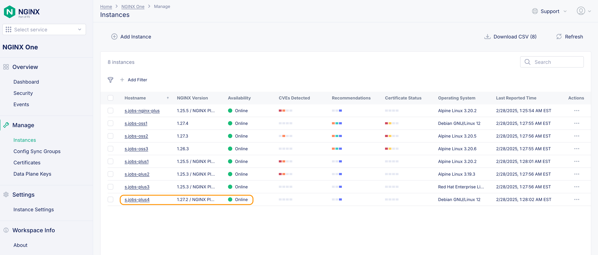

# Install an R33 instance.

Release 33 of NGINX now requires NGINX Agent to be installed along with a license for NGINX One (Not to be confused with the NGINX One Console we are working with today). It is not as painful as some have been led to believe.  Let's add a new R33 instance to our lab setup.

First we need the NGINX One `license.jwt` file which you can get from [my.f5.com](https://my.f5.com). Create a new file in the lab2 folder called `license.jwt` and paste the contents into it. Save the file and then add that to a CLI variable as you did with the original JWT token:

```bash
export JWT2=$(cat license.jwt)
```

In this lab we use a docker-compose.yml file to deploy our containers and register with the One Console. We will now add an R33 (latest) version of the NGINX Plus container. Open the docker-compose file in VS Code.

After the `plus3` instance code block we will put a new block of code for the R33 release. We will call this `plus4`, keeping in line with our naming convention for the lab.

Starting on line 74 let's enter this block of code:

```bash
plus4: # Debian R33 NGINX Plus Web / Load Balancer
    environment:
      NGINX_AGENT_SERVER_HOST: 'agent.connect.nginx.com'
      NGINX_AGENT_SERVER_GRPCPORT: '443'
      NGINX_AGENT_TLS_ENABLE: 'true'
      NGINX_AGENT_SERVER_TOKEN: $TOKEN # Datakey Fron Nginx One Console
      NGINX_LICENSE_JWT: $JWT2
      # NGINX_AGENT_INSTANCE_GROUP: $NAME-sync-group
    hostname: $NAME-plus4
    container_name: $NAME-plus4
    image: private-registry.nginx.com/nginx-plus/agent:debian # From Nginx Private Registry R33
    volumes: # Sync these folders to container
      - ./nginx-plus/etc/nginx/nginx.conf:/etc/nginx/nginx.conf
      - ./nginx-plus/etc/nginx/conf.d:/etc/nginx/conf.d
      - ./nginx-plus/etc/nginx/includes:/etc/nginx/includes
      - ./nginx-plus/usr/share/nginx/html:/usr/share/nginx/html
    ports:
      - '80' # Open for HTTP
      - '443' # Open for HTTPS
      - '9000' # Open for API / Dashboard page
      - '9113' # Open for Prometheus Scraper page
    restart: always
	#
```

Save your edits. You'll notice a couple of changes from the other blocks (besides the name). The first is the environment variable called `NGINX_LICENSE_JWT: $JWT2` This is what authorizes the pulling of this specific image. The second change is the image name `private-registry.nginx.com/nginx-plus/agent:debian` which pulls the NGINX Plus with Agent installed. We will be able to see this in the One Console once deployed.

Now that this file is edited, save it and let's restart the containers. Issue the following commands:

```bash
docker compose down
docker compose up --force-recreate -d
```

<br />

# Examine in One Console

You will notice a few things in One console now. First - why are there duplicate container names?!?!? 


Containers as we know are ephemeral. Once we destroy / recreate them they re-register with the Console. You can manually clean these up (delete the grayed out versions of your images) or you can have these cleaned up automatically. Previously we used the search to narrow down the instances with your name.  This time we will use the Filter feature. Choose the action of `Availability is Unavailable` then you can select your containers and use the `Delete selected` button. 


Once done, remember to clear the filter so you will be able to see the active instances.


 To automate this, you can expand the `Settings` menu on the left hand side it will reveal an entry for `Instance Settings`. 


Clicking that will take you to a screen where you can change the cleanup to a time of your choosing.  We usually leave it at 24 hours not seen, but we can set it down to a single hour. 


<details>
  <summary><b>Note</b></summary>
Make sure you aren't too aggressive with the auto cleanup as sometimes it is good to see what has been out in production over a recent period.
</details>


Now that we cleaned things up we can see the plus4 instance in our `Instances` interface.  



If we click on the instance name, now we can see the NGINX version as well as the Agent version that are deployed:

