# NGINX Instance Manager and Upgrading NGINX Plus Instances to R33

## Introduction

This lab will explore how to install the NGINX Instance Manager. While NGINX One Console is the standard for managing your fleet of installs, some environments cannot connect to the SaaS platform. With release 33, your instances being managed is now a requirement. Let's explore how we can add our instances to NIM and how it will assist us in prepping our systems for the R33 upgrade. We will explore the NIM interface, create an Instance Group and look at how we can manage configs, similar to how we did things in the One Console. Finally, we will show deploying a R33 instance to One Console and upgrading our Dataplane instance to R33 via NIM.

## Learning Objectives

- You will learn how to install the NGINX Instance Manager
- You will learn how to pin a release version while installing NGINX Plus
- You will learn how to add an NGINX web server to the NGINX Instance Manager
- You will learn how to install NGINX Agent from NIM
- You will learn how to use Instance Groups in NIM
- You will learn how to upgrade your release to R33 (latest)

## Prerequisites

- You must have a license for NGINX One (jwt, key & cert)
- You must have Docker and Docker Compose installed and running
- See `Lab0` for instructions on setting up your system for this Workshop
- Familiarity with basic Linux concepts and commands
- Familiarity with basic NGINX concepts and commands

<br/>

### Run NGINX Instance Manager with Docker


|          NGINX Instance Manager          |              Docker              |             NGINX Plus             |
| :--------------------------------------: | :------------------------------: | :--------------------------------: |
| 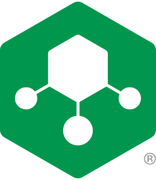 |  |  |


# Install NIM via docker compose

Begin by logging into the Jumphost via RDP or Guacamole. Open Visual Studio Code and use the Terminal located in the bottom panel. Login to the virtual machine where we will install nim. Passwordless ssh was set up for this lab so need only type `ssh <host>` in the VS Code Terminal to get to the server. After logging in, change directory to the lab8 folder.

```bash
ubuntu@jumphost:~/Documents/nginx-one-workshops/labs$ ssh nim

ubuntu@nim:~$ cd ~/Documents/nginx-one-workshops/labs/lab8
ubuntu@nim:~/Documents/nginx-one-workshops/labs/lab8$ 
```

Download your NGINX One .jwt, .crt and .key files from MyF5 and place into the nginx-plus folder as outlined below. You may need to rename them. If you are using the F5 UDF Lab environment, these files have been placed there ahead of time, please confirm they are present on your system.

```bash
tree nginx-plus

nginx-plus
├── etc
│   └── license.jwt
├── nginx-repo.crt
└── nginx-repo.key

1 directory, 3 files
```

With the license files in place we will now register our docker engine with the private NGINX registry so that we are authorized to pull official docker images from it. Use the following command:

```bash
sudo docker login private-registry.nginx.com --username=$(cat nginx-plus/etc/license.jwt) --password=none
```

```bash
## Example Response
Login Succeeded
```

Before we install NGINX Instance manager, we can set the admin login password by creating a file. For lab purposes, we will set it to "admin", but this is not advised for production settings.

```bash
cd nim
echo "admin" > admin_password.txt
```

Having authorized the system and set an admin password, we can now pull the docker image for NGINX Instance manager. In your terminal, while still in the nim directory run the docker compose up command:

```bash
sudo docker compose up -d
```

```bash
### SAMPLE Output ###

[+] Running 42/42
 ✔ clickhouse Pulled                                                                                                                                             13.5s 
   ✔ c6a83fedfae6 Pull complete                                                                                                                                   0.3s 
   ✔ 7b3da2bcf942 Pull complete                                                                                                                                   0.4s 
   ✔ 1cb7a9c2b8af Pull complete                                                                                                                                   0.4s 
   ✔ 4cdd78e6b64c Pull complete                                                                                                                                   0.4s 
   ✔ 1e150014240d Pull complete                                                                                                                                   0.4s 
   ✔ 49a84a755226 Pull complete                                                                                                                                   0.5s 
   ✔ a29c5d358355 Pull complete                                                                                                                                   0.5s 
   ✔ 38ea0ab5f37e Pull complete                                                                                                                                  13.4s 
   ✔ ea4b66e8f71e Pull complete                                                                                                                                  13.4s 
 ✔ precheck Pulled                                                                                                                                                0.5s 
   ✔ f18232174bc9 Pull complete                                                                                                                                   0.4s 
 ✔ nim Pulled                                                                                                                                                    23.9s 
   ✔ 486dbf987c66 Pull complete                                                                                                                                   5.1s 
   ✔ 207b812743af Pull complete                                                                                                                                   7.8s 
   ✔ 841e383b441e Pull complete                                                                                                                                   7.8s 
   ✔ 0256c04a8d84 Pull complete                                                                                                                                   7.9s 
   ✔ 38e992d287c5 Pull complete                                                                                                                                   7.9s 
   ✔ 9e9aab598f58 Pull complete                                                                                                                                   7.9s 
   ✔ 4de87b37f4ad Pull complete                                                                                                                                   7.9s 
   ✔ f2d22cc4b764 Pull complete                                                                                                                                  10.7s 
   ✔ 27533015f703 Pull complete                                                                                                                                  12.0s 
   ✔ ca2e0071687b Pull complete                                                                                                                                  15.3s 
   ✔ c5434169f85a Pull complete                                                                                                                                  15.3s 
   ✔ 20ad2ba67974 Pull complete                                                                                                                                  15.3s 
   ✔ 1028d2181621 Pull complete                                                                                                                                  15.5s 
   ✔ 19352cd67f3f Pull complete                                                                                                                                  21.1s 
   ✔ ffb89cfd3c43 Pull complete                                                                                                                                  21.1s 
   ✔ cabeb33f2096 Pull complete                                                                                                                                  21.2s 
   ✔ 6b14a3117e3c Pull complete                                                                                                                                  21.2s 
   ✔ 74ff22f682b1 Pull complete                                                                                                                                  21.2s 
   ✔ cec134b32e50 Pull complete                                                                                                                                  21.2s 
   ✔ f2c9d76f3213 Pull complete                                                                                                                                  21.3s 
   ✔ 5256032da6a6 Pull complete                                                                                                                                  21.3s 
   ✔ 211d662669f2 Pull complete                                                                                                                                  21.3s 
   ✔ 7798c1f0a3ac Pull complete                                                                                                                                  21.3s 
   ✔ f519b0d13d8a Pull complete                                                                                                                                  21.3s 
   ✔ 40643f043770 Pull complete                                                                                                                                  21.4s 
   ✔ f4539bd52ac1 Pull complete                                                                                                                                  21.4s 
   ✔ 155e928eba8b Pull complete                                                                                                                                  21.5s 
   ✔ 28ad6a95c9b0 Pull complete                                                                                                                                  21.5s 
   ✔ 7335aabdf3b7 Pull complete                                                                                                                                  21.5s 
[+] Running 9/9
 ✔ Network nim_clickhouse        Created                                                                                                                          0.0s 
 ✔ Network nim_external_network  Created                                                                                                                          0.1s 
 ✔ Network nim_default           Created                                                                                                                          0.0s 
 ✔ Volume "nim_proxy-certs"      Created                                                                                                                          0.0s 
 ✔ Volume "nim_clickhouse-data"  Created                                                                                                                          0.0s 
 ✔ Volume "nim_nim-data"         Created                                                                                                                          0.0s 
 ✔ Container nim-precheck-1      Started                                                                                                                          1.1s 
 ✔ Container nim-clickhouse-1    Healthy                                                                                                                          6.0s 
 ✔ Container nim-nim-1           Started                                                                                                                          6.2s 
```

# Confirm NIM is now installed 

Using docker, check the status of our containers. There should be two containers listed as `Up` and `(healthy)`.

```bash
sudo docker ps
```

```bash
### SAMPLE OUTPUT ###

CONTAINER ID   IMAGE                                                          COMMAND                  CREATED          STATUS                      PORTS                                             NAMES
1b74c6e3cb55   private-registry.nginx.com/nms/nim-standalone-compose:2.19.0   "/docker-entrypoint.…"   48 seconds ago   Up 41 seconds (healthy)     80/tcp, 0.0.0.0:443->443/tcp, [::]:443->443/tcp   nim-nim-1
661d5bf525d4   clickhouse/clickhouse-server:23-alpine                         "/entrypoint.sh"         48 seconds ago   Up 47 seconds (healthy)                                                       nim-clickhouse-1
```

We can exit out of the terminal and can use the RDP (or Guacamole) session we are connected to. Open the Chrome web browser. Go to the NIM license page and add the license to the NIM console. The URL for this lab is: https://10.1.1.5/ui/settings/license

You will login with the username of `admin` and the password we set in the text file, also `admin`.

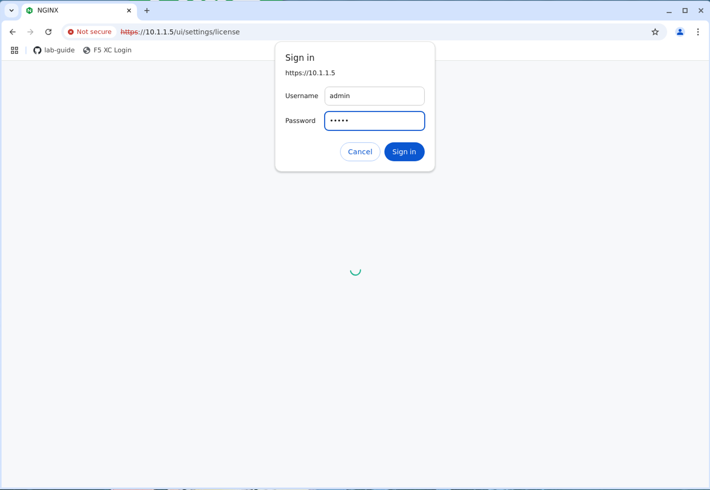

Click the green `Get Started` button, which will open a panel on the right side of the screen.

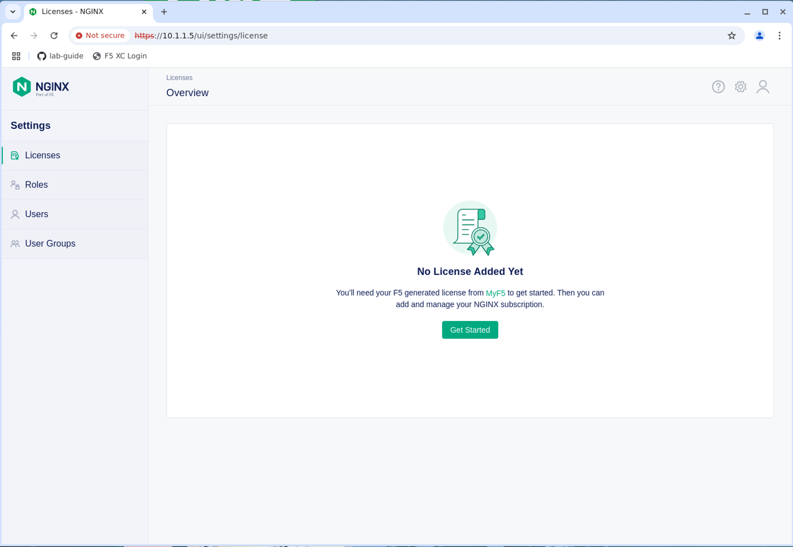

Drag your license.jwt file to the indicated area and click the green `Add` button.  

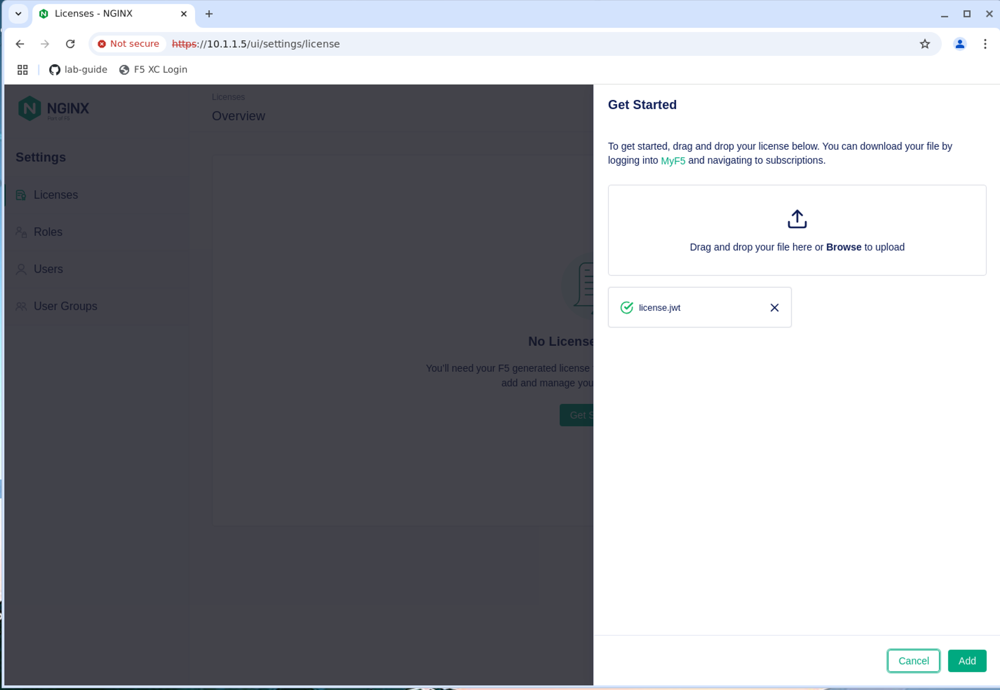

You can now confirm that there is an active license for NIM.

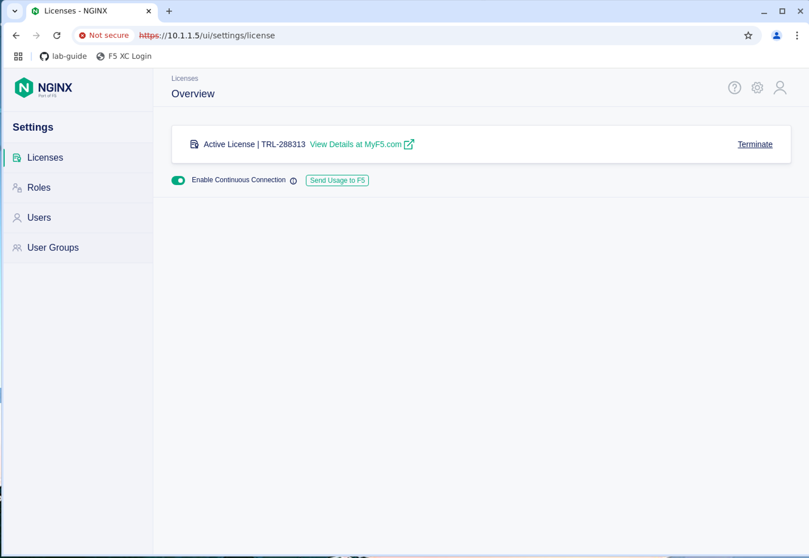

You'll see there is a button to `Enable Continuous Connection` which sends the usage to F5. We will discuss what to do if your NIM is not connected in a bit.

# Stand up a NGINX Plus instance on R32

As a lab exercise we will create an NGINX instance that is pinned to R32. This will show you how some environments are set up (who weren't ready to move to the R33 release). From the jumphost you can use the terminal to get to the command line to do an install. You can also use Webshell to the Nplus server of RDP directly to it. No matter how you connect, let's run the following commands:

```bash
cd ~/Documents

sudo mkdir -p /etc/nginx/
sudo cp /license/license.jwt /etc/nginx/license.jwt

sudo mkdir -p /etc/ssl/nginx
sudo cp /license/nginx-repo.* /etc/ssl/nginx/
```
If you are using the3 F5 UDF environment, these files have been placed there ahead of time for your convenience and you can continue below without doing the above step.

```bash
sudo apt update
sudo apt install apt-transport-https lsb-release ca-certificates wget gnupg2 ubuntu-keyring
wget -qO - https://cs.nginx.com/static/keys/nginx_signing.key     | gpg --dearmor     | sudo tee /usr/share/keyrings/nginx-archive-keyring.gpg >/dev/null
 printf "deb [signed-by=/usr/share/keyrings/nginx-archive-keyring.gpg] \
https://pkgs.nginx.com/plus/ubuntu `lsb_release -cs` nginx-plus\n" | sudo tee /etc/apt/sources.list.d/nginx-plus.list
```

For this lab, we need to pin this release version to R32 so that we can show the upgrade process. The keys we are using are good for R33, so if we simply ask for an install of nginx we will get the latest release (currently R33). To pin the release, we manually need to put the R32 branch in URL like:  `/plus/R32/`

```bash
sudo vi /etc/apt/sources.list.d/nginx-plus.list 
```
Change this line:

```bash
https://pkgs.nginx.com/plus/ubuntu jammy nginx-plus"
```

 to:

```bash
https://pkgs.nginx.com/plus/R32/ubuntu jammy nginx-plus"
```

Now run the commands to install NGINX Plus:

```bash
sudo wget -P /etc/apt/apt.conf.d https://cs.nginx.com/static/files/90pkgs-nginx
sudo apt update
sudo apt install -y nginx-plus
```

Confirm the version that you installed:

```bash
nginx -v
```

```bash
### SAMPLE OUTPUT ###
nginx version: nginx/1.25.5 (nginx-plus-r32-p2)
```

```bash
sudo systemctl start nginx
```

# Create an Instance Group on NIM

Now that NGINX Plus is installed, let's go back to the jumphost and log into the NIM console. Open Chrome and go to (https://10.1.1.5 credentials are: admin/admin)

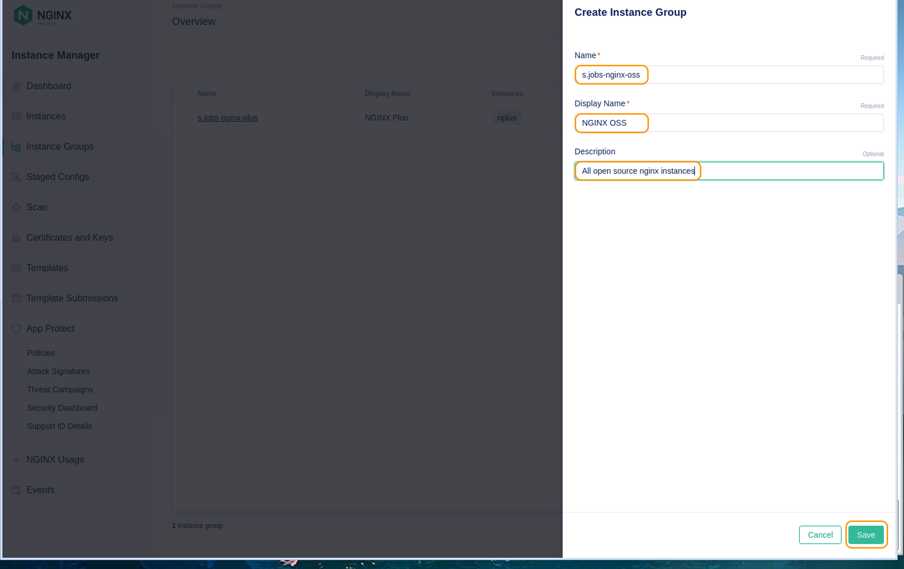


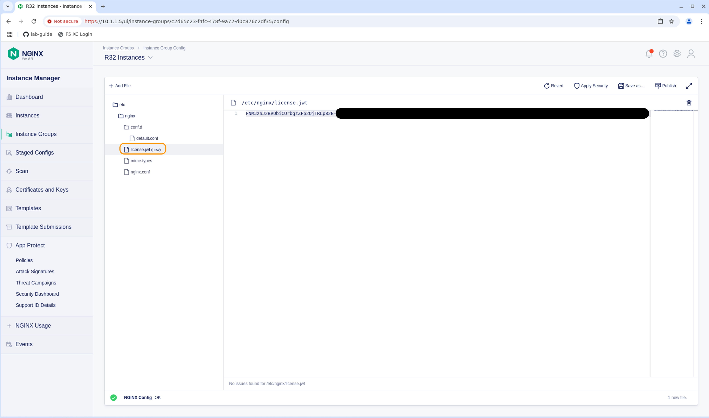

## Install NGINX agent and add NGINX Plus to NIM

In the NIM Console, click on the Instances menu in the left hand side.  You will notice it gives you the instructions to run on your NGINX instance machine, to add agent and register it. The command it shows us in the screenshot is:

```bash
curl -k https://10.1.1.5/install/nginx-agent | sudo sh
```

We need to get terminal access to teh NPlus machine.  We can use XRDP, WebShell, or from the VS Studio terminal issue this command:

```bash
ssh nplus
```

We are going to modify the curl command. When this test nginx instance gets added we want it to go directly into the NIM Instance Group without doing anything extra. To do that, we modify the single curl command to two lines that look like:

```bash
curl -k https://10.1.1.5/install/nginx-agent > install.sh
sudo sh ./install.sh --instance-group s.jobs-nginx-plus
```

We will verify this in the NIM console, but before we leave this system, you can see that it added one line to the /etc/nginx-agent/agent-dynamic.conf file:

```bash
cd  /etc/nginx-agent 
cat agent-dynamic.conf 
```

```bash
    instance_group: s.jobs-nginx-plus
```

### Restart the agent to add this to a new Instance group.

```bash
sudo systemctl start nginx-agent
```

Similar to how One Console handles things, when the first instance is added to an Instance group, that config becomes the default (if none was prepared ahead of time). Now that we have configured Agent on this system, you will see it in the Instance Group section we assigned it to.


> [!IMPORTANT]  
> We are going to talk about air-gapped systems in a little bit which affect how you install and report usage to F5. First let's introduce some other scenarios into NIM instance groups.


We have an Instance Group, let's discover the instances that we can place into it. In the left hand menu you will see a `Scan` button.  Clicking on that brings up the discovery interface.  Here we will search by ip address/subnet to find any instances that we can manage.

We have a systems(s) added to the resource group, let's show how we can push out config changes and even new files. To do an upgrade on an R32 system, there needs to be a license.jwt file placed in the /etc/nginx folder. This prevents accidental upgrades to R33 or later from happening. Putting the file in place we can then go and upgrade each system.

# Install an R33 instance.

Release 33 of NGINX now requires NGINX Agent to be installed along with a license for NGINX One (Not to be confused with the NGINX One Console we are working with today). It is not as painful as some have been led to believe. Let's add a new R33 instance to our lab setup.

First we need the NGINX One `license.jwt` file which you can get from [my.f5.com](https://my.f5.com). Create a new file in the lab8 folder called `license.jwt` and paste the contents into it. If you are in the F5 UDF environment, this has been done for you. Add that to a CLI variable as you did with the original JWT token:

```bash
export JWT=$(cat license.jwt)
# We just updated the JWT variable to the R33 JWT file. Confirm the other two variables are still set:
echo $NAME
echo $TOKEN
# If they are not set, go ahead and set them again:
export NAME=s.jobs
export TOKEN=<insert the token key for One Console that you used previously>
```

As we updated the JWT token, we need to login to docker with the new credentials:

```bash
docker login private-registry.nginx.com --username=$JWT --password=none
```

In this lab we re-use a docker-compose.yml file from lab2 to deploy our containers and register with the One Console. This time we will now add an R33 (latest) version of the NGINX Plus container. Open the docker-compose file in VS Code.

```bash
vi lab8/docker-compose.yml
```

After the `plus3` instance code block we will put a new block of code for the R33 release. We will call this `plus4`, keeping in line with our naming convention for the labs.

Starting on line 74 let's enter this block of code:

```bash
plus4: # Debian R33 NGINX Plus Web / Load Balancer
    environment:
      NGINX_AGENT_SERVER_HOST: '10.1.1.5'
      NGINX_AGENT_SERVER_GRPCPORT: '443'
      NGINX_AGENT_TLS_ENABLE: 'true'
      NGINX_LICENSE_JWT: $JWT
      # NGINX_AGENT_INSTANCE_GROUP: $NAME-sync-group
    hostname: $NAME-plus4
    container_name: $NAME-plus4
    image: private-registry.nginx.com/nginx-plus/agent:debian # From Nginx Private Registry R33
    volumes: # Sync these folders to container
      - ./nginx-plus/etc/nginx/nginx.conf:/etc/nginx/nginx.conf
      - ./nginx-plus/etc/nginx/conf.d:/etc/nginx/conf.d
      - ./nginx-plus/etc/nginx/includes:/etc/nginx/includes
      - ./nginx-plus/usr/share/nginx/html:/usr/share/nginx/html
    ports:
      - '80' # Open for HTTP
      - '443' # Open for HTTPS
      - '9000' # Open for API / Dashboard page
      - '9113' # Open for Prometheus Scraper page
    restart: always
	#
```

Save your edits. You'll notice a couple of changes from the other blocks (besides the name). The first is the environment variable called `NGINX_LICENSE_JWT: $JWT` This is what authorizes the pulling of this specific image. The second change is the image name `private-registry.nginx.com/nginx-plus/agent:debian` which pulls the NGINX Plus with Agent installed. We will be able to see this in the One Console once deployed.

Now that this file is edited, save it and let's restart the containers. Issue the following commands:

```bash
docker compose down
docker compose up --force-recreate -d
```

<br />

# Examine in One Console

You will notice a few things in One console now. First - why are there duplicate container names?!?!? 

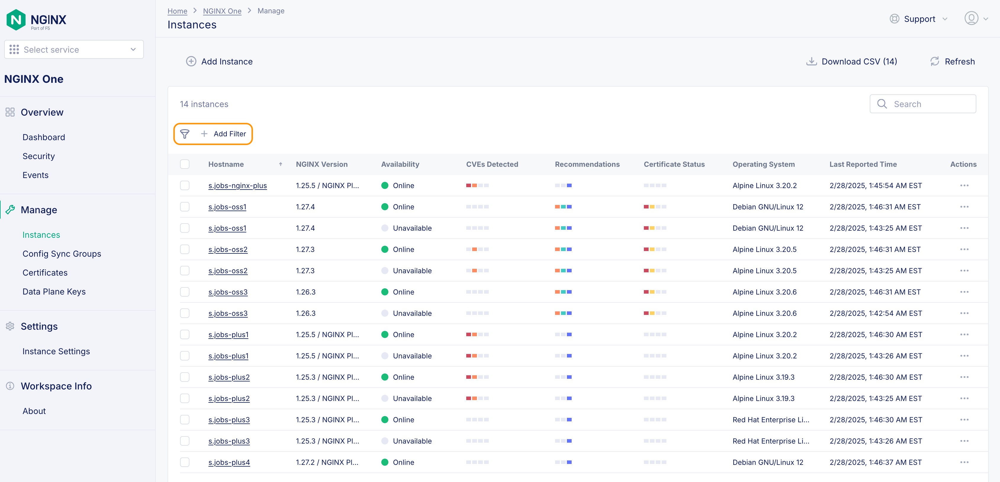

Containers as we know are ephemeral. Once we destroy / recreate them they re-register with the Console. You can manually clean these up (delete the grayed out versions of your images) or you can have these cleaned up automatically. Previously we used the search to narrow down the instances with your name.  This time we will use the Filter feature. Choose the action of `Availability is Unavailable` then you can select your containers and use the `Delete selected` button. 

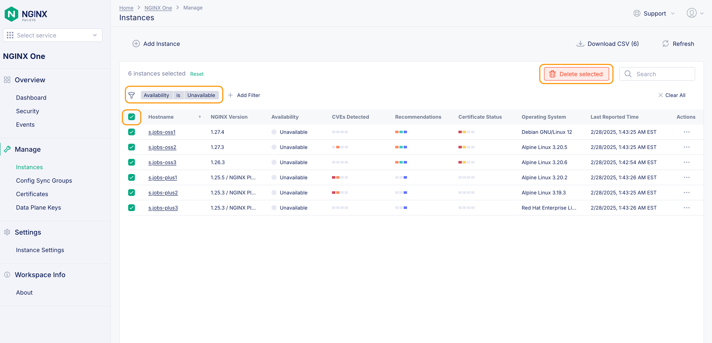

Once done, remember to clear the filter so you will be able to see the active instances.

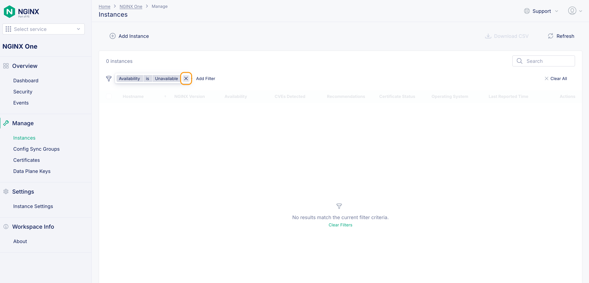

 To automate this removal of instances, you can expand the `Settings` menu on the left hand side it will reveal an entry for `Instance Settings`. 

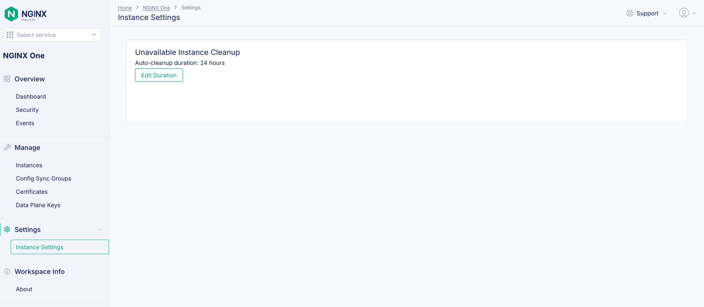

Clicking that will take you to a screen where you can change the cleanup to a time of your choosing.  We usually leave it at 24 hours not seen, but we can set it down to a single hour. 

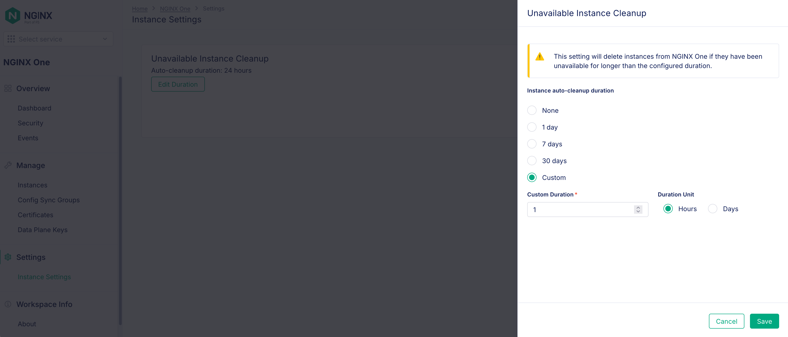

<details>
  <summary><b>Note</b></summary>
Make sure you aren't too aggressive with the auto cleanup as sometimes it is good to see what has been out in production over a recent period.
</details>


Now that we cleaned things up we can see the plus4 instance in our `Instances` interface.  

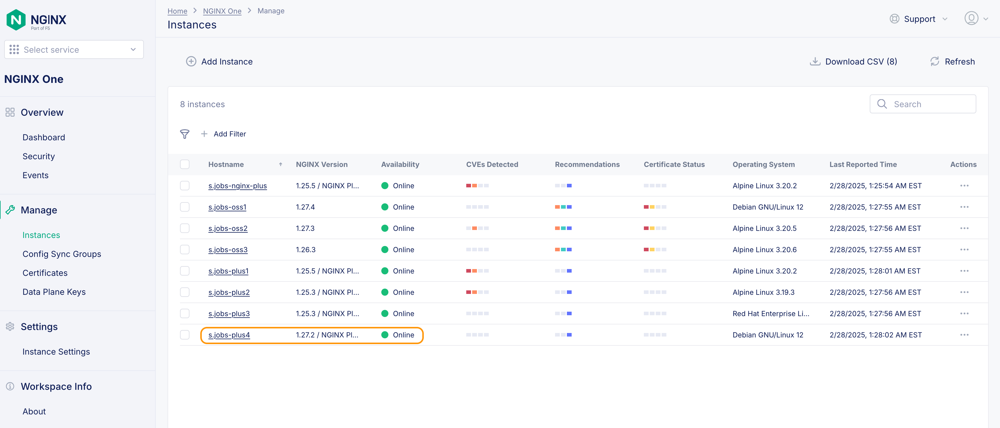

If we click on the instance name, now we can see the NGINX version as well as the Agent version that are deployed:

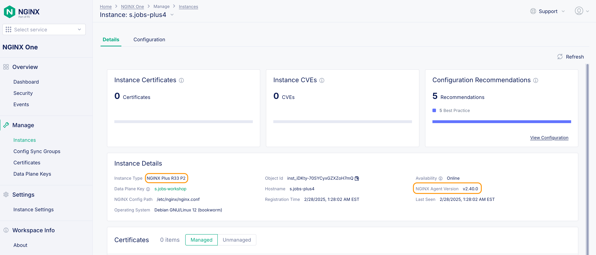

That's how easy it is to deploy an R33 instance and have it registered with One Console. Using A/B testing practices, you can move the traffic from and R332 container to the R33 instance.  We can now clean up the One Console environment by issuing:

```bash
docker compose down
```

# Upgrade NGINX Plus from R32 to R33
What about upgrading a non container NGINX instance?  Let's take the previous R32 install we had and upgrade it.  This time through the NIM console.

 - Login to system
 - Confirm license file was pushed via console
 - Check apt source (to make sure it wasn't pinned)
 - Upgrade to R33
 - Confirm in NIM that the system was upgraded.


**This completes Lab8.**

## References

- [NGINX Instance Manager Docs](https://docs.nginx.com/nginx-instance-manager)


### Authors

- Chris Akker - Solutions Architect - Community and Alliances @ F5, Inc.
- Shouvik Dutta - Solutions Architect - Community and Alliances @ F5, Inc.
- Adam Currier - Solutions Architect - Community and Alliances @ F5, Inc.

-------------

Navigate to ([LabGuide](../readme.md))
