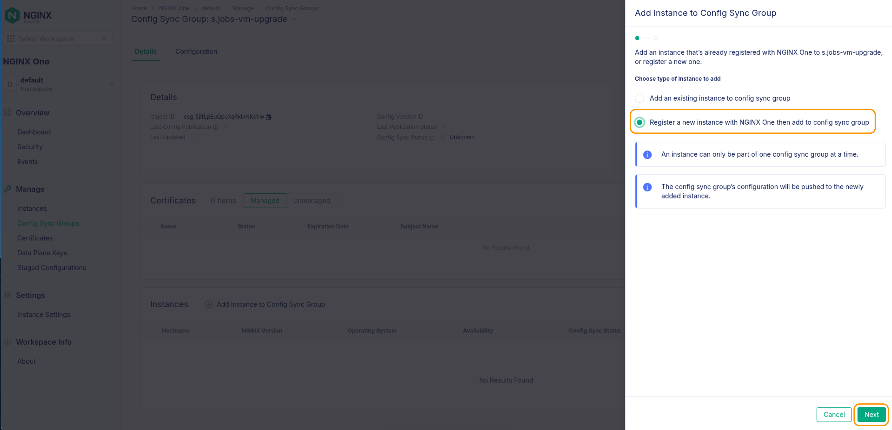
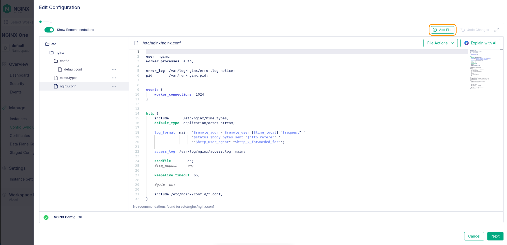

# NGINX One Console: Upgrading NGINX Plus Instances to R34

## Introduction

With NGINX Plus release 33, your instances are required to be managed. You have added instances to One Console in previous labs. Let's take a look at how you can leverage the console to upgrade both container instances and standalone servers.

## Learning Objectives

- You will learn how to upgrade Docker containers to the latest release
- You will learn how to install NGINX Agent from commands in NGINX One Console
- You will learn how to add an NGINX web server manually to NGINX One Console
- You will learn how to use Config Sync Groups to prepare bare metal systems for upgrade
- You will learn how to upgrade your release to R34 (latest) & Confirm it in One Console
- You will learn how to enable the Plus metrics for reporting in One Console

## Prerequisites

- You must have a license for NGINX One (jwt, key & cert)
- You must have Docker and Docker Compose installed and running
- See `Lab0` for instructions on setting up your system for this Workshop
- Familiarity with basic Linux concepts and commands
- Familiarity with basic NGINX concepts and commands

<br/>

### Upgrading to R34


|          NGINX One         |              Docker              |             NGINX Plus             |
| :--------------------------------------: | :------------------------------: | :--------------------------------: |
|  |  |  |


# Upgrade a Docker Container to R34

You will now review the `lab8/docker-compose.yml` file. This compose file is the same as the one we used in Lab 2 with a new code block. Review the new code block on lines 74-95:

```bash
  plus4: # Debian R34 NGINX Plus Web / Load Balancer
    environment:
      NGINX_AGENT_SERVER_HOST: 'agent.connect.nginx.com'
      NGINX_AGENT_SERVER_GRPCPORT: '443'
      NGINX_AGENT_TLS_ENABLE: 'true'
      NGINX_AGENT_SERVER_TOKEN: $TOKEN # Datakey Fron Nginx One Console
      NGINX_LICENSE_JWT: $JWT
      NGINX_AGENT_INSTANCE_GROUP: $NAME-sync-group
    hostname: $NAME-plus4
    container_name: $NAME-plus4
    image: private-registry.nginx.com/nginx-plus/agent:debian # From Nginx Private Registry R34
    volumes: # Sync these folders to container
      - ./nginx-plus/etc/nginx/nginx.conf:/etc/nginx/nginx.conf
      - ./nginx-plus/etc/nginx/conf.d:/etc/nginx/conf.d
      - ./nginx-plus/etc/nginx/includes:/etc/nginx/includes
      - ./nginx-plus/usr/share/nginx/html:/usr/share/nginx/html
    ports:
      - '80' # Open for HTTP
      - '443' # Open for HTTPS
      - '9000' # Open for API / Dashboard page
      - '9113' # Open for Prometheus Scraper page
    restart: always
```
You'll notice a couple of changes from the other blocks (besides the name). The first is the environment variable called `NGINX_LICENSE_JWT: $JWT` 

This is what authorizes the pulling of a R33 or newer image. The second change is the image name `private-registry.nginx.com/nginx-plus/agent:debian` which pulls the debian version of the NGINX Plus with Agent installed. We will be able to see this in the One Console once deployed.

Now that you understand the new code block, go ahead and restart the containers. Make sure you are in the labs/lab8 directory.

```bash
cd lab8
```
```bash
docker compose up --force-recreate -d
```

```bash
### SAMPLE OUTPUT ###
[+] Running 4/4
 ✔ plus4 Pulled                                                                                                                                 10.5s 
   ✔ 254e724d7786 Already exists                                                                                                                 0.0s 
   ✔ d71cbbb6d298 Pull complete                                                                                                                  6.6s 
   ✔ db3b1a3b3d5f Pull complete                                                                                                                  7.0s 
[+] Running 11/11
 ✔ Network lab8_default    Created                                                                                                               0.1s 
 ✔ Container s.jobs-web2   Started                                                                                                               1.2s 
 ✔ Container s.jobs-oss2   Started                                                                                                               2.7s 
 ✔ Container s.jobs-oss3   Started                                                                                                               3.4s 
 ✔ Container s.jobs-oss1   Started                                                                                                               2.3s 
 ✔ Container s.jobs-plus1  Started                                                                                                               3.4s 
 ✔ Container s.jobs-web3   Started                                                                                                               2.1s 
 ✔ Container s.jobs-web1   Started                                                                                                               1.8s 
 ✔ Container s.jobs-plus4  Started                                                                                                               2.9s 
 ✔ Container s.jobs-plus2  Started                                                                                                               2.8s 
 ✔ Container s.jobs-plus3  Started  
```

In the One Console interface we can see that the `plus4` image has been added. That was pretty easy to get the new docker container on the latest version. You can now use standard A/B practices to move your workloads over to the new R34 container and retire the old containers. 


If we want to upgrade standalone NGINX instances (not container based) we can use NGINX One Console to make the task easier. You will now take a single web server, add it to a new Config Sync Group and then upgrade it to R34. You will use familiar concepts from the previous labs to accomplish this goal.

<br>

# Create a Config Sync Group on NGINX One Console

In the left hand menu, click on the Manage->Config Sync Groups link. Here you will click on the `Add Config Sync Group` button and name it $NAME-vm-upgrade. 

In our example we use the name `s.jobs`, but you will use the one you have been using for this workshop. Once named, click the `Create` button. You are going to add the standalone instance to this group in a moment.


<br>

# Install Agent and add the system to the Config Sync Group

There is a NGINX Plus instance at release R32 installed for you in this lab. You will now install NGINX Agent and connect the instance to One Console. You will then add a license file to the configuration and push it out to the remote system. Finally, you will log into the server and upgrade it to the latest NGINX Plus version.

Before you begin, let's confirm that we actually have a web server on Release 32 and it is up and running. 

We are going to need the TOKEN to connect the system, since the web server is a physically different server, you will need to set the TOKEN variable on the new system.  You can make this easier by echoing the output before you ssh to the new system (so you can copy it):

```bash
ubuntu@jumphost:~/Documents/nginx-one-workshops/labs/lab8$ echo $TOKEN
yOa55EprwIFQ2Ky7Ni/PZtpTSU7uhKI3I5PfbCAAAAA=
```
```bash
ubuntu@jumphost:~/Documents/nginx-one-workshops/labs/lab8$ ssh nplus
```
Now that you are on the nplus system, set the TOKEN variable again.

```bash
ubuntu@nplus:~$ export TOKEN=yOa55EprwIFQ2Ky7Ni/PZtpTSU7uhKI3I5PfbCAAAAA=
ubuntu@nplus:~$ echo $TOKEN
yOa55EprwIFQ2Ky7Ni/PZtpTSU7uhKI3I5PfbCAAAAA=
```
Now check the version of NGINX that is currently installed:

```bash
nginx -v
```
```bash
### SAMPLE OUTPUT ###
nginx version: nginx/1.25.5 (nginx-plus-r32-p1)
```

Check the status of the web server:
```bash
ubuntu@nplus:~$ sudo systemctl status nginx
```
```bash
### SAMPLE OUTPUT ###
● nginx.service - NGINX Plus - high performance web server
     Loaded: loaded (/lib/systemd/system/nginx.service; enabled; vendor preset: enabled)
     Active: active (running) since Wed 2025-04-30 22:30:02 UTC; 3h 40min ago
       Docs: https://www.nginx.com/resources/
    Process: 14068 ExecStartPre=/usr/lib/nginx-plus/check-subscription (code=exited, status=0/SUCCESS)
    Process: 14072 ExecStart=/usr/sbin/nginx -c /etc/nginx/nginx.conf (code=exited, status=0/SUCCESS)
   Main PID: 14073 (nginx)
      Tasks: 5 (limit: 9553)
     Memory: 5.9M
        CPU: 60ms
     CGroup: /system.slice/nginx.service
             ├─14073 "nginx: master process /usr/sbin/nginx -c /etc/nginx/nginx.conf"
             ├─14074 "nginx: worker process" "" "" "" "" "" "" "" "" "" "" "" "" "" "" "" "" "" "" ""
             ├─14075 "nginx: worker process" "" "" "" "" "" "" "" "" "" "" "" "" "" "" "" "" "" "" ""
             ├─14076 "nginx: worker process" "" "" "" "" "" "" "" "" "" "" "" "" "" "" "" "" "" "" ""
             └─14077 "nginx: worker process" "" "" "" "" "" "" "" "" "" "" "" "" "" "" "" "" "" "" ""
```

Everything here looks like it is working. If your nginx service isn't `Active (running)` then manually start it with:

```bash
ubuntu@nplus:~$ sudo systemctl start nginx
```


# Manually add an NGINX Instance to your Config Sync Group

Click on the Config Sync Groups link on the left hand menu. Then find your $NAME-vm-upgrade group and click on the name. This will open the Details pane for that Config Sync Group.


On the bottom third of the page is a section called `Instances`. Here you will click on the`Add Instance to Config Sync Group` button.


On this screen you will choose `Register a new instance with NGINX One then add to config sync group. Then click the `Next` button in the lower right.



On this next screen you will choose the radio button `Use Existing Key`. In the `Data Plane Key` field type $TOKEN

At the bottom of that screen you will be on the `Virtual Machine or Bare Metal` tab, this will give you the command you need to run on the `nplus` machine.


You will now run this command on the `nplus` server to install NGINX Agent:

```bash
curl https://agent.connect.nginx.com/nginx-agent/install | DATA_PLANE_KEY="$TOKEN" sh -s -- -y -c s.jobs-vm-upgrade
```

```bash
### SAMPLE OUTPUT ###
...

 upgraded, 0 newly installed, 0 to remove and 7 not upgraded.

  7. Installing nginx-agent package ... done.
  8. Building configuration file ... done.
  9. Checking config sync group name ... ok.
Updating /var/lib/nginx-agent/agent-dynamic.conf with CONFIG_SYNC_GROUP_NAME=s.jobs-vm-upgrade
Successfully added config sync group name to /var/lib/nginx-agent/agent-dynamic.conf
 10. Making sure NGINX Plus metrics are active. Verifies use of the NGINX Plus API... The NGINX One Console is not receiving available metrics. To fix this problem, enable the NGINX Plus API, as described here:
https://docs.nginx.com/nginx-one/getting-started/#enable-nginx-plus-api

 A few checks have failed - please read the warnings above!

 To start and stop the NGINX Agent type:

     sudo  systemctl { start | stop } nginx-agent

 Nginx Agent log can be found here:
     /var/log/nginx-agent/agent.log

Reading NGINX systemctl unit file for NGINX user information

 NGINX Plus installation found running as user root 

 NGINX Plus currently running as root.
 If you would like to run in unprivileged mode, please reference https://docs.nginx.com/nginx/admin-guide/installing-nginx/installing-nginx-plus#nginx-plus-unprivileged-installation 
 Running nginx process as root.

 After NGINX agent is launched, it takes a couple of minutes for this system to appear
 in the NGINX One user interface.

 Launching nginx-agent ...
 All done.
```

You can now check that NGINX agent is running:

```bash
ubuntu@nplus:~$ sudo systemctl status nginx-agent
● nginx-agent.service - NGINX Agent
     Loaded: loaded (/etc/systemd/system/nginx-agent.service; enabled; vendor preset: enabled)
     Active: active (running) since Thu 2025-05-01 05:21:46 UTC; 2min 37s ago
       Docs: https://github.com/nginx/agent#readme
    Process: 16152 ExecStartPre=/bin/mkdir -p /var/run/nginx-agent (code=exited, status=0/SUCCESS)
    Process: 16153 ExecStartPre=/bin/mkdir -p /var/log/nginx-agent (code=exited, status=0/SUCCESS)
   Main PID: 16154 (nginx-agent)
      Tasks: 12 (limit: 9553)
     Memory: 11.7M
        CPU: 31.859s
     CGroup: /system.slice/nginx-agent.service
             └─16154 /usr/bin/nginx-agent

May 01 05:21:46 nplus nginx-agent[16154]: time="2025-05-01T05:21:46Z" level=info msg="Events initializing"
May 01 05:21:46 nplus nginx-agent[16154]: time="2025-05-01T05:21:46Z" level=info msg="NGINX Counter initializing { false unix:/var/run/nginx-agent/ng>
May 01 05:21:46 nplus nginx-agent[16154]: time="2025-05-01T05:21:46Z" level=info msg="Commander received meta:<timestamp:<seconds:1746076906 nanos:97>
May 01 05:21:46 nplus nginx-agent[16154]: time="2025-05-01T05:21:46Z" level=info msg="setting displayName to nplus"
May 01 05:21:46 nplus nginx-agent[16154]: time="2025-05-01T05:21:46Z" level=info msg="OneTimeRegistration completed"
May 01 05:21:46 nplus nginx-agent[16154]: time="2025-05-01T05:21:46Z" level=info msg="Upload: Sending data chunk data 0 (messageId=1773efe4-7a71-40ca>
May 01 05:21:46 nplus nginx-agent[16154]: time="2025-05-01T05:21:46Z" level=info msg="Upload: Sending data chunk data 1 (messageId=1773efe4-7a71-40ca>
May 01 05:21:46 nplus nginx-agent[16154]: time="2025-05-01T05:21:46Z" level=info msg="Upload sending done 1773efe4-7a71-40ca-98f6-18ce66538181 (chunk>
May 01 05:21:46 nplus nginx-agent[16154]: time="2025-05-01T05:21:46Z" level=info msg="setting displayName to nplus"
May 01 05:21:47 nplus nginx-agent[16154]: time="2025-05-01T05:21:47Z" level=info msg="setting displayName to nplus"
```

Back in One Console, you can see the instance has been added to the Config Sync Group:


# Upgrade Preparation

While in this Config Sync Group, let's go to the `Configuration` tab and click on the `Edit Configuration` button in the upper right.


Here you will click on the `Add File` button - so that you can add the One License JWT file that is required for upgrades to R33 and later.



You can use the `Upload Auxiliary / Other File` button if you had downloaded the file from my.f5.  Here you will simply create an empty file and then pas the JWT value we have been using from the labs. You can issue a `echo $JWT` command to get the string you need. The file needs to be place in a specific location, so type the filename with the full path:

```bash
/etc/nginx/license.jwt
```
Now click the add button to create an empty file. 


Paste the JWT value into the editor window and then click the `Next` button on the bottom right.


This brings up the review screen, you can hit the `Save and Publish` button in the bottom right. This will verify the file and then push it out to the hosts (be it 1, 10 or hundreds)!


You will now be able to see which systems are `In Sync` meaning they now have the license file.


We can now ssh to the `nplus` system and verify the license file is actually there:

```bash
ubuntu@nplus:~$ tree /etc/nginx
.
├── conf.d
│   └── default.conf
├── fastcgi_params
├── license.jwt
├── mime.types
├── modules -> /usr/lib/nginx/modules
├── nginx.conf
├── scgi_params
└── uwsgi_params

2 directories, 7 files
```

You can now upgrade this system to the latest version of NGINX Plus. This could be automated if there were many servers, but as you only have the one instance let's do it manually:

```bash
sudo apt update
sudo apt upgrade nginx-plus
```
You can quickly confirm you are running the new version:

```bash
nginx -v
```
```bash
### SAMPLE OUTPUT ###
nginx version: nginx/1.27.4 (nginx-plus-r34)
```

You can also confirm this in One Console. You may need to hit the `Refresh` button in the upper right, but then you will see an R34 instance now installed.


# Enable Plus Metrics

You saw there was an error/warning when you upgraded mentioning Plus metrics not being enabled. As a final task for this lab we will correct that. In One Console you will edit the Config for the $NAME-vm-group.


Click on teh default.conf file and then uncomment lines 47-51.  When done click the `Next` button.


You will get the same review screen and can dig into if you want to or just hit the `Save and Publish` button. That will now ensure your metrics are reporting corretly for Plus.


# Cleanup

As a good practice, you should clean up your labs when done. Find all of your containers that are running:

```bash
docker ps --filter "name=$NAME" --format 'table {{.ID}}\t{{.Names}}'
```
```bash
###SAMPLE OUTPUT ###
CONTAINER ID   NAMES
9c70dac20d10   s.jobs-oss1
b55af5ed082c   s.jobs-plus1
9b5ba66aa81b   s.jobs-oss3
5dd40e9c4b41   s.jobs-oss2
fb6c4d8a81a1   s.jobs-web1
8ff9479987c9   s.jobs-plus2
e9afab76c78e   s.jobs-web2
bcbc69c9c0b4   s.jobs-web3
d2fc7951edd1   s.jobs-plus3
5187894e4c2b   s.jobs-plus4
f2673427f154   s.jobs-one-manual
```
We can clean the main images up with `docker compose` and the manual image with `docker stop` (if it was running):

```bash
docker compose down
docker stop $NAME-one-manual
```

<br/>

**This completes Lab8.**

<br/>

## References

- [NGINX One Documentation](https://docs.nginx.com/nginx-one/)


### Authors

- Chris Akker - Solutions Architect - Community and Alliances @ F5, Inc.
- Shouvik Dutta - Solutions Architect - Community and Alliances @ F5, Inc.
- Adam Currier - Solutions Architect - Community and Alliances @ F5, Inc.

-------------

Navigate to ([Main Menu](../readme.md))