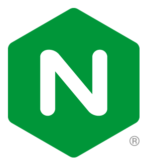

 

## NGINX ONE Console Workshop 102

 

### Overview

 

> ><strong>Welcome to the NGINX ONE Console Workshop!</strong>

 

This **NGINXperts Workshop** will introduce the **`NGINX ONE Console`** with hands-on practice through lab exercises.

You will learn and explore NGINX ONE Console, part of the F5 Distributed Cloud. You will connect various NGINX instances to the Console and manage them.  You will explore how the Console is used to manage and monitor your fleet of Nginx servers.  You will see how the built-in ONE Console tools can provide important and helpful information about your instances, so you can take appropriate corrective actions as needed.

The Hands-on Lab Exercises are designed to build upon each other, adding additional services and features as you progress through them, completing the labs in sequential order is required.  You can follow along as an instructor guides you through these exercises, or you can do the exercises at your pace on your own time.

This is the second Workshop in the `NGINXperts Series` from the Nginx Communities and Alliances Team at Nginx.

 

NGINX ONE Console  |
:-------------------------:|
  |

 

The Hands-On Lab Exercises are designed to build upon each other, adding additional services and features as you progress through them.  `It is important to complete the lab exercises in sequential order.`

By the end of this Workshop, you will have a working, operational NGINX ONE Console, with multiple Nginx instances connected and managed.

 

### Prerequisites

See the [Lab0 Readme.md](lab0/readme.md) for details on Student Prerequisites for this Workshop.

 

  NGINX Plus | NGINX One Console |  NGINX OSS 
:-------------------------:|:-------------------------:|:-------------------------:
  |     |  

 

## Lab Outline

### Lab 0: Prerequisites - Student Skills / Resources
- [Lab 0: Prerequisites - Student Skills / Resources](lab0/readme.md)

### Lab 1: NGINX One Console Access & Overview
- [Lab 1: NGINX One Console Access & Overview](lab1/readme.md)

### Lab 2: Add NGINX OSS Container
- [Lab 2: Add NGINX OSS Container](lab2/readme.md)

### Lab 3: Add NGINX Plus Container  
- [Lab 3: Add NGINX Plus Container](lab3/readme.md)

### Lab 4: NGINX Instance Groups
- [Lab 4: NGINX Instance Groups](lab4/readme.md)

### Lab 5: Managing your NGINX fleet
- [Lab 5: Managing your NGINX fleet](lab5/readme.md)

### Lab 6: TLS Certificates
- [Lab 6: TLS Certificates](lab6/readme.md)

### Lab 7: CVE Overview
- [Lab 7: CVE Overview](lab7/readme.md)

### Lab 8: Placeholder
- [Lab 8: Placeholder](lab8/readme.md)

### Lab 9: Placeholder
- [Lab9: Placeholder](lab9/readme.md)

### Lab 10: Placeholder
- [Lab10: Placeholder](lab10/readme.md)

#### Labs Optional: Optional Exercises
- [Labs Optional: Optional Exercises](labs-optional/readme.md)

 

### Authors

- Chris Akker - Solutions Architect - Community and Alliances @ F5, Inc.
- Shouvik Dutta - Solutions Architect - Community and Alliances @ F5, Inc.
- Adam Currier - Solutions Architect - Community and Alliances @ F5, Inc.

 

Click [Lab0: Student Prerequisites](lab0/readme.md) for details on Student Prerequisite Requirements for this Workshop.

Click [Lab1: NGINX One Console Access & Overview](lab1/readme.md) to get started! 

