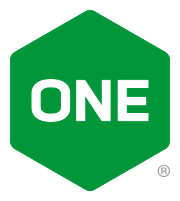

 

## NGINX One Console Workshop

 

### Overview

 

> ><strong>Welcome to the NGINX One Console Workshop!</strong>

 

This **NGINXperts Workshop** will introduce the **`NGINX One Console`** with hands-on practice through lab exercises.

You will learn and explore NGINX One Console, part of the F5 Distributed Cloud. You will connect various NGINX instances to the Console and manage them.  You will explore how the Console is used to manage and monitor your fleet of Nginx servers.  You will see how the built-in ONE Console tools can provide important and helpful information about your instances, so you can take appropriate corrective actions as needed.

The Hands-on Lab Exercises are designed to build upon each other, adding additional services and features as you progress through them, completing the labs in sequential order is required.  You can follow along as an instructor guides you through these exercises, or you can do the exercises at your pace on your own time.

This is the second Workshop in the `NGINXperts Series` from the Nginx Communities and Alliances Team at Nginx.

 

NGINX One Console  |
:-------------------------:|
  |

 

The Hands-On Lab Exercises are designed to build upon each other, adding additional services and features as you progress through them.  `It is important to complete the lab exercises in sequential order.`

By the end of this Workshop, you will have a working, operational NGINX One Console, with multiple Nginx instances connected and managed.

 

### Prerequisites

Choose one of the [Lab 0: Workshop pre-work](#lab-0-workshop-pre-work-choose-any-one) for details on Student Prerequisites for this Workshop.

 

  NGINX Plus | NGINX One Console |  NGINX OSS
:-------------------------:|:-------------------------:|:-------------------------:
  |     |  

 

## Lab Outline

### Lab 0: Workshop pre-work (Choose any one)
- [Lab 0: Workshop pre-work using F5 provided UDF environment](lab0/readme.md)
- [Lab 0: Workshop pre-work using your own system](lab0/prerequisites.md)

### Lab 1: NGINX One Console Introduction & Access
- [Lab 1: NGINX One Console Introduction & Access](lab1/readme.md)

### Lab 2: Build workshop components within Docker
- [Lab 2: Build workshop components within Docker](lab2/readme.md)

### Lab 3: NGINX One Console Overview and Deep Dive  
- [Lab 3: NGINX One Console Overview and Deep Dive](lab3/readme.md)

### Lab 4: Managing your NGINX fleet
- [Lab 4: Managing your NGINX fleet](lab4/readme.md)

### Lab 5: NGINX Reverse Proxy and HTTP Load Balancing
- [Lab 5: NGINX Reverse Proxy and HTTP Load Balancing](lab5/readme.md)

### Lab 6: NGINX Plus Logs, Health Checks and API
- [Lab 6: NGINX Plus Logs, Health Checks and API](lab6/readme.md)

### Lab 7: Monitoring NGINX Plus with Prometheus and Grafana
- [Lab 7: Monitoring NGINX Plus with Prometheus and Grafana](lab7/readme.md)

### Lab 8: NGINX Instance Manager and Upgrading NGINX Plus Instances to R33
- [Lab 8: NGINX Instance Manager and Upgrading NGINX Plus Instances to R33](lab8/readme.md)

 

### Authors

- Chris Akker - Solutions Architect - Community and Alliances @ F5, Inc.
- Shouvik Dutta - Solutions Architect - Community and Alliances @ F5, Inc.
- Adam Currier - Solutions Architect - Community and Alliances @ F5, Inc.

 

Choose one of the [Lab 0: Workshop pre-work](#lab-0-workshop-pre-work-choose-any-one) to get all set to work through the workshop content.

Click [Lab1: NGINX One Console Introduction & Access](lab1/readme.md) to get started!
